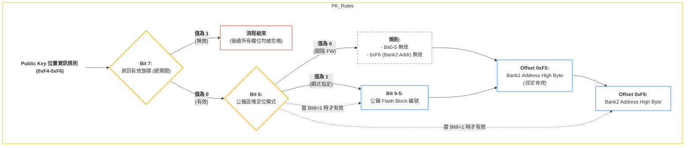
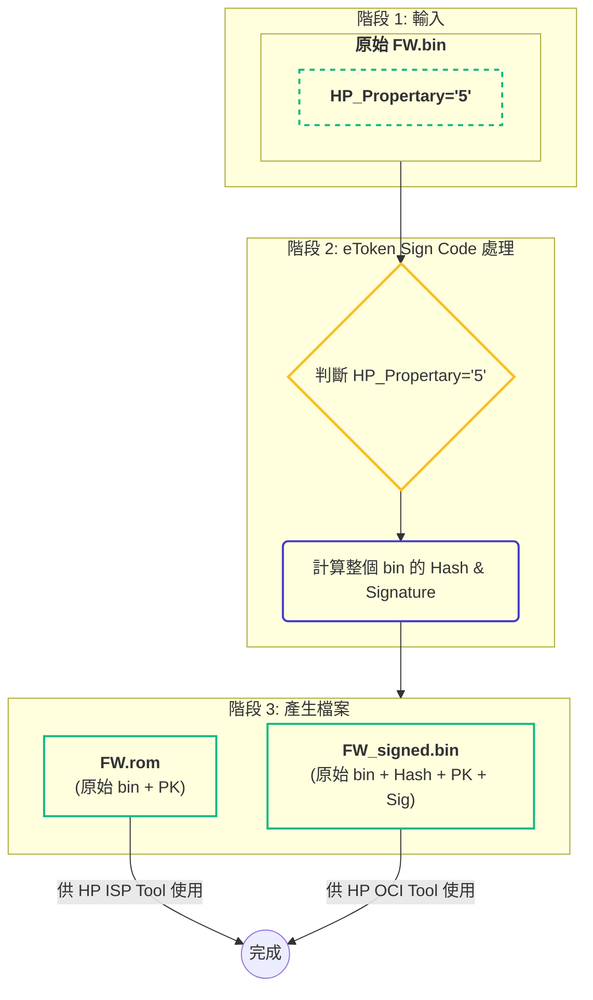
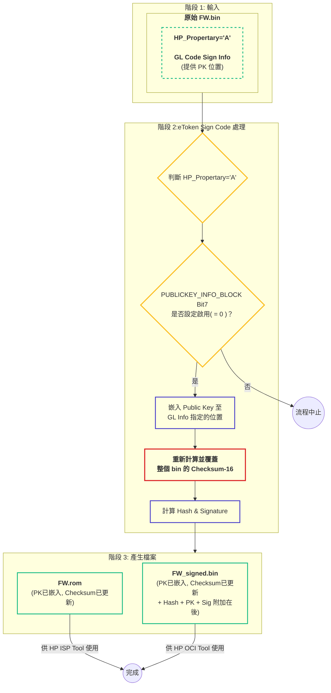
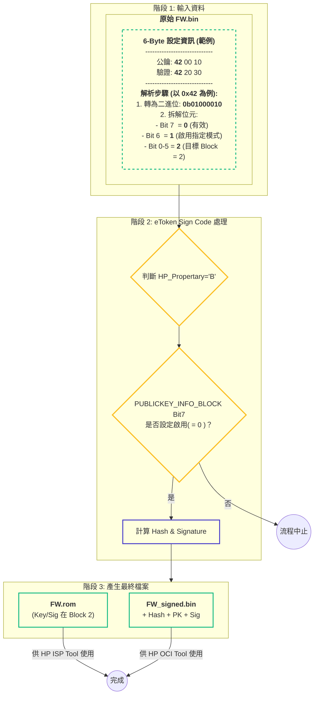
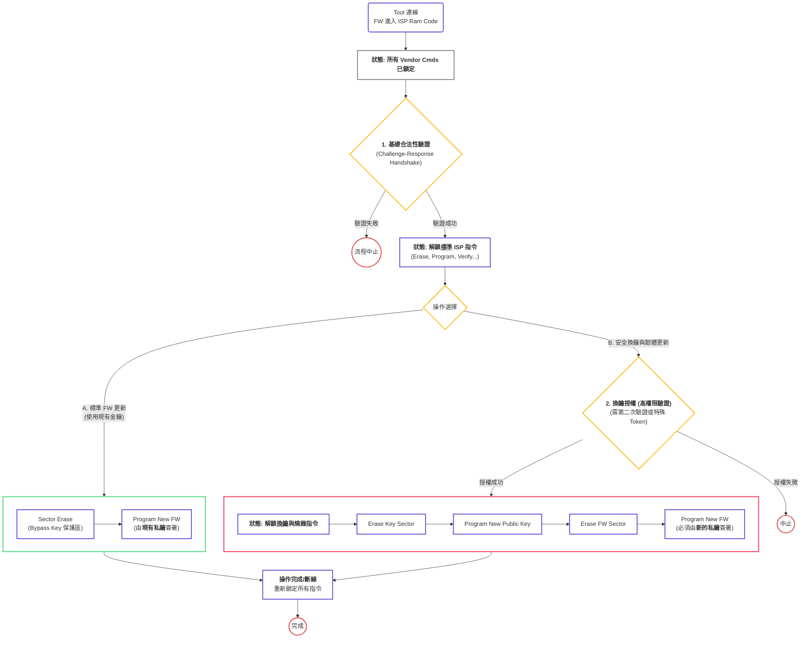
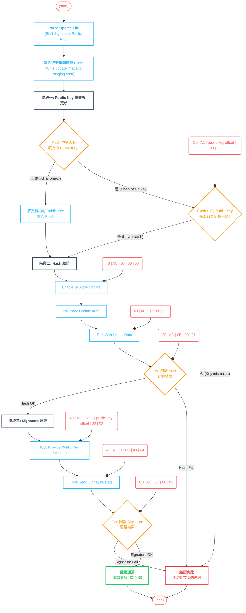
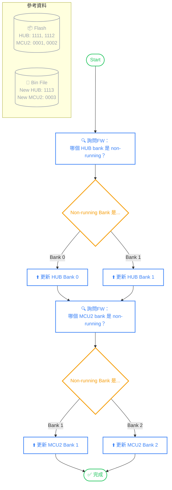

> 文件版本: 2.0
---
## 1. 適用範圍與演進路徑
💡 **盲點提醒**：後續新 IC 若在 Flash Block 構成或 Bank 切割方式上改動，`GL code sign info` 中 bit6=0 的「跟隨 FW 起始 Block」規則，可能直接失效，需預留 fallback。
---
## 2. 核心設計原則與情境定義 (最新)
為了相容舊有的非 Code-Sign Bonding IC 以及支援新的 Code-Sign Bonding IC，我們定義了三種主要情境 (case)。
### 核心判斷點
1. IC Bonding 類型: Code-Sign vs. Non-Code Sign。
1. HP_Propertary String: FW Bin 中的字串 ('5', 'A', 'B')，作為工具鏈和 FW 的主要行為依據。
1. GL Code-Sign Info: GL Signature 前的 6-byte 設定區塊。
### 應用範圍
- eToken Sign Code: 主要依賴 HP_Propertary 和 GL code sign info。
- eToken Gen ROM: 依賴 Bonding, HP_Propertary, 和 GL code sign info。
- ISP Tool & FW Load Code: 必須同時使用上述全部三個判斷點。
### 2.1. 情境、IC 與參數對照表
表一：Flash FW 配置及 ISP 差異
### 核心情境對照表
### 關鍵規則與備註
### A. 韌體升級路徑限制 (Firmware Upgrade Path)
1. ❌ 禁止降級路徑:
### B. GL Code-Sign Info 的角色與規則
1. 結構獨立性:
1. 功能與兼容性:
### C. 情境適用性限制 (Case-specific Constraints)
1. case3 的專屬性:
表二：IC、適用類型與參數對應
---
## 3. 6-Byte 設定區塊規格 (GL code sign info)
### 3.1. 概覽
為了讓韌體 (FW) 能夠在啟動時驗證公鑰 (Public Key) 和簽名 (Hash+Signature)，我們在 GL Signature 前方定義了一個 6-Byte 的設定區塊 (0xF4-0xF9)。這個區塊的功能是告訴 Boot ROM 在 Flash 中的哪個位置可以找到這兩組關鍵資訊。
此區塊分為兩部分：
- 公鑰位置資訊：前 3 個位元組 (0xF4-0xF6)，用於定義 Public Key 的儲存位置。
- 驗證資訊位置：後 3 個位元組 (0xF7-0xF9)，用於定義驗證資訊 (Hash+Sig) 的儲存位置。
### 3.2. 結構定義
### 3.3. 內部邏輯規則圖
下圖視覺化了公鑰位置資訊 (0xF4-0xF6) 的內部處理邏輯。（驗證資訊區塊的邏輯與此完全相同，但在 case1 和 case2 中會被忽略）

---
## 4. FW 規劃與工具鏈流程
### 4.1. FW 規劃階段注意事項 (Checklist)
在規劃韌體專案時，為確保 Code-Sign 功能正常運作，務必注意以下關鍵事項：
- 空間規劃
- 升級模式考量
- 外部區塊風險
- 團隊溝通
---
### 4.2. Case 1: HP_Propertary = '5' (簽章資訊外掛)
### 核心概念
此模式對應早期的 FW (< 64K)，所有 Code-Sign 相關資訊 (Public Key, Hash, Signature) 都被視為外部資料，由 eToken 產生後附加在原始 FW bin 之後，供 ISP Tool 在燒錄時使用。GL code sign info 在此模式下完全無效。
### eToken Sign Code 流程

---
### 4.3. Case 2: HP_Propertary = 'A' (公鑰嵌入 + 重算 Checksum)
### 核心概念
此模式是當前的主流作法 (FW >= 64K)。Public Key 被嵌入到 FW bin 的內部，這會破壞原始的 checksum-8。因此，最關鍵的步驟是 eToken 必須重新計算並覆蓋 checksum-8。Hash 和 Signature 依然作為外部資料附加。
### eToken Sign Code 流程

---
### 4.4. Case 3: HP_Propertary = 'B' (全部資訊嵌入)
### 核心概念
此模式為未來 Code-Sign Bonding IC 的標準作法。所有 Code-Sign 資訊 (Public Key, Hash, Signature) 都會根據 GL code sign info 的指示嵌入到 FW bin 內部。由於這些資訊在 FW load code 時會被 Boot ROM 驗證並跳過，因此不需要重算 checksum-8。
### eToken Sign Code 流程

---
## 5. ISP 安全性擴展 (未來規劃)
### 5.1. 關鍵需求與注意事項
為確保 ISP 流程的安全性，特別是在引入「更換公鑰 (Public Key)」功能時，各團隊需遵守以下規則：
- 1. Public Key 的保護 (Protection of Public Key)
- 2. 更換公鑰的獨立流程 (Secure Key-Replacement Flow)
- 3. 合法性驗證機制的強化 (Hardening of Authentication)
### 5.2. 建議的「更換公鑰」安全流程圖

### 5.3. 待辦事項與待確認問題
- [SW 團隊協助確認]
- [FW 團隊需執行]
---
## 6. GL7524 Code Sign Update flow
> 此章節描述 ISP Tool 與 FW Ram Code 之間的運行時互動，主要適用於 case1 和 case2

---
## 7. GL7524 & MCU2 Bank Check Update flow
> 此章節為高階應用流程，不受底層 Code-Sign 機制變動影響

---
### 參考連結
🔗 GL7524 A02 Code-Sign 與 ISP 安全架構
