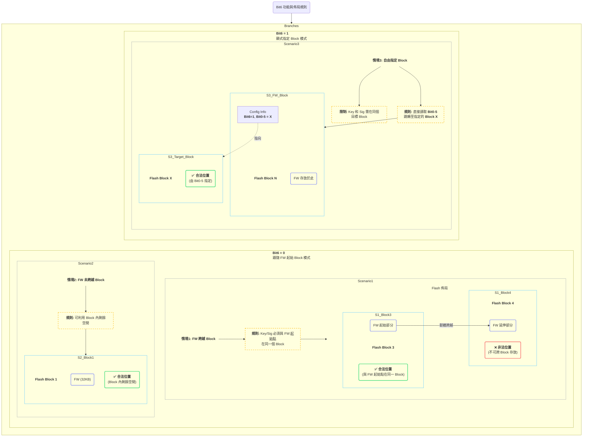
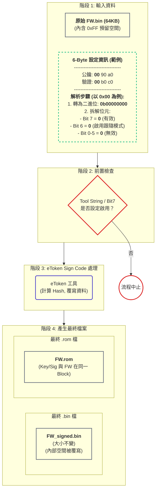
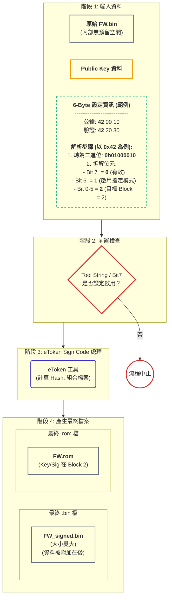

## 1 .適用範圍與演進路徑
> 盲點提醒：後續新 IC 若在 Flash Block 構成或 Bank 切割方式上改動，bit6=0 的「跟隨 FW 起始 Block」規則，可能直接失效，需預留 fallback。
---
## 2. 6-Byte 設定區塊規格
### 2.1. 概覽
為了讓韌體 (FW) 能夠在啟動時驗證公鑰 (Public Key) 和簽名 (Hash+Signature)，我們在 GL Signature 前方定義了一個 6-Byte 的設定區塊 (0xF4-0xF9)。這個區塊的功能是告訴 Boot ROM 在 Flash 中的哪個位置可以找到這兩組關鍵資訊。
此區塊分為兩部分：
- 公鑰位置資訊：前 3 個位元組 (0xF4-0xF6)，用於定義 Public Key 的儲存位置。
- 驗證資訊位置：後 3 個位元組 (0xF7-0xF9)，用於定義驗證資訊 (Hash+Sig) 的儲存位置。
### 2.2. 結構定義 (Structure Definition)
下表詳細定義了 6-Byte 設定區塊中每個位元組和位元欄位的功能。
### 2.3. 邏輯規則圖 (Logical Rules Diagram)
下圖視覺化了公鑰位置資訊 (0xF4-0xF6) 的內部處理邏輯，重點展示了 Bit 7 (總開關) 和 Bit 6 (定位模式) 如何決定其他欄位的有效性。（驗證資訊區塊的邏輯與此完全相同）

```mermaid
%% Code-Sign Info General Rules Diagram (Final Outline Style - 100% Compatible)
flowchart TD
    %% --- Style Definitions (Outline Style for Max Readability) ---
    %% The key is 'fill:transparent' and a thicker 'stroke-width'.
    %% Text will always be on the page background, ensuring contrast.
    classDef field fill:transparent,stroke:#60A5FA,stroke-width:2px
    classDef titleNode fill:transparent,stroke:transparent,font-weight:bold
    classDef decision fill:transparent,stroke:#FBBF24,stroke-width:2.5px
    classDef rule fill:transparent,stroke:#9CA3AF,stroke-width:2px,stroke-dasharray: 5 5
    classDef dependency stroke:#9CA3AF,stroke-width:1.5px,stroke-dasharray: 4 4
    classDef stop fill:transparent,stroke:#F87171,stroke-width:2px

    %% --- Main Container ---
    subgraph PK_Rules
        %% The outer container still has a border but no fill.
        style PK_Rules fill:transparent,stroke:#FCD34D,stroke-width:2px
        
        PK_Rules_Title("<b>Public Key 位置資訊規則 (0xF4-0xF6)</b>")
        B7{"<b>Bit 7:</b><br/>資訊有效旗標 (總開關)"}
        
        %% --- Path for Bit7=1 (Invalid) ---
        Stop["<b>流程結束</b><br/>(後續所有欄位均被忽略)"]
        
        %% --- Path for Bit7=0 (Valid) ---
        B6{"<b>Bit 6:</b><br/>公鑰區塊定位模式"}
        F5["<b>Offset 0xF5:</b><br/>Bank1 Address High Byte<br/><i>(恆定有效)</i>"]
        B05["<b>Bit 0-5:</b><br/>公鑰 Flash Block 編號"]
        F6["<b>Offset 0xF6:</b><br/>Bank2 Address High Byte"]
        Rule_0["<b>規則:</b><br/>- Bit0-5 無效<br/>- 0xF6 (Bank2 Addr) 無效"]

        %% --- Flow Definition ---
        PK_Rules_Title --> B7
        B7 -- "<b>值為 1</b><br/>(無效)" --> Stop
        B7 -- "<b>值為 0</b><br/>(有效)" --> B6
        
        B6 -- "<b>值為 0</b><br/>(跟隨 FW)" --> Rule_0
        Rule_0 --> F5

        B6 -- "<b>值為 1</b><br/>(顯式指定)" --> B05
        B05 --> F5 --> F6
        
        %% --- Dependency Links to show conditional validity ---
        B6 -.->|"當 Bit6=1 時才有效"| B05
        B6 -.->|"當 Bit6=1 時才有效"| F6
    end
    
    %% --- Apply Styles ---
    class B7,B6 decision
    class Stop stop
    class Rule_0 rule
    class B05,F5,F6 field
    class PK_Rules_Title titleNode
    linkStyle 7,8 dependency
```

### 詳細解析
我們以上方的 Hexdump 範例 ... 00 90 a0 00 b0 c0 ... 進行逐步解析。
### 1. Public Key 位置資訊 (黃色區塊 @ 0xF4-0xF6)
- 範例值: 00 90 a0
- Offset 0xF4: PUBLICKEY_INFO_BLOCK
- Offset 0xF5: PUBLICKEY_INFO_BANK1_ADDR_H
- Offset 0xF6: PUBLICKEY_INFO_BANK2_ADDR_H
### 2. 驗證資訊位置 (藍色區塊 @ 0xF7-0xF9)
- 範例值: 00 b0 c0
- 意義: 這三個位元組的結構與邏輯和黃色區塊完全相同，只是它們定義的是「驗證資訊 (Hash+Sig)」的位置。
- 解析:
---
## 3.設計細節與情境問答 (FAQ)
### 3.1核心設計原則
PUBLICKEY_INFO_BLOCK 和 CSVERIFY_INFO_BLOCK 中的 Bit6 是一個關鍵的控制旗標，它決定了系統如何定位公鑰 (Public Key) 和驗證資訊 (Signature) 的儲存區塊 (Flash Block)。這個設計主要為了解決不同 MCU 韌體大小不一，以及是否啟用雙 Bank 升級 (Dual-Bank) 所帶來的靈活性需求。
Bit6 提供了兩種定位模式：
- Bit6 = 0 (簡易模式)：位置隱式關聯。公鑰/簽名所在的 Flash Block 與韌體 (FW) 本身的起始 Block 相同。這是一種簡化的預設行為。
- Bit6 = 1 (專家模式)：位置顯式指定。公鑰/簽名所在的 Flash Block 由 Bit0-5 的值明確指定，與韌體所在的 Block 可以完全無關。
### 3.2情境規則圖 

### 3.3.模式詳解與情境問答
### 模式一：Bit6 = 0 (跟隨 FW 起始 Block)
這種模式下，公鑰和驗證資訊的存放有以下規則和情境：
Q1: 為何要設計 Bit6=0 這種「跟隨模式」？
> A1: 主要是為了簡化處理並限制範圍，特別是考慮到某些 MCU 的韌體可能非常大（例如 MCU2 超過 64KB）。此模式強制規定，即使韌體跨越多個 Flash Block，其對應的公鑰和簽名也必須存放在與韌體起始點相同的那個 Flash Block 內。
Q2: 如果韌體很小，公鑰/簽名可以放在韌體結束後、下一個 Block 開始前的剩餘空間嗎？
> A2: 可以，這是允許的，也是此模式下最靈活的應用場景。 只要公鑰和簽名的位址仍在同一個 Flash Block 內即可。
---
### 模式二：Bit6 = 1 (由 Bit0-5 明確指定)
這種模式給予了最大的自由度，但需要開發者進行更精確的配置。
Q3: Bit6=1 模式下，系統如何讀取資訊？
> A3: 在此模式下，Boot ROM 會完全忽略韌體所在的 Block，而是直接讀取 Bit0-5 的值，將其作為目標 Flash Block 的編號。所有後續的位址計算都以此指定的 Block 為基準。
---
### 3.4關鍵限制總結
1. 單一實體同 Block 原則 (適用 Bit6=1 模式)
1. 不同實體可異地存放
1. 跨 Block 限制 (適用 Bit6=0 模式)
## 4.FW 規劃與工具鏈流程
### 4.1. FW 規劃階段注意事項 (Checklist)
在規劃韌體專案時，為確保 Code-Sign 功能正常運作，務必注意以下關鍵事項：
- 空間規劃
- 升級模式考量
- 外部區塊風險
- 團隊溝通
### 4.2.範例一：Bit6 = 0 模式 (跟隨 FW 起始 Block)
### 核心概念
當 Bit6 設定為 0 時，代表公鑰 (Public Key) 和驗證資訊 (Signature) 的儲存位置與 FW Bin 檔本身緊密綁定。它們必須被「填入」到 Bin 檔內部預先規劃好的特定位移 (Offset) 處。
在生成 ROM 檔時，這些資訊所在的 Flash Block 會自動跟隨其對應的 FW Bank 所在的起始 Block。這是一種簡化的、預設的行為模式，確保了相關資訊總是在同一個 64KB 區塊內。
### EToken Sign Code 流程
下圖展示了在 Bit6=0 模式下，eToken 工具如何處理原始 Bin 檔並產生最終檔案。

### 流程說明與範例結合
現在，我們將上圖的流程與您的具體配置範例結合起來說明：
假設 Hub FW bin config 配置如下:
> FW bin 為 64Kbytes: public key，要放置在 FW bin 裡面，offset 為 0x9000。驗證資訊，要放置在 FW bin 裡面，offset 在 0xB000。
1. 輸入 (Input):
1. 前置檢查:
1. 產生 .bin 檔:
1. 產生 .rom 檔:
### 4.3.範例二：Bit6 = 1 模式 (顯式指定 Block)
### 核心概念
當 Bit6 設定為 1 時，代表公鑰 (Public Key) 和驗證資訊 (Signature) 的儲存位置與 FW Bin 檔本身完全分離。它們不會被填入 Bin 檔內部的預留空間，而是作為獨立的資料塊，由工具鏈（eToken）處理後，附加到檔案的末尾，或放置在 Flash 的指定位置。
這種模式給予了最大的佈局自由度，常用於需要精確控制 Flash 空間，或多個韌體共享同一份公鑰/簽名的場景。
### 工具鏈 (eToken) Sign Code 流程
下圖展示了在 Bit6=1 模式下，eToken 工具如何處理原始 Bin 檔並產生最終檔案。

### 流程說明與範例結合
現在，我們將上圖的流程與您的具體配置範例結合起來說明：
假設 Hub FW bin config 配置如下:
> FW bin 為 64Kbytes: public key，要放置在 FW bin 以外，bank1 offset 為 0x20000，bank2 offset 為 0x21000。驗證資訊，要放置在 FW bin 以外，bank1 offset 在 0x22000，bank2 offset 在 0x23000。
1. 輸入 (Input):
1. 產生 .bin 檔:
1. 產生 .rom 檔 (最關鍵的一步):
## 5. ISP 安全性擴展 (未來規劃)
### 5.1. 關鍵需求與注意事項
為確保 ISP 流程的安全性，特別是在引入「更換公鑰 (Public Key)」功能時，各團隊需遵守以下規則：
- 1. Public Key 的保護 (Protection of Public Key)
- 2. 更換公鑰的獨立流程 (Secure Key-Replacement Flow)
- 3. 合法性驗證機制的強化 (Hardening of Authentication)
### 5.2.建議的「更換公鑰」安全流程圖
下圖是一個建議的安全流程，旨在將「標準 ISP 更新」和高風險的「更換公鑰」操作進行分離。
