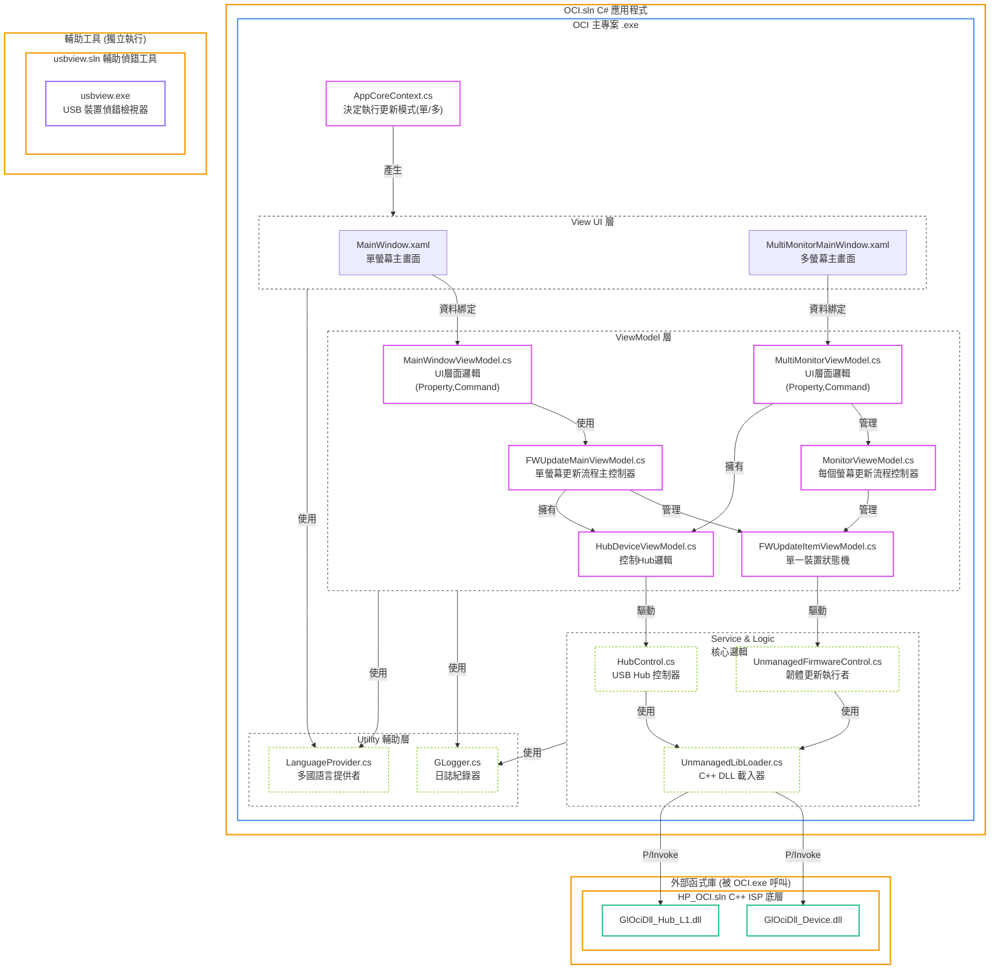
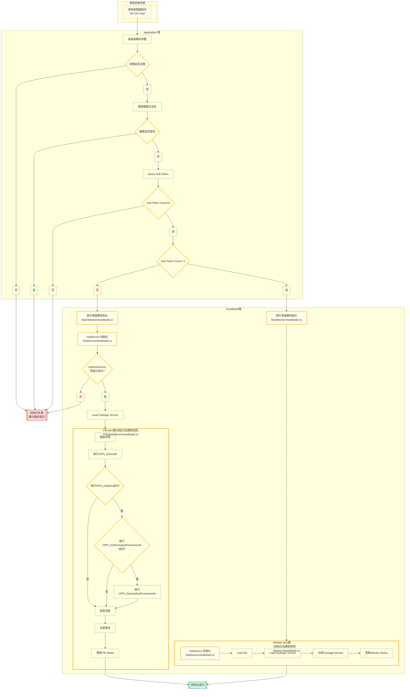
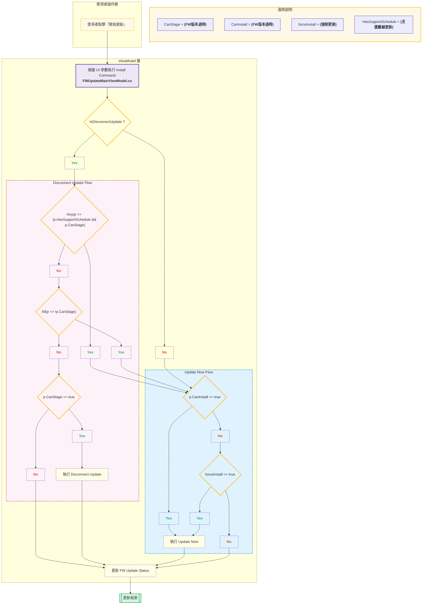
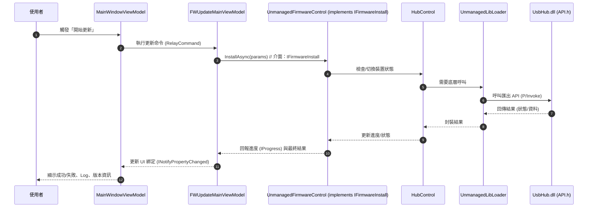

> 文件目標：本報告旨在對HP OCI Tool專案的現行架構進行分析。透過對 C# 原始碼、專案結構及底層 C++ 函式庫的詳細審視，本文將精準地描繪系統的運作方式、設計模式、職責劃分，並從程式碼中提取關鍵證據，以客觀地揭示當前架構的優點與亟待解決的核心痛點。
---
### 1. 宏觀架構：三大解決方案
整個 OCI Tool 生態系由三個獨立的 Visual Studio 解決方案構成，各司其職，形成了一個典型的分層體系。
### 🎨 OCI Tool 內部詳細架構圖 (最終版)
這張圖表詳細描繪了 OCI 專案內部各個關鍵 C# 檔案之間的依賴與呼叫關係。

### OCI Tool 啟動初始化流程圖

### OCI Tool 現行單螢幕韌體更新流程圖

### 📁 OCI.sln - C# 應用程式
---
---
---
1) 專案與層級關係總覽（Dependency Map）

```mermaid
flowchart TB
  %% --- Projects ---
  subgraph P11[專案 1.1：OCI（WPF/MVVM，.exe）]
    direction TB
    subgraph VM[ViewModel 層]
      MainWindowVM[MainWindowViewModel.cs]
      FWMainVM[FWUpdateMainViewModel.cs]
      FWItemVM[FWUpdateItemViewModel.cs]
      HubDevVM[HubDeviceViewModel.cs]
      MonVM[MonitorViewModel.cs]
    end

    subgraph ML[Model & Logic 層]
      UFC[UnmanagedFirmwareControl.cs]
      ULL[UnmanagedLibLoader.cs]
      HubCtl[HubControl.cs]
      FCB[FirmwareControlBuilder.cs]
      Models["資料模型<br/>FirmwareInfo.cs / MonitorInfo.cs / InitParameter.cs"]
    end

    subgraph UT[Utility 層]
      Ctx[AppCoreContext.cs]
      Log[GLogger.cs]
      Lang[LanguageProvider.cs]
      Conv["Converters<br/>ex: StatusConverter.cs"]
    end

    subgraph PI[Presentation / Interface 層]
      VMB[ViewModelBase.cs]
      RC[RelayCommand.cs]
      IFWCtrl[IFirmwareControl.cs]
    end
  end

  subgraph P12[專案 1.2：HP.FirmwareInstall（介面契約庫，.dll）]
    IFWInst[IFirmwareInstall.cs]
    FWVer[FirmwareVersion.cs]
    FWInfo[FirmwareInfo.cs]
  end

  subgraph P13[專案 1.3：UsbHub（C++ 函式庫，.dll）]
    APIh[API.h]
    DLLMain[dllmain.cpp]
  end

  %% --- Key Relations inside OCI ---
  MainWindowVM --> FWMainVM
  FWMainVM --> FWItemVM
  FWMainVM --> HubDevVM
  FWMainVM --> MonVM

  %% Model/Logic wiring
  FWMainVM --> UFC
  UFC --> HubCtl
  HubCtl --> ULL
  ULL --> APIh

  %% Contracts / Models
  UFC -.implements.-> IFWInst
  Models --- FWInfo
  Models --- FWVer

  %% VM base & commands
  MainWindowVM --> VMB
  FWMainVM --> VMB
  FWItemVM --> VMB
  HubDevVM --> VMB
  MonVM --> VMB
  VM -.-> RC

  %% Utilities (dashed to reduce clutter)
  VM -.-> Ctx
  ML -.-> Ctx
  VM -.-> Log
  ML -.-> Log
  VM -.-> Lang
  VM -.-> Conv

  %% Cross-project references
  PI --> IFWInst
  ML --> FWInfo
  ML --> FWVer

  %% --- Styles ---
  classDef vm fill:#FFECB3,stroke:#FF9800,stroke-width:2px,color:#000;
  classDef model fill:#BBDEFB,stroke:#1976D2,stroke-width:2px,color:#000;
  classDef util fill:#C8E6C9,stroke:#388E3C,stroke-width:2px,color:#000;
  classDef iface fill:#E1BEE7,stroke:#8E24AA,stroke-width:2px,color:#000;
  classDef dll fill:#FFCDD2,stroke:#D32F2F,stroke-width:2px,color:#000;

  class MainWindowVM,FWMainVM,FWItemVM,HubDevVM,MonVM vm;
  class UFC,ULL,HubCtl,FCB,Models model;
  class Ctx,Log,Lang,Conv util;
  class VMB,RC,IFWCtrl iface;
  class IFWInst,FWVer,FWInfo dll;
  class APIh,DLLMain dll;

```

2) 韌體更新呼叫流程（High-level Sequence）

### 3. 現況痛點與關鍵證據 (Code-Driven Analysis)
> 以下分析直接來自對原始碼的審視，是推動架構改造的最有力證據。
### 痛點一：職責混雜，UI 與核心業務邏輯緊密耦合
- 現象：OCI 主專案 是一個「萬能」專案，混合了 UI 呈現 (.xaml)、UI 邏輯 (ViewModel) 和核心業務邏輯 (Model)。
- 證據：FWUpdateMainViewModel.cs 直接建立並驅動 UnmanagedFirmwareControl.cs。這意味著任何 UI 流程的變更，都可能直接影響到核心的韌體更新邏輯，反之亦然。
- 結論：缺乏一個清晰的「抽象層」，導致可維護性與可測試性下降。
### 痛點二：硬式編碼 (Hard-coded) 的流程引擎
- 現象：韌體更新的步驟、順序和條件判斷，是被寫死在 C# 程式碼中的。
- 證據：OCI/Utility/Flow/ 目錄下存在一系列 Step.cs 檔案（如 InitiStep.cs, InstalledVersionStep.cs）。這表明開發者已意識到需要將流程「步驟化」，但這些步驟的調度邏輯依然是 C# 程式碼。
- 結論：任何流程的調整（例如增加一個檢查步驟、修改重試策略）都必須修改程式碼並重新編譯發佈，缺乏靈活性，無法快速應對需求變更。
### 痛點三：契約版本化策略的缺失與介面碎片化
- 現象：當需要為韌體更新功能增加新能力時，現有架構缺乏優雅的擴充方式。
- 證據：HP.FirmwareInstall 專案中，除了基礎的 IFirmwareInstall.cs，還被迫額外建立了 IFirmwareInstall20.cs 和 IFirmwareInstall22.cs。
- 結論：這是最典型的因缺乏版本化介面策略而導致的「介面碎片化」。每次新增功能都可能需要建立一個全新的、不相容的介面，導致呼叫端邏輯變得複雜。這為引入 Engine Facade 和 IBurnEngineV1, V2 這種版本化介面設計提供了強力的動機。
