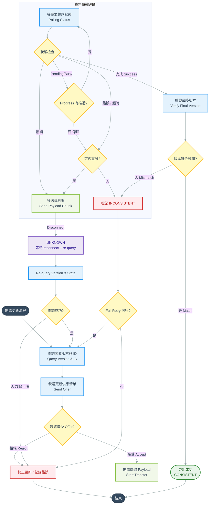

> Scope：以 **CFU Host（Zephyr / Linux）為核心**

目標：支援更新 Hub（Primary）及其內部 PD / Scaler（Subcomponents）

> 

> **文件狀態**：Rev 2（治理強化版）

> **Behavior Authority**：Linux fwupd 為 Reference Implementation

> **Normative Level**：本文件中「MUST / MUST NOT / SHOULD / MAY」遵循 RFC 2119 語意

---

# 0. Glossary & Normative Definitions

本章節為全文件術語的**權威定義**。任何章節出現以下術語時，均以此處定義為準。

## 0.1 角色術語

| 術語 | 定義 | 實例 |

| CFU Host | 發起 CFU transaction 的一方，執行 firmware 傳輸與 retry 邏輯。對 Device 內部結構保持不可知（device-agnostic） | Linux fwupd / Zephyr CFU Engine |

| CFU Device | 接收 CFU transaction 的一方。Host 視角中唯一的對話對象 | USB Hub（Primary Component） |

| Primary Component | Device 中負責 orchestration 的角色。擁有 multi-component 一致性責任 | Hub FW |

| Subcomponent | 由 Primary 代理更新的次要元件。Host 不直接看見 | PD Controller、Scaler |

| Component ID | Device 回報的識別碼。對 Host 而言為 opaque token | 由 Device 定義的 byte 值 |

| Reference Host | 被指定為行為標準的 Host 實作 | Linux fwupd（本專案） |

| Behavior Replica | 必須複製 Reference Host 行為的實作 | Zephyr CFU Host |

| Golden Trace | Reference Host 執行成功後擷取的 protocol-level 封包序列，作為 Replica 驗證基準 | USB HID packet capture |

## 0.2 Host 狀態機定義

Host 狀態機共 4 個狀態，每個狀態均定義**進入條件**與**離開條件**。

| 狀態 | 進入條件 | 離開條件 | Host 行為 |

| CONSISTENT | (1) Device 回報 transaction 完成 AND (2) 最終版本查詢結果符合 Offer 中宣告的版本 AND (3) 無 pending retry | 啟動新 transaction | 回報 success；結束流程 |

| IN_PROGRESS | Device 回報 BUSY / PENDING / ACK 但未完成 | (a) 收到 SUCCESS → CONSISTENT (b) 收到 error → INCONSISTENT (c) stall 超過 threshold → INCONSISTENT (d) disconnect → UNKNOWN | 依 progress-based flow control 等待；不得 abort |

| INCONSISTENT | (1) Device 明確回報失敗 OR (2) version mismatch OR (3) progress stall 超時 OR (4) chunk retry 達上限 | (a) full transaction retry 成功 → CONSISTENT (b) retry 上限達到 → 終止並回報錯誤 | 執行 full transaction retry（re-send full package） |

| UNKNOWN | (1) Transport disconnect OR (2) Host 自身 reboot 後重新連線 OR (3) 無回應且超過 global timeout | (a) re-query 後得到明確狀態 → 對應狀態 (b) re-query 失敗超過 N 次 → 終止 | 等待 reconnect → re-query version → 依查詢結果轉移狀態 |

## 0.3 Device 回應碼語意

Host 必須正確辨識以下 Device 回應類別。實際 byte 編碼依 CFU spec / Hub FW 實作定義，Host 僅依**語意類別**進行狀態轉移。

| 語意類別 | 含義 | Host 應觸發 |

| ACCEPT | Device 接受 Offer，準備接收 payload | 進入 payload transmission |

| REJECT | Device 拒絕 Offer（版本不符 / 不支援 / policy 限制） | 不 retry；回報終止 |

| BUSY | Device 忙碌（flash write / I²C 傳輸中） | 進入 IN_PROGRESS；啟動 progress monitor |

| PENDING | Device 已接收但處理未完成 | 同 BUSY |

| PARTIAL_SUCCESS | 部分 subcomponent 成功、部分失敗（由 Primary 聚合回報） | 視為 INCONSISTENT；full retry |

| SUCCESS | Transaction 完成 | 進入 verification 階段 |

| INCONSISTENT | Device 主動回報內部狀態不一致 | 執行 full transaction retry |

| TIMEOUT（Host 推斷） | 超過 timeout 無回應 | 依 retry policy 處理 |

## 0.4 判定原則（Host 邊界守則）

當新情境未被明確列舉時，以下兩條原則為 Host 行為的判定依據：

1. **結構不可知原則**：若某行為需要 Host 知道 Device 內部結構（subcomponent 數量、類型、拓樸），則 Host MUST NOT 實作該行為，應交由 Primary 處理。

1. **跨交易無狀態原則**：若某行為需要 Host 在多個 transaction 之間維持 Device 語意狀態（而非 transport 狀態），則 Host MUST NOT 實作該行為，應由 Device 持久化。

---

# 1. 系統角色定義

## 1.1 角色鏈

```plain text
CFU Host（Linux / Zephyr）
    ↓
CFU Device（Hub / Primary Component）
    ↓
Subcomponents（PD / Scaler）
```

## 1.2 關鍵責任分配

| 元件 | 責任 | Failure Ownership |

| CFU Host | 發起 transaction、傳輸 firmware、管理 retry、維護 Host-side 狀態機 | Transport-level 錯誤；Host 狀態機錯誤 |

| Hub FW（Primary） | 決定 accept/reject、執行 orchestration、聚合 subcomponent 狀態、持久化 INCONSISTENT 狀態 | Orchestration 錯誤；一致性錯誤；idempotency 違反 |

| Subcomponents | 接收並應用 firmware | Flash write 錯誤；自身版本錯誤 |

| Transport（USB HID / I²C） | 封包傳輸 | Framing / enumeration / reconnect 問題 |

## ⚠️ 關鍵邊界

👉 Host **MUST NOT 假設 PD / Scaler 存在**

👉 Host 的唯一觀點：

```plain text
我只在跟一個 CFU device 溝通
```

👉 所有 multi-component 邏輯：

```plain text
完全由 Hub FW 負責
```

---

# 2. Host 設計核心

## 2.1 Host 的設計目標

Host 必須滿足：

- protocol compliant

- transport resilient

- device-agnostic（不可依賴 Hub internal 行為）

## 2.2 Host 不應做的事情（強制）

Host MUST NOT：

- 解讀 Component ID 的語意（視為 opaque token）

- 理解或推論子組件（PD / Scaler）存在

- 控制更新順序

- 聚合 multi-component 狀態

- 假設 Device 具備 atomic update 能力

### 判定原則（覆蓋未列舉情境）

> 若某行為違反 §0.4 的「結構不可知」或「跨交易無狀態」任一原則，即屬禁止範圍。

### 設計原則

> Host 負責傳輸與重試；Device 負責決策與一致性。

---

## 2.3 Host Behavior Authority Model

為確保跨平台（Linux / Zephyr）一致性，定義以下原則：

### Behavior Authority

- **Linux（fwupd）為 Reference Implementation（行為標準）**

- **Zephyr Host 為 Behavior Replica（必須遵循）**

### 規則

1. Zephyr MUST 複製 Linux 的 CFU transaction 行為

1. Zephyr MUST NOT 重新設計 state machine

1. Zephyr MUST NOT 改變 retry / timeout 語意

1. Zephyr MUST NOT 簡化 error handling

### 允許差異（non-normative）

- Transport implementation

- Timing jitter（在 §A 定義的容忍範圍內）

- Log detail level

### 禁止差異（normative）

- Transaction flow

- Retry policy

- Status handling

- Recovery behavior

### 驗證機制（落地規範）

Behavior Authority 不是宣告，而是可執行的治理合約。下列機制為 MUST：

| 機制 | 要求 |

| Golden Trace Diff | 每次 Zephyr CFU Engine 變更，MUST 提交與 Linux Reference 的封包比對結果（見 §10.2） |

| Reference Owner Veto | Reference Host 的維護者（fwupd plugin owner）對 Replica 變更具 veto 權 |

| Diff Tolerance 定義 | 必須明確區分「允許差異」（timing jitter）與「禁止差異」（transaction flow）。見 §10.2.2 |

| Review Cadence | 每季至少一次 cross-platform behavior audit |

---

# 3. Linux vs Zephyr 責任分配

## 3.1 CFU Host Responsibility Matrix

每層表格新增 **Failure Ownership** 欄位，用於 bug triage 時責任歸屬。

### Layer 0：Package / Policy

| 功能 | Linux | Zephyr | Failure Ownership |

| Package parsing | ✅ 主責 | ❌ 不做 | Linux / Build toolchain |

| Component ID mapping | ✅ 定義 | ❌ 不理解 | Linux / Package author |

| Version policy | ✅ 定義 | ❌ 不做 | Linux / Product policy |

| Dependency policy | ✅ 定義 | ❌ 不做 | Linux / Package author |

👉 Zephyr 不應該理解 package 結構。所有 metadata 解讀應由 Linux / build-time 工具完成。

### Layer 1：CFU Host Engine

| 功能 | Linux | Zephyr | Failure Ownership |

| Offer 發送 | ✅ | ✅ | Host implementation |

| Payload chunking | ✅ | ✅ | Host implementation |

| Retry / timeout | ✅ | ✅ | Host implementation |

| Status polling | ✅ | ✅ | Host implementation |

| State machine | ✅（reference） | ✅（必須一致） | Linux（定義） / Zephyr（實作） |

👉 Zephyr MUST 複製 Linux 的 state machine 語意，不可自行簡化。

### Layer 2：Transport Layer

| 功能 | Linux | Zephyr | Failure Ownership |

| USB stack | Kernel | Zephyr USB | Linux：Kernel team / Zephyr：CFU Host team |

| HID handling | 成熟 | ⚠️ 需自行補強 | Linux：Kernel / Zephyr：CFU Host team |

| reconnect | Kernel 處理 | ❌ 需自己做 | Linux：Kernel / Zephyr：CFU Host team |

| error recovery | Kernel + fwupd | ❌ 需自己做 | Linux：Kernel + fwupd / Zephyr：CFU Host team |

👉 Zephyr 最大風險在這一層；Linux 可視為 ground truth。

### Layer 3：Flow Control / Busy Handling

| 功能 | Linux | Zephyr | Failure Ownership |

| Busy handling | 部分有 | ❌ 必須實作 | Host implementation |

| Progress monitor | 部分有 | ❌ 必須實作 | Host implementation |

| Stall detection | 不完整 | ❌ 必須強化 | Host implementation |

| Long wait tolerance | 基本 | ❌ 必須強化 | Host implementation |

### Layer 4：Recovery / Retry Strategy

| 功能 | Linux | Zephyr | Failure Ownership |

| Retry policy | 基本 | ❌ 必須強化 | Host implementation |

| Idempotent retry | 未保證 | ❌ 必須支援 | Host（發起） + Hub FW（接受）共同負責，見 §6.5 |

| Inconsistent recovery | 不完整 | ❌ 必須實作 | Host + Hub FW |

### Layer 5：Debug / Observability

| 功能 | Linux | Zephyr | Failure Ownership |

| full log | ✅ | ⚠️ 簡化版 | Host implementation |

| packet capture | ✅ | ❌ | External tooling（USB analyzer） |

| hex trace | ✅ | ⚠️ 建議加入 | Host implementation |

| replay capability | ✅ | ❌ | External tooling |

---

# 4. Host CFU Engine 設計

## 4.1 Transaction Flow



---

## 4.2 Host 必須實作的功能

### (A) Offer Management

- 建立 offer metadata

- 支援多版本 image

- 支援 downgrade policy（可選）

### (B) Payload Transmission

- chunking（依 transport）

- sequence control

- integrity check（host-side）

### (C) Retry / Timeout

- configurable timeout（參數見 §A Timing Parameters Reference）

- exponential backoff

- retry 上限

### (D) Status Handling

- polling interval

- status decode

- error mapping

---

## ⚠️ Host 必須容忍

Device 回報：

- delay

- busy

- inconsistent state

- partial failure

---

# 5. Transport 與 Flow Control（Host 視角）

## 5.1 USB HID（主要）

Host 必須處理：

- report framing

- device reconnect

- enumeration

- HID report size 限制

---

## ⚠️ 關鍵風險

```plain text
USB = streaming
Device = 可能 blocking（flash / I²C）
```

👉 Host 必須：

- 支援 timeout（參數見 §A）

- 支援 retry

- 不假設即時回應

---

## 5.2 Progress-based Flow Control（強制）

當 Device 回報 `BUSY` 或 `IN_PROGRESS` 時：

```plain text
if progress increasing:
    continue waiting（up to LongWaitMax, see §A）
else if progress stalled > ProgressStallThreshold:
    treat as timeout → enter INCONSISTENT
```

### 設計要求

- Host MUST 實作 progress monitoring

- Host MUST NOT 因 BUSY 直接 abort

- Host MUST 支援長時間 blocking（預設 ≥ 60 秒，見 §A LongWaitMax）

### 風險

若未實作此機制，可能導致：

- 誤判 timeout

- 重複傳輸 payload

- flash corruption

- duplicate write

---

# 6. Atomicity 與狀態模型（Host 視角）

## 6.1 Host Atomicity Model

```plain text
SUCCESS:
- Device 回報完成
- Version 符合預期
- System 回到 CONSISTENT

FAILURE:
- 任一階段錯誤
- 或 version 不一致
- 或 system 進入 INCONSISTENT

UNKNOWN:
- timeout / disconnect
```

👉 Host 不應假設多 component strict atomicity。

👉 本設計採用：

```plain text
Atomic Illusion + Recoverability
```

---

## 6.2 狀態模型（Host）

Host 必須處理以下 4 種狀態，完整定義見 §0.2：

```plain text
CONSISTENT
IN_PROGRESS
INCONSISTENT
UNKNOWN
```

## 6.3 Host 行為規則

| 狀態 | Host 行為 |

| CONSISTENT | success |

| IN_PROGRESS | wait / retry（progress monitor） |

| INCONSISTENT | retry full transaction（見 §6.5） |

| UNKNOWN | reconnect + re-query（見 §4.1 流程圖） |

---

## 6.4 Persistent State Requirement（Device 端前提）

由於 CFU 協議本質上是 stateless，Device 必須持久化至少以下狀態：

- 更新進行中（IN_PROGRESS）

- 不一致狀態（INCONSISTENT）

### 原因

- reboot 後 Host 無法知道先前 transaction 的中間狀態

- Device 必須能在重新連線後回報真實一致性

### Host 行為

當 Host 偵測到：

- version mismatch

- inconsistent state

- aggregate state 與預期不符

應執行：

```plain text
re-send full package
```

前提：Device orchestration 必須具備 idempotency（見 §6.5）。

---

## 6.5 Idempotency Contract（新增 / 關鍵）

由於 §6.4 要求 Host 可執行 `re-send full package`，以下定義 Host 與 Device 之間關於冪等性的契約。**此章節為本文件最核心的實作契約，實作前必須確認讀懂。**

### 6.5.1 三層冪等語意

Host 的 retry 在不同層級具有不同的冪等要求：

| 層級 | 冪等要求 | Device 必須保證 | Host 可採取 |

| L1：Chunk level | 同一 sequence 的 chunk 被重送時，Device MUST 幂等處理（接受並回覆成功，但 flash 僅寫入一次） | 以 sequence number 為去重鍵 | 無上限 chunk retry（受 §A MaxChunkRetry 限制） |

| L2：Transaction level | 同一 Offer 被重送時，Device MUST 能識別為「同一次交易的續作」或「全新交易」，並作出一致處置 | 以 Offer ID / session token 為識別；持久化 INCONSISTENT state | Full retry（Host reboot 後亦可） |

| L3：Package level | 同一 package 被完整重送時（例如 Host 換機後），Device MUST 依自身版本與 INCONSISTENT 標記決定是否接受 | 比對目前版本與 package 宣告版本；考量 downgrade policy | `re-send full package` |

### 6.5.2 切換條件（Host 端決策邏輯）

Host 在 retry 時應依下表決定使用哪一層級：

| 觸發情境 | 使用層級 | 理由 |

| Transport error（HID NAK / USB retry） | L1 Chunk | Device 狀態未受影響 |

| Chunk ACK timeout，但連線仍在 | L1 Chunk（MaxChunkRetry 次內）→ 失敗後升級 L2 | 先假設 chunk 遺失，仍在同一 transaction |

| Chunk retry 達上限 | L2 Transaction | 目前 transaction 判定失敗 |

| Disconnect + reconnect | L2 Transaction（先 re-query，若 Device 狀態仍為 IN_PROGRESS）或 L3 Package（若狀態為 INCONSISTENT 或 UNKNOWN） | 連線層中斷需重新對齊狀態 |

| Host reboot | L3 Package | Host 已失去所有 in-memory 狀態 |

| Version mismatch（驗證階段） | L3 Package（一次機會） | 代表前一次 transaction 的最終結果不可信 |

### 6.5.3 Device 端前提（供 Hub FW team 參照）

若下列任一條件不成立，Host 的 retry 邏輯 MUST 退化為保守模式（每次失敗即 abort，不自動 retry）：

1. Device MUST 對同一 sequence number 的 chunk 去重

1. Device MUST 持久化 `IN_PROGRESS` / `INCONSISTENT` 狀態，跨 reboot 存活

1. Device MUST 在 `re-query` 時回報真實一致性（不得回報過時版本）

1. Device orchestration MUST 對 L2 / L3 retry 具冪等性（重複成功的 transaction 不得破壞已完成的 subcomponent）

### 6.5.4 未定義行為（Open）

以下行為目前**未在本契約定義**，實作前 MUST 與 Hub FW team 確認：

- 跨 Host 實作的 retry（Linux 起的 transaction，Zephyr 接續完成）是否支援？

- 同一 Device 同時被兩個 Host 連線時的 session 隔離策略？

---

# 7. Error Model（Host）

## 7.1 Error 分類

| 類型 | 說明 |

| Transport Error | USB / HID 問題 |

| Protocol Error | CFU message invalid |

| Device Reject | 不接受更新 |

| Timeout | 無回應 |

| Version Mismatch | 更新後版本不符 |

| Inconsistent State | Device 內部狀態不一致 |

---

## 7.2 Retry Strategy

```plain text
Transport Error   → L1 chunk retry
Timeout           → L1 chunk retry（有限次，含 progress 監控）→ 升級 L2
Reject            → 不 retry
Version mismatch  → fail + L3 package retry（一次）
Inconsistent      → L2 full transaction retry
```

完整層級語意見 §6.5。

---

# 8. Zephyr CFU Host 特別設計

## 8.1 必須補齊的能力

### (A) USB Host Stack

- enumeration

- HID support

- reconnect

- error recovery

👉 ⚠️ Zephyr 此處不成熟，屬最大風險。建議參考版本與 sample 見 §13 Open Questions。

### (B) CFU Engine（需自行實作）

- state machine（§0.2 定義）

- chunking

- retry logic（§6.5 契約）

- status decode（§0.3 語意）

### (C) 非阻塞設計

- non-blocking loop

- async event

- watchdog

- event-driven state transition

建議模式：

```plain text
send_chunk → return immediately
wait_event → status / timeout
```

可考慮使用：

- `k_poll`

- event flags

- work queue + async callback

---

## 8.2 必須避免的錯誤

❌ blocking send

❌ 固定 timeout（MUST 依 §A 參數化）

❌ 假設 device 即時回應

❌ 將 Linux 與 Zephyr 寫成兩套語意不同的 host

---

# 9. Linux（fwupd）角色

## ✔ Linux 的角色

👉 **Reference Host / Behavior Authority**

用途：

- 驗證 CFU 行為

- 建立 baseline

- 產生 golden trace

- 測試 FW / Hub orchestration

---

## ❌ Linux 不是

- MCU solution

- Zephyr 替代品

- 最終 embedded runtime

---

# 10. Debug 與驗證策略（Host 視角）

## 10.1 Debug 分類

### Case A：Linux OK，Zephyr NG

懷疑：

- USB host stack

- HID implementation

- timing mismatch

- event-driven state machine

### Case B：全部 NG

懷疑：

- Hub FW

- offer parsing

- version logic

- component orchestration

### Case C：成功但版本錯

懷疑：

- device orchestration

- version reporting

- aggregation state

### Case D：timeout / disconnect

懷疑：

- device busy（flash / I²C）

- host timeout 設定錯

- reconnect recovery 缺失

### Case E：Device Busy 連鎖反應

情境：

```plain text
Device flash → stall → USB timeout → host retry
```

解法：

- host 增加容忍時間

- progress-based monitoring

- device non-blocking

---

## 10.2 Protocol Trace Verification

### 10.2.1 標準流程

1. 使用 Linux fwupd 執行 update

1. 使用 USB analyzer / Wireshark capture 封包

1. 建立 golden trace

1. Zephyr 執行相同流程

1. 進行 hex-level 比對

用途：

- 驗證 HID framing

- 驗證 report ID / 長度

- 驗證 timing

- 快速定位是 transport 問題還是 protocol 問題

### 10.2.2 Diff Tolerance（Golden Trace 比對容忍規範）

比對時將封包差異分為三類：

| 類別 | 差異項目 | 處置 |

| 允許（Acceptable） | Inter-packet timing（± 容忍範圍，見 §A） | 不算違反 |

| 允許（Acceptable） | Log 格式差異 | 不比對 |

| 需 review | Retry 次數差異 | 需 Reference Owner 審查 |

| 需 review | Polling interval 差異 | 需 Reference Owner 審查 |

| 禁止（Blocking） | Transaction 順序差異 | MUST 修正 |

| 禁止（Blocking） | Payload 內容差異 | MUST 修正 |

| 禁止（Blocking） | Status decode 結果差異 | MUST 修正 |

| 禁止（Blocking） | State transition 差異 | MUST 修正 |

### 10.2.3 Golden Trace Registry（管理規範）

Golden trace 並非單一檔案，而是一個 registry。

**命名規則**：

```plain text
golden_trace__<hub_fw_version>__<cfu_spec_version>__<transport>__<scenario>.pcap
例：golden_trace__hubfw_1.2.3__cfu_1.0__usbhid__update_primary_only.pcap
```

**Applicable Range（每份 trace 必附 metadata）**：

- Hub FW 版本範圍（e.g. `>= 1.2.0, < 1.3.0`）

- CFU spec 版本

- 適用 subcomponent 組合（e.g. `primary_only` / `primary+pd` / `primary+pd+scaler`）

- 產生日期與 Reference Host 版本

**失效條件**：

- Hub FW major 版本升級 → 全部 trace MUST 重新產生

- Hub FW minor 版本升級 → 相關 scenario trace 需重新驗證

- CFU spec 變更 → 全部 trace 重新產生

**儲存位置**：建議版本控管於專案 `traces/` 目錄或獨立 repo。

---

# 11. Implementation Roadmap（Host 導向）

## Phase 1：Linux 驗證

- fwupd update 成功

- log / trace 完整

- 建立 golden trace（依 §10.2.3 registry 規範）

## Phase 2：Hub FW

- accept / reject

- orchestration

- status aggregation

- persistent state（§6.4）

- idempotent retry behavior（§6.5.3 全部條件）

## Phase 2.5：Mock Device Phase

目的：在 Zephyr 實作前先驗證 Host 行為。

內容：

- 模擬 Device 回應：

  - BUSY
  
  - REJECT
  
  - PARTIAL SUCCESS
  
  - TIMEOUT
  
  - INCONSISTENT

- 不傳實際 firmware

驗證：

- Retry 行為（L1 / L2 / L3 切換）

- Flow control

- Error handling

- State machine 正確性

### Mock Device Exit Criteria（避免 Mock-Real 落差）

Mock Device 通過以下條件才能視為有效基準：

1. Mock 回應語意 MUST 由 Hub FW team 簽署，確認與真實 FW 的 observable behavior 一致

1. Mock MUST 覆蓋 §0.3 所有回應類別

1. Mock MUST 能模擬 §6.5.3 中 Device 端前提的「不滿足」情境（用於測 Host 的保守模式退化）

1. Host 在 Mock 上通過後，MUST 再跑一次真機 smoke test 才能推進 Phase 3

👉 此 Phase 為必要，不可省略。

## Phase 3：Zephyr Host

- USB host bring-up

- HID support

- CFU engine

- event-driven state machine

- long-wait / progress monitor

---

## ⚠️ 關鍵順序不可顛倒

👉 不可直接從 Zephyr 開始。

---

# 12. 最後總結

👉 Host 做的事情：

```plain text
傳輸 + 容錯 + retry + recovery trigger
```

👉 Hub 做的事情：

```plain text
決策 + orchestration + aggregation + consistency ownership
```

👉 Linux 的角色：

```plain text
定義什麼是正確
```

👉 Zephyr 的角色：

```plain text
在不穩環境下仍然做到正確
```

---

## 核心結論

這份設計不是在讓 Host 變聰明，而是在讓 Host：

- 保持抽象

- 保持可攜

- 保持一致

- 在 Device 行為不確定時仍能安全完成 transaction

---

# 13. Open Questions & Known Limitations（新增）

本章節記錄目前尚未解決的問題，供後續迭代追蹤。**誠實揭露未知比假裝完備更重要。**

## 13.1 Architectural Open Questions

| 編號 | 問題 | 影響 | 負責釐清 |

| OQ-1 | PD / Scaler 同時更新時，Hub FW orchestration 是否支援並行？若支援，聚合狀態的時序語意為何？ | 影響 Host timeout 預估與 progress monitor 閾值 | Hub FW team |

| OQ-2 | USB reconnect 後，Device 是否允許 chunk-level 續傳，或一律 full package retry？ | 影響 §6.5 L2 / L3 切換邊界 | Hub FW team + Host team |

| OQ-3 | 跨 Host 實作 retry（Linux 起 → Zephyr 續）是否為支援情境？ | 影響 session token 設計 | 產品決策 |

| OQ-4 | 同一 Device 同時被兩個 Host 連線時的隔離策略？ | 影響 multi-host 場景 | 產品決策 + Hub FW |

| OQ-5 | Downgrade policy 由 Host 或 Device 決定？兩者衝突時以何者為準？ | 影響 Offer 拒絕語意 | 產品決策 |

## 13.2 Zephyr 技術風險

| 項目 | 當前狀態 | 風險 |

| Zephyr USB Host Stack 成熟度 | 需確認目前使用的 Zephyr 版本與 Kconfig 組合是否足以支撐 HID + reconnect | 可能導致 Phase 3 大幅延期 |

| HID report 大小限制 | Zephyr USB HID sample 是否支援 CFU 所需的 report size 尚未驗證 | 可能需 patch Zephyr stack |

| Watchdog 整合 | 長 wait（>60s）與 watchdog 的互動尚未設計 | 可能誤觸 system reset |

## 13.3 Known Limitations

1. 本文件僅涵蓋 USB HID transport；I²C transport 細節待獨立文件補充。

1. 本文件未處理 CFU Host 自身的 firmware 更新情境（self-update）。

1. Security（簽章驗證、rollback protection）不在本文件範圍，由獨立 security 文件涵蓋。

---

# Appendix A：Timing Parameters Reference

以下為 Host 實作的 timing 參數建議值。所有數值 MUST 為 configurable，且 Linux 與 Zephyr MUST 使用相同預設值以確保行為一致。

| 參數 | 建議預設 | 最小值 | 最大值 | 可調整層級 | 說明 |

| OfferTimeout | 3 s | 1 s | 10 s | Host config | 發送 Offer 後等待 accept/reject 的上限 |

| ChunkAckTimeout | 2 s | 500 ms | 10 s | Host config | 單一 chunk 發送後等待 ACK 的上限 |

| StatusPollInterval | 100 ms | 50 ms | 1 s | Host config | IN_PROGRESS 時的輪詢週期 |

| BusyStallThreshold | 10 s | 3 s | 60 s | Host config | Progress 未推進視為 stall 的門檻 |

| ProgressStallThreshold | 同上 | — | — | — | BusyStallThreshold 的別名 |

| LongWaitMax | 120 s | 60 s | 300 s | Host config | 單一 BUSY 階段容忍的最長等待（即使 progress 有推進亦有硬上限） |

| MaxChunkRetry | 3 | 1 | 10 | Host config | 單一 chunk 的 L1 retry 上限 |

| MaxTransactionRetry | 2 | 0 | 5 | Host config | L2 full transaction retry 上限 |

| MaxPackageRetry | 1 | 0 | 3 | Host / User policy | L3 package retry 上限 |

| RetryBackoffInitial | 500 ms | 100 ms | 5 s | Host config | Exponential backoff 起始值 |

| RetryBackoffMax | 5 s | 1 s | 30 s | Host config | Exponential backoff 上限 |

| ReconnectTimeout | 30 s | 5 s | 120 s | Host config | Disconnect 後等待重新連線的上限 |

| ReQueryMaxAttempts | 3 | 1 | 10 | Host config | UNKNOWN 狀態下 re-query 的上限 |

| TraceTimingTolerance | ± 20% | ± 5% | ± 50% | Verification config | Golden trace diff 的 timing 容忍（見 §10.2.2） |

**預設值調整原則**：

- 預設值以「真機實測穩定值 × 1.5 安全係數」設定

- 正式調整前 MUST 在 Mock Device 與真機各跑一輪迴歸

- 跨平台（Linux / Zephyr）的預設值 MUST 保持一致，不允許為了簡化而在 Zephyr 使用不同數值

```mermaid
%%{init: { 'theme': 'base', 'themeVariables': { 'primaryTextColor': '#2c3e50', 'lineColor': '#95a5a6', 'fontSize': '15px'}}}%%
flowchart TD

    %% ==========================================
    %% 樣式定義
    %% ==========================================
    classDef layerBox fill:#ffffff,stroke:#7f8c8d,stroke-width:2px,stroke-dasharray: 5 5,rx:10,ry:10;
    classDef L0_style fill:#e8eaf6,stroke:#3f51b5,stroke-width:2px;
    classDef L1_style fill:#e3f2fd,stroke:#2196f3,stroke-width:2px;
    classDef L2_style fill:#f1f8e9,stroke:#8bc34a,stroke-width:2px;
    classDef L3_style fill:#fff3e0,stroke:#ff9800,stroke-width:2px;
    classDef L4_style fill:#f3e5f5,stroke:#9c27b0,stroke-width:2px;
    classDef L5_style fill:#eceff1,stroke:#607d8b,stroke-width:2px;

    %% ==========================================
    %% 流程主體
    %% ==========================================

    subgraph L0_Group ["層級 0：更新策略層"]
        A[" 
        <b>【 L0: Update Package & Policy 】</b><br/>
        🎯 責任：準備 Image / Offer、驗證相依性<br/>
        ⚠️ 問題：ID 不匹配、版本策略錯誤、送錯 Image
        "]:::L0_style
    end

    subgraph L1_Group ["層級 1：主機引擎層"]
        B["
        <b>【 L1: Host CFU Engine 】</b><br/>
        🎯 責任：狀態機驅動、Chunk 分塊發送、Retry 處理<br/>
        ⚠️ 問題：Timeout 行為不一、狀態碼解析錯誤
        "]:::L1_style
    end

    subgraph L2_Group ["層級 2：傳輸層"]
        C["
        <b>【 L2: Transport Layer 】</b><br/>
        🎯 責任：HID 封裝、Bus Reset 處理、Report Framing<br/>
        ⚠️ 問題：Session 遺失、封包順序錯置、格式不對
        "]:::L2_style
    end

    subgraph L3_Group ["層級 3：Hub 主裝置層"]
        D["
        <b>【 L3: Hub CFU Device FW 】</b><br/>
        🎯 責任：解析 Offer、寫入 Staging Flash、回報狀態<br/>
        ⚠️ 問題：Accept Policy 錯誤、Flash 寫入死鎖
        "]:::L3_style
    end

    subgraph L4_Group ["層級 4：內部編排層"]
        E["
        <b>【 L4: Hub Orchestration 】</b><br/>
        🎯 責任：跨組件調度 (PD/Scaler)、I2C 代理、回滾<br/>
        ⚠️ 問題：部分成功/部分失敗、狀態未聚合、Rollback 不完全
        "]:::L4_style
    end

    subgraph L5_Group ["層級 5：子組件端"]
        F["
        <b>【 L5: Subcomponent FW 】</b><br/>
        🎯 責任：執行自燒錄、重啟自檢、回報結果<br/>
        ⚠️ 問題：I2C Protocol Timeout、Image 格式不符
        "]:::L5_style
    end

    %% ==========================================
    %% 連線 (增加長度以防截斷)
    %% ==========================================
    A ===> B
    B ===> C
    C ===> D
    D ===> E
    E ===> F

    %% 應用背景框樣式
    L0_Group:::layerBox
    L1_Group:::layerBox
    L2_Group:::layerBox
    L3_Group:::layerBox
    L4_Group:::layerBox
    L5_Group:::layerBox
```


