文件概述
本文件提供對 C# WPF 韌體更新工具的詳細分析。內容涵蓋其分層的系統架構，以及從啟動到完成更新的完整執行流程。旨在清晰地呈現應用程式的內部運作原理與設計思想。
1. 系統架構圖 (Architecture Diagram)
這個圖表展示了應用程式的幾個核心組件以及它們之間的相互關係。

```mermaid
graph TD
    %% -------------------------------------------
    %% --- 1. 定義節點樣式 (Class Definitions) ---
    %% -------------------------------------------
    %% 使用者/外部元件的樣式
    classDef userNode fill:#F3E8FF,stroke:#9333EA
    classDef externalNode fill:#E0E7FF,stroke:#4F46E5
    %% 應用程式與核心邏輯層的樣式
    classDef appLayerNode fill:#FEF9C3,stroke:#D97706
    classDef coreLayerNode fill:#D1FAE5,stroke:#059669

    %% ------------------------------------
    %% --- 2. 架構圖結構 (Graph) ---
    %% ------------------------------------

    %% --- 使用者互動層 ---
    subgraph "使用者互動層 (User Interaction)"
        User[<font size=4>👨‍💻 User / 使用者</font>]
    end

    %% --- 應用層 (前端) ---
    subgraph "應用層 (Application Layer)"
        %% 修正點：將 (UI Logic) 等所有括號替換為 HTML 實體
        WPF_App[<font size=4><b>C# WPF Application</b></font><br/><i>&#40;FirmwareOneKeyUpdate.exe&#41;</i><br/>- UI 邏輯 &#40;UI Logic&#41;<br/>- 高階流程控制 &#40;High-level flow control&#41;<br/>- 背景/非同步處理 &#40;BackgroundWorker/Async&#41;]
    end

    %% --- 核心邏輯層 (後端) ---
    subgraph "核心邏輯層 (Core Logic Layer)"
        DLL[<font size=4><b>Native DLL</b></font><br/><i>&#40;FirmwareOneKeyUpdateLibrary.dll&#41;</i><br/>- 硬體通訊 &#40;Hardware Communication&#41;<br/>- 韌體解析 &#40;Firmware Parsing&#41;<br/>- 燒錄與驗證邏輯 &#40;Programming & Verifying Logic&#41;]
    end

    %% --- 外部組件 ---
    subgraph "外部組件 (External Components)"
        Device[<font size=4>🔌 USB Device / USB 裝置</font><br/><i>&#40;e.g., ASUS Monitor&#41;</i>]
        FW_File[<font size=4>📄 Firmware File / 韌體檔案</font><br/><i>&#40;*.bin&#41;</i>]
    end

    %% --- 箭頭：定義各組件之間的關係 ---
    User -- "透過 GUI 互動<br/>&#40;Interacts with GUI&#41;" --> WPF_App
    WPF_App -- "尋找檔案路徑<br/>&#40;Finds file path&#41;" --> FW_File
    WPF_App -- "透過 P/Invoke 呼叫函式<br/>&#40;Calls functions via P/Invoke&#41;" --> DLL
    DLL -- "回傳進度、狀態、資料<br/>&#40;Returns progress, status, data&#41;" --> WPF_App
    DLL -- "讀取與解析檔案<br/>&#40;Reads & Parses&#41;" --> FW_File
    DLL -- "發送指令 / 接收資料<br/>&#40;Sends Commands / Receives Data&#41;" --> Device

    %% ---------------------------------------
    %% --- 3. 應用樣式到節點 (Apply Classes) ---
    %% ---------------------------------------
    class User userNode
    class WPF_App appLayerNode
    class DLL coreLayerNode
    class Device,FW_File externalNode
```

架構圖解說：
1. 使用者 (User)：與 WPF 應用程式的圖形介面互動。
1. C# WPF Application (前端)：這是您提供的程式碼，負責所有使用者介面、流程控制和非同步任務管理。它本身不直接與硬體溝通。
1. Native DLL (後端/核心)：這是真正的 "大腦"。它被 C# 程式透過 P/Invoke 呼叫，負責所有底層工作，包括讀取韌體檔案、透過 USB 與裝置通訊、執行燒錄等。
1. 外部組件：包括需要更新的 USB 裝置 和包含新韌體的 .bin 檔案。
這個架構將 UI 和核心邏輯完全分離，是一個非常經典和穩健的設計。
### 2. 程式執行流程圖 (Flowchart)
這個圖表詳細描繪了從程式啟動到更新完成或關閉的完整步驟。

```mermaid
flowchart TD
    %% -------------------------------------------
    %% --- 1. 定義節點樣式 (Class Definitions) ---
    %% -------------------------------------------
    %% 紫色：開始/結束
    classDef startEndNode fill:#E9D5FF,stroke:#8B5CF6,stroke-width:2.5px,font-weight:bold
    %% 藍色：I/O 或與外部元件互動
    classDef ioNode fill:#DBEAFE,stroke:#3B82F6,stroke-width:2.5px
    %% 黃色：內部處理/狀態轉換
    classDef processNode fill:#FEF3C7,stroke:#F59E0B,stroke-width:2.5px
    %% 綠色菱形：決策點
    classDef decisionNode fill:#D1FAE5,stroke:#10B981,stroke-width:2.5px,shape:diamond
    %% 紅色：錯誤/終止點
    classDef errorNode fill:#FEE2E2,stroke:#EF4444,stroke-width:2.5px
    %% 透明：階段標題
    classDef title fill:transparent,stroke:transparent,font-weight:bold,font-size:18px

    %% ------------------------------------
    %% --- 2. 流程圖結構 (Flowchart) ---
    %% ------------------------------------

    %% --- 應用程式啟動 ---
    A([啟動應用程式]) --> B{執行模式?};
    B -- "GUI 介面模式" --> B1[啟動背景執行緒<br>進行偵測];
    B -- "Console 命令列模式" --> C;
    B1 --> C;
    
    %% --- 階段一：偵測與資訊收集 ---
    subgraph "Phase 1: 偵測與資訊收集 (Detection & Information Gathering)"
        C["<b>1. 偵測與資訊收集</b>"] 
        --> D[<b>尋找韌體檔案</b><br/><i>&#40;*.bin&#41;</i>];
        
        D --> D_Decision{檔案搜尋結果?};
        
        D_Decision -- "找到一個檔案" --> E[<b>設定檔案路徑</b><br/><i>呼叫 SetFilePath&#40;&#41;</i>];
        E --> F[<b>進入更新模式</b><br/><i>呼叫 SwitchOnUSB&#40;&#41;</i>];
        F --> G[<b>讀取裝置型號</b><br/><i>呼叫 GetModelName&#40;&#41;</i>];
        G --> G_Decision{裝置是否正常找到?};
        
        G_Decision -- "是" --> H[<b>比對檔案與裝置型號</b><br/><i>呼叫 CheckFWFileModelName&#40;&#41;</i>];
        H --> H_Decision{型號是否匹配?};
        
        H_Decision -- "是" --> I[<b>讀取目前韌體版本</b><br/><i>呼叫 GetMonitorFWVersion&#40;&#41;</i>];
        I --> J[<b>讀取新韌體版本</b><br/><i>呼叫 GetUserVersion&#40;&#41;</i>];
        
        %% 偵測階段的錯誤路徑
        D_Decision -- "找不到檔案" --> Z1[<b>錯誤</b><br/>找不到韌體檔案];
        D_Decision -- "找到多個檔案" --> Z2[<b>錯誤</b><br/>找到多個韌體檔案];
        G_Decision -- "否 / 錯誤" --> Z3[<b>錯誤</b><br/>找不到裝置或偵測到多個裝置];
        H_Decision -- "否" --> Z4[<b>錯誤</b><br/>韌體檔案名稱格式錯誤];
    end

    %% --- 階段二：分析與使用者操作 ---
    subgraph "Phase 2: 分析與使用者操作 (Analysis & User Action)"
        J --> K["<b>2. 分析與使用者操作</b>"];
        
        K --> L{版本分析結果?};
        L -- "可以更新<br/><i>&#40;例如: 當前版本 < 新版本&#41;</i>" --> M1[<b>顯示「可更新」介面</b><br/>按鈕文字: 'Update'];
        L -- "已是最新版本<br/><i>&#40;例如: 當前版本 == 新版本&#41;</i>" --> M2[<b>顯示「已是最新」介面</b><br/>按鈕文字: 'Close'];
        L -- "版本讀取錯誤" --> Z5[<b>錯誤</b><br/>無法讀取版本資訊];
        
        M1 --> N{等待使用者操作};
    end

    %% --- 階段三：執行更新 ---
    subgraph "Phase 3: 執行更新 (Update Process)"
        N -- "使用者點擊 'Update'<br/>或進入自動模式" --> O["<b>3. 執行更新</b>"];
        
        O --> P[<b>啟動並行更新</b><br/>- 新執行緒執行 <i>ProgramMain&#40;&#41;</i><br/>- 非同步任務 <i>UpdateAsync&#40;&#41;</i> 輪詢進度];
        P --> Q{更新迴圈<br/><i>&#40;while !IsIdle&#41;</i>};
        Q -- "輪詢中..." --> R[<b>從 DLL 獲取進度與狀態</b>];
        R --> S[更新 UI 進度條];
        S --> T{更新過程出錯?};
        T -- "否" --> Q;
        T -- "是" --> Z6[<b>錯誤</b><br/>更新過程中發生錯誤];
        Q -- "更新完成" --> U[<b>更新成功!</b><br/>再次檢查裝置的最終版本];
        U --> V[<b>顯示「更新完成」介面</b><br/>按鈕文字: 'Close'];
    end

    %% --- 階段四：清理與退出 ---
    subgraph "Phase 4: 清理與退出 (Cleanup & Exit)"
        W["<b>4. 清理與退出</b>"]
        
        %% 所有結束路徑的匯集點
        M2 --> W;
        V --> W;
        Z1 --> W;
        Z2 --> W;
        Z3 --> W;
        Z4 --> W;
        Z5 --> W;
        Z6 --> W;
        
        W --> X[<b>退出更新模式</b><br/><i>呼叫 SwitchOffUSB&#40;&#41; / ExitISP&#40;&#41;</i>];
        X --> Y[<b>輸出最終錯誤碼</b><br/>至 Console.Error];
        Y --> Z([結束應用程式]);
    end

    %% ---------------------------------------
    %% --- 3. 應用樣式到節點 (Apply Classes) ---
    %% ---------------------------------------
    class A,Z startEndNode
    class B,D_Decision,G_Decision,H_Decision,L,N,Q,T decisionNode
    class B1,E,F,G,H,I,J,M1,M2,P,R,S,U,V,X,Y processNode
    class Z1,Z2,Z3,Z4,Z5,Z6 errorNode
    class D,F,G,I,J,R,X,Y ioNode
    class C,K,O,W title
```

流程圖解說：
1. 啟動與模式判斷：程式啟動後，首先判斷是 GUI 模式還是 Console 模式。GUI 模式會使用 BackgroundWorker 來避免 UI 凍結。
1. Phase 1: Detection (偵測階段)：
1. Phase 2: Scenario Analysis (場景分析)：
1. Phase 3: Update Process (更新流程)：
1. Phase 4: Cleanup & Exit (清理與退出)：
## ⚙️ 3. 函式功能與流程對應表 (Function Mapping)
> [!INFO]
### C# 應用程式函式 (前端邏輯)
這些函式定義在 MainWindow.cs 中，負責高階的流程控制、UI 互動和非同步任務管理。
### 原生 DLL 匯入函式 (核心邏輯)
這些是透過 [DllImport] 從 FirmwareOneKeyUpdateLibrary.dll 匯入的底層函式，負責所有與硬體和韌體檔案的直接互動。
