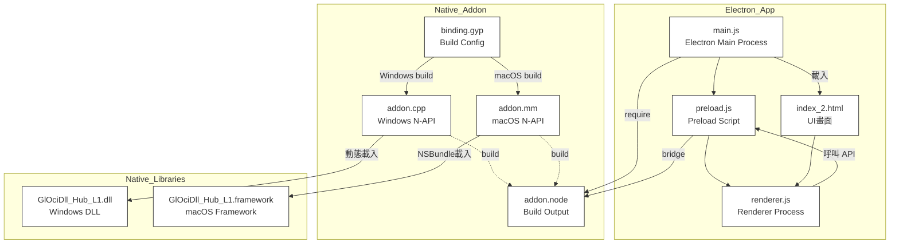

### 1. main.js
- 功能說明：
- 開發重點：
- 互動關係：
---
### 2. binding.gyp
- 功能說明：
- 開發重點：
- 互動關係：
---
### 3. addon.cpp
- 功能說明：
- 開發重點：
- 互動關係：
---
### 4. addon.mm
- 功能說明：
- 開發重點：
- 互動關係：
---
### 5. preload.js
- 功能說明：
- 開發重點：
- 互動關係：
---
### 6. renderer.js
- 功能說明：
- 開發重點：
- 互動關係：
---
### 7. index_2.html
- 功能說明：
- 開發重點：
- 互動關係：

## 2. 架構說明
- main.js
- preload.js
- renderer.js + index_2.html
- binding.gyp
- addon.cpp / addon.mm
- GlOciDll_Hub_L1.dll / .framework
---
## 3. 應用流程（簡述）
1. 啟動 → main.js 建立 window，注入 preload.js
1. renderer.js 在 UI 觸發時，透過 window.electron 呼叫 native API
1. native API 呼叫 addon.node，實際由 addon.cpp/addon.mm 與 DLL/Framework 溝通
1. DLL/Framework 回應查詢/更新，層層回傳至 UI
## 未完成事項
```javascript
<!DOCTYPE html>
<html lang="en">
<head>
  <meta charset="UTF-8" />
  <meta name="viewport" content="width=408, initial-scale=1.0">
  <title>Firmware Update Tool</title>
  <link rel="stylesheet" href="tailwind.css">
  <link rel="stylesheet" href="custom.css">
  <style>
    .button-primary:disabled,
    .button-primary[disabled] {
      background: #a3a3a3 !important;
      color: #ececec !important;
      cursor: not-allowed !important;
      opacity: 0.7;
      box-shadow: none !important;
  html, body {
    height: 100vh;
    min-height: 100vh;
    margin: 0;
    padding: 0;
    background: #191c1f;
  }
  #main-panel {
    background: #23262b;
    border-radius: 18px;
    box-shadow: 0 10px 38px 0 rgba(30,30,40,0.16), 0 2px 8px 0 rgba(0,0,0,0.22);
    min-width: 370px;
    max-width: 420px;
    width: 100vw;
    height: 100vh;
    min-height: 100vh;
    margin: 0 auto;
    display: flex;
    flex-direction: column;
    -webkit-app-region: drag;
    overflow: hidden;
    border: 1.5px solid #242730;
  }
  #content-area {
    flex: 1 1 0%;
    display: flex;
    flex-direction: column;
    justify-content: flex-start;
    min-height: 0;
  }
  .chip-card {
    background: transparent;
    border-radius: 13px;
    border: none;
    box-shadow: none;
    margin-bottom: 16px;
    transition: background 0.13s;
  }
  .chip-card:hover {
    background: #232336;
  }
  .icon-bg {
    width: 46px; height: 46px;
    border-radius: 50%;
    display: flex; align-items: center; justify-content: center;
    background: none;
    margin-right: 16px;
  }
  .icon-bg.scaler img {
    background: none;
  }
  .icon-bg.hub img {
    background: none;
  }
  .icon-bg.pd img {
    background: none;
  }
  .icon-shadow { filter: drop-shadow(0 1px 3px rgba(0,0,0,0.14)); }
  .no-drag { -webkit-app-region: no-drag; }
  #chip-list-area {
    overflow-y: auto;
    flex: 1 1 0%;
    min-height: 0;
    max-height: none;
    padding-bottom: 0.5rem;
  }
  .status-dot {
    display: inline-block;
    width: 15px;
    height: 15px;
    background: #35d072;
    border-radius: 50%;
    margin-right: 8px;
    box-shadow: 0 0 5px #2ecc71bb;
    vertical-align: middle;
  }
  .button-primary {
    background: #3778ff;
    color: #fff !important;
    border-radius: 9px;
    font-weight: 700;
    font-size: 1.07rem;
    box-shadow: 0 2px 12px 0 #367aff50;
    border: none;
    transition: background 0.17s, box-shadow 0.13s, transform 0.08s;
    will-change: transform;
  }
  .button-primary:active { transform: scale(0.97);}
  .button-primary:hover {
    background: #2553c4;
    box-shadow: 0 4px 16px #457dff90;
  }

  .chip-label {
    color: #fff;
    font-weight: 600;
    font-size: 1.1rem;
    letter-spacing: 0.01em;
  }
  .chip-status {
    color: #47e08f;
    font-size: 0.97rem;
    font-weight: 500;
  }
  .fw-version {
    color: #e4e4e7;
    font-weight: 700;
    font-size: 1.1rem;
    margin: 0 4px;
  }
  .fw-arrow {
    color: #b3bac6;
    font-weight: 700;
    font-size: 1.32rem;
    margin: 0 3px;
  }
  .chip-card .icon-bg img { width: 36px; height: 36px; }
  #chip-list-area { margin-top: 16px; }
  </style>
</head>
<body>
  <div id="main-panel">
    <div id="content-area" class="w-full px-6 pt-7 pb-0">
      <div class="mb-2">
        <div class="flex items-center justify-between">
          <div class="text-2xl font-extrabold text-white mb-2 tracking-tight" style="letter-spacing: 0.01em;">
            Firmware Update Tool
          </div>
          <div class="text-blue-300 font-semibold text-base opacity-75 select-none">V1.0.0</div>
        </div>
        <div id="chip-status-area">
          <div id="chip-status" class="flex items-center text-base text-gray-100 mb-3">
            <span class="status-dot"></span>
            <span class="ml-1">Chip Status: <span class="text-green-400 font-semibold">Connected</span></span>
          </div>
          <div id="update-success-msg" class="hidden text-base text-green-400 mb-3 font-bold">
            All Firmware Update Success!
          </div>
          <div id="update-fail-msg" class="hidden text-base text-red-400 mb-3 font-bold">
            Firmware Update Failed!
          </div>
        </div>
      </div>
      <div id="chip-list-area">
        <div id="chip-list" class="w-full"></div>
      </div>
      <div id="progress-bar-container" class="w-full h-2 bg-gray-700 rounded my-4 hidden">
        <div id="progress-bar" class="bg-blue-500 h-2 rounded transition-all duration-300" style="width: 0%;"></div>
      </div>
    </div>
<div class="flex gap-4 w-full max-w-xs mx-auto mb-7 mt-2 px-2">
  <button id="update-button"
    class="no-drag flex-1 button-primary text-lg disabled:bg-gray-400 disabled:text-gray-100 disabled:cursor-not-allowed">
    Update All
  </button>
  <button id="exit-button" class="no-drag flex-1 button-secondary text-lg">
    Cancel
  </button>
</div>
  </div>
  <script>
  // 使用彩色 SVG icon
  const iconFiles = {
    "Scaler chip": "Scaler.svg",
    "Scaler": "Scaler.svg",
    "USB HUB L1 Chip": "Hub.svg",
    "USB HUB L2 Chip": "Hub.svg",
    "PD Chip": "Pd.svg",
    "PD": "Pd.svg"
  };

  function formatFwVer(obj) {
    if (!obj) return "-";
    if (typeof obj.revision !== "undefined") return obj.revision;
    return "-";
  }

  async function renderChips(chips) {
    await Promise.all(chips.map(async chip => {
if (chip.name.startsWith("USB HUB") && window.electron) {
  try {
    const installed = await window.electron.getInstalledFirmwareInfo();
    const packaged = await window.electron.getPackagedFirmwareInfo();
    chip.current = formatFwVer(installed);
    chip.latest = formatFwVer(packaged);
  } catch (e) {
    chip.current = '-';
    chip.latest = '-';
  }
}

    }));
    const $chipList = document.getElementById('chip-list');
    $chipList.innerHTML = chips.map(chip => {
      let iconClass = 'icon-bg';
      if (chip.name.startsWith('USB HUB')) iconClass += ' hub';

      else if (chip.name === 'Scaler chip' || chip.name === 'Scaler') iconClass += ' scaler';
      else if (chip.name === 'PD Chip' || chip.name === 'PD') iconClass += ' pd';
      return `
        <div class="chip-card flex items-center justify-between px-0 py-2">
          <div class="flex items-center">
            <div class="${iconClass}">
              
            </div>
            <div>
              <div class="chip-label">${chip.name}</div>
              <div class="chip-status">${chip.statusText || "Ready to update"}</div>
            </div>
          </div>
          <div class="flex items-center gap-2">
            <span class="fw-version">${chip.current || '-'}</span>
            <span class="fw-arrow">→</span>
            <span class="fw-version" style="color: #fff;">${chip.latest || '-'}</span>
          </div>
        </div>
      `;
    }).join('');
  }

  async function initChipUiAndRender() {
    fetch('chips.json')
      .then(res => res.json())
      .then(async allChips => {
        if (!allChips || (Array.isArray(allChips) && allChips.length === 0)) {
          document.getElementById('chip-list').innerHTML =
            `<div class="text-gray-500 text-center py-8">No chip found.</div>`;
          return;
        }
        if (!Array.isArray(allChips)) allChips = [allChips];
        await renderChips(allChips);
      })
      .catch(err => {
        document.getElementById('chip-list').innerHTML =
          `<div class="text-red-400 text-center py-8">Failed to load chips.json</div>`;
      });
  }

  // 初始化
  initChipUiAndRender();

  // 事件
  const updateBtn = document.getElementById('update-button');
  const exitBtn = document.getElementById('exit-button');
  const progressBarContainer = document.getElementById('progress-bar-container');
  const progressBar = document.getElementById('progress-bar');
  const chipStatus = document.getElementById('chip-status');
  const updateFailMsg = document.getElementById('update-fail-msg');
  const updateSuccessMsg = document.getElementById('update-success-msg');

  updateBtn.onclick = async function () {
    updateBtn.disabled = true;
    progressBarContainer.classList.remove('hidden');
    progressBar.style.width = '0%';
    chipStatus.classList.remove('hidden');
    updateSuccessMsg.classList.add('hidden');
    updateFailMsg.classList.add('hidden');
    let percent = 0;
    let interval = setInterval(() => {
      percent += 10;
      progressBar.style.width = percent + '%';
      if (percent >= 100) clearInterval(interval);
    }, 100);

    try {
      const result = await window.electron.installFirmware();
      if (!result || typeof result.result === "undefined" || result.result !== 0) {
        updateFailMsg.textContent = "Firmware Update Failed! " + (result && result.errorMessage ? result.errorMessage : "");
        updateFailMsg.classList.remove('hidden');
        progressBarContainer.classList.add('hidden');
        chipStatus.classList.remove('hidden');
        updateSuccessMsg.classList.add('hidden');
        updateBtn.disabled = false;
        return;
      }
      await window.electron.getInstalledFirmwareInfo();
      setTimeout(() => {
        progressBarContainer.classList.add('hidden');
        chipStatus.classList.add('hidden');
        updateSuccessMsg.classList.remove('hidden');
        updateFailMsg.classList.add('hidden');
        initChipUiAndRender();
      }, 400);
    } catch (e) {
      setTimeout(() => {
        progressBarContainer.classList.add('hidden');
        chipStatus.classList.remove('hidden');
        updateSuccessMsg.classList.add('hidden');
        updateFailMsg.textContent = "Firmware Update Failed! " + (e.message || e);
        updateFailMsg.classList.remove('hidden');
        updateBtn.disabled = false;
      }, 200);
    }
  };

  exitBtn.onclick = function () {
    console.log('renderer: Cancel 按下');
  if (window.electron && window.electron.close) {
    window.electron.close();
  } else {
    window.close && window.close();
  }
};
  </script>
</body>
</html>

```
