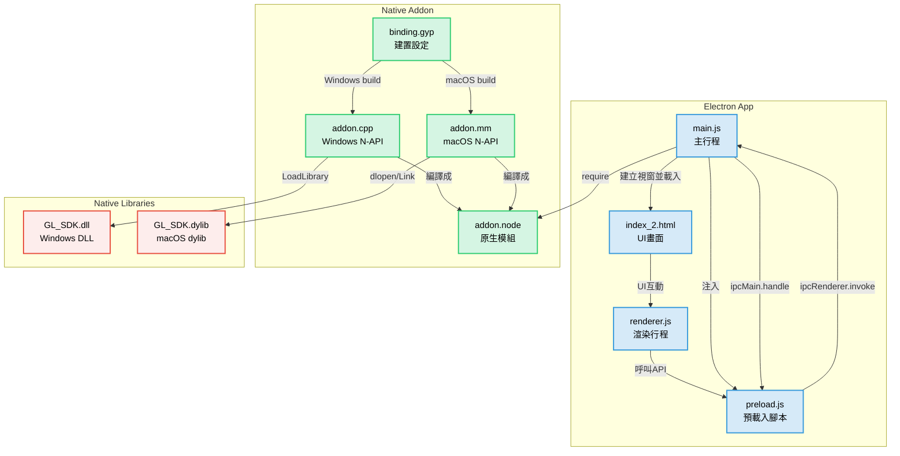
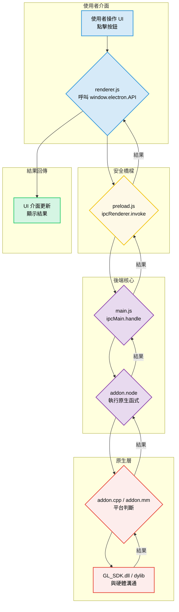

### 專案名稱：USB Hub 韌體管理工具
### 1. 專案目標
本專案旨在開發一個跨平台（Windows & macOS）的桌面應用程式，透過 Electron 框架提供統一的使用者介面。主要功能是與多款 USB Hub 硬體進行通訊，以實現韌體版本的查詢與線上更新。
支援硬體列表：
- Hub
- Scaler
- PD
### 2. 技術架構
本專案採用 Electron 作為主要框架，並透過 Node.js Native Addon 技術橋接 JavaScript 與底層 C++/Objective-C 程式碼，以呼叫已分別封裝好的原生 SDK（Windows 為 .dll，macOS 為 .dylib）。
# 專案結構說明
本專案為 Electron 跨平台桌面應用，整合 Native Addon 以支援 Windows 及 macOS 環境下的 USB Hub 韌體查詢與升級功能。下方整理各主要檔案及其功能、互動流程，以及架構圖。
---
## 目錄與主要檔案說明
---
## 架構互動流程

---
## 各檔案互動重點
- main.js：Electron 應用進入點。負責建立視窗、透過 IPC (行程間通訊) 機制接收來自前端的請求，並呼叫原生插件 (addon.node) 的功能。
- preload.js：安全的橋樑。它將前端 (renderer.js) 想要呼叫的功能，透過 ipcRenderer 轉發給 main.js 處理，而不是直接暴露原生 API，從而提升安全性。
- renderer.js：前端 JS。負責所有 UI 互動邏輯，並經由 preload.js 暴露的全域 API (window.electron.*) 來發起對底層功能的請求。
- binding.gyp：建置設定檔。根據作業系統 (OS) 選擇 src/addon.cpp (Windows) 或 src/addon.mm (macOS) 進行編譯，最終生成統一的 addon.node 檔案。
- addon.cpp / addon.mm：原生插件實作。各自對應 Windows/macOS 的 N-API 程式碼，並負責動態載入對應平台的底層函式庫。
- GL_SDK.dll / GL_SDK.dylib： 原生硬體存取函式庫。這是真正與硬體溝通的核心，處理 Hub 韌體查詢與更新的具體邏輯。
---
## 典型運作流程
- 使用者啟動 App，main.js 建立主視窗並載入 UI (index_2.html)。
- preload.js 將一組安全的 API (例如 window.electron.getUsbHubList) 注入到前端的 window 物件中。
- 使用者在 UI 上操作，觸發 renderer.js 呼叫 window.electron.getUsbHubList()。
- preload.js 接收到呼叫，立即透過 ipcRenderer.invoke 將請求與參數發送給 main.js。
- main.js 中的 ipcMain.handle 監聽到請求，接著呼叫已載入的 addon.node 的對應函式。
- addon.node 根據當前平台執行對應的程式碼：
- 執行結果從原生函式庫逐層回傳：DLL/dylib → Addon → main.js → renderer.js。
- renderer.js 收到最終結果後，更新 UI 介面進行顯示。
### 運作流程圖

---
## 注意事項
- 若要新增/修改原生功能，需要同步修改：
- 建置 (build) 時，請確保本機已安裝對應平台的建置工具鏈 (Build Toolchain)，且原生函式庫的路徑設定正確。
- 使用時請勿更動 GL_SDK.dll 或 GL_SDK.dylib 的檔案名稱與相對路徑，否則原生插件會因找不到檔案而載入失敗。
