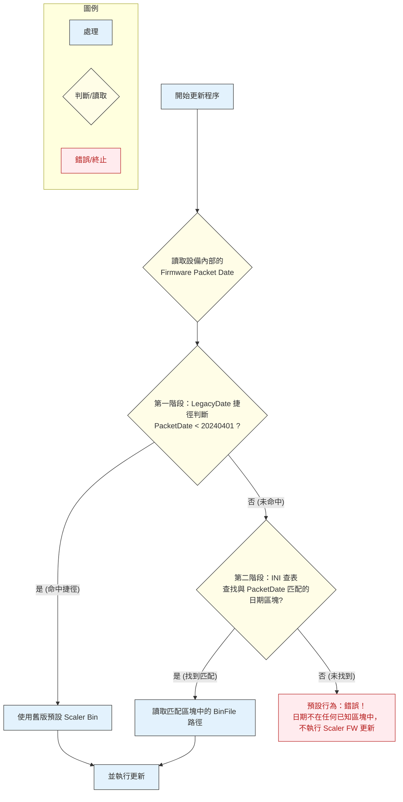

### 1. 總覽 (Overview)
本文件旨在說明裝置的韌體更新機制。此機制的運作方式為一個兩階段的判斷流程。首先，程式會利用 LegacyDate 進行一個快速的捷徑判斷來處理非常早期的韌體版本。若捷徑未命中，則會進入標準的「查表執行」流程：讀取裝置當前的 Firmware Packet Date，在 ini 設定檔中查找與該日期完全匹配的區塊，並直接使用該區塊中指定的 BinFile 檔案來進行更新。
### 2. INI 檔案設定說明 (MonitorUpdates.ini)
INI 檔案是更新規則的唯一來源。使用者必須為每一個已知的 PacketDate 建立一個對應的日期區塊，並在其中透過 BinFile 參數，明確指定當裝置 PacketDate 為此日期時，應該使用哪一個具體的 scaler.bin 檔案。
### 範例 INI 內容：
```plain text
[Unify]
ModelName=724pu
PanelName=bydate
LegacyDate=20240331

[20240331]
BinFile=Firmware/HP_724pu_PanelWISTRON_724pu_BD_WISTRON_Z24uG3_E1IM1131_V1.20.2.0_20250731_sig_Service_Header.bin

[20250731]
BinFile=Firmware/HP_724pu_PanelWISTRON_724pu_BD_WISTRON_Z24uG3_E1IM1131_V1.20.2.0_20250731_sig_Service_Header.bin

[20250801]
BinFile=Firmware/HP_724pu_PanelWISTRON_724pu_BD_WISTRON_Z24uG3_E1IM1131_V1.20.2.0_20250801_sig_Service_Header.bin
```
### 各區塊說明：
- [Unify] 區塊:
- [YYYYMMDD] 日期區塊 (例如 [20240331]):
### 3. 處理流程詳解 (Flowchart Explained)
1. 開始更新程序: 啟動韌體更新流程。
1. 讀取裝置資訊: 獲取裝置當前的 Firmware Packet Date。
1. 第一階段：LegacyDate 捷徑判斷:
1. 第二階段：在 INI 中查找匹配項:
1. 執行 Scaler 更新:

### 4. 方案限制與注意事項
根據流程圖左上角的提示，此方案存在以下限制：
- 維護成本 (Maintenance Cost):
- 發布限制 (Release Constraint):
- 禁止韌體降級 (No Downgrade):
