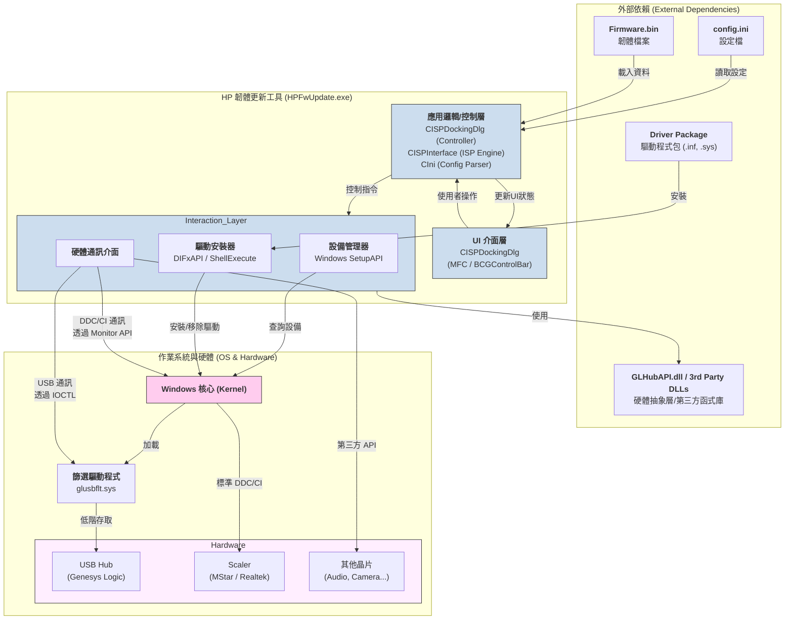

```mermaid
graph TD
    subgraph "外部依賴 (External Dependencies)"
        direction LR
        INI[<b>config.ini</b><br>設定檔]
        BIN[<b>Firmware.bin</b><br>韌體檔案]
        DRIVER["<b>Driver Package</b><br>驅動程式包 (.inf, .sys)"]
        DLL["<b>GLHubAPI.dll / 3rd Party DLLs</b><br>硬體抽象層/第三方函式庫"]
    end

    subgraph "HP 韌體更新工具 (HPFwUpdate.exe)"
        direction TB
        
        UI_Layer["<b>UI 介面層</b><br>CISPDockingDlg<br>(MFC / BCGControlBar)"]

        Logic_Layer["<b>應用邏輯/控制層</b><br>CISPDockingDlg (Controller)<br>CISPInterface (ISP Engine)<br>CIni (Config Parser)"]
        
        Interaction_Layer["<b>系統與硬體互動層</b>"]

        UI_Layer -- 使用者操作 --> Logic_Layer;
        Logic_Layer -- 更新UI狀態 --> UI_Layer;
        
        INI -- 讀取設定 --> Logic_Layer;
        BIN -- 載入資料 --> Logic_Layer;
        
        Logic_Layer -- 控制指令 --> Interaction_Layer;

        subgraph "Interaction_Layer"
            direction LR
            DevManager["<b>設備管理器</b><br>Windows SetupAPI"]
            DrvInstaller["<b>驅動安裝器</b><br>DIFxAPI / ShellExecute"]
            HW_Comm["<b>硬體通訊介面</b>"]
        end

        Interaction_Layer -- 使用 --> DLL
        DRIVER -- 安裝 --> DrvInstaller
    end

    subgraph "作業系統與硬體 (OS & Hardware)"
        direction TB
        OS_Kernel["<b>Windows 核心 (Kernel)</b>"]
        FilterDriver["<b>篩選驅動程式</b><br>glusbflt.sys"]
        Hardware["<b>目標硬體</b>"]
        
        OS_Kernel -- 加載 --> FilterDriver
        
        subgraph "Hardware"
            direction LR
            USB_Hub["USB Hub<br>(Genesys Logic)"]
            Scaler["Scaler<br>(MStar / Realtek)"]
            Other["其他晶片<br>(Audio, Camera...)"]
        end
    end
    
    DevManager -- 查詢設備 --> OS_Kernel
    DrvInstaller -- 安裝/移除驅動 --> OS_Kernel
    HW_Comm -- USB 通訊<br>透過 IOCTL --> FilterDriver
    FilterDriver -- 低階存取 --> USB_Hub
    
    HW_Comm -- DDC/CI 通訊<br>透過 Monitor API --> OS_Kernel
    OS_Kernel -- 標準 DDC/CI --> Scaler
    HW_Comm -- 第三方 API --> Other
    
    
    style UI_Layer fill:#cde,stroke:#333
    style Logic_Layer fill:#cde,stroke:#333
    style Interaction_Layer fill:#cde,stroke:#333
    style OS_Kernel fill:#fce,stroke:#333
    style Hardware fill:#fef,stroke:#333
```

```mermaid
graph TD
    A[開始: 啟動 HPFwUpdate.exe] --> B{初始化與環境檢查 OnInitDialog};
    B --> C{OS 版本是否相容?};
    C -- 否 --> D[顯示錯誤後結束];
    C -- 是 --> E{讀取 INI 設定檔};
    E --> F{設定檔與韌體檔案是否存在?};
    F -- 否 --> D;
    F -- 是 --> G{"搜尋目標硬體<br>(顯示器/USB Hub)"};
    G --> H{是否找到目標硬體?};
    H -- 否 --> I[提示設備不適用後結束];
    H -- 是 --> J{"載入並驗證韌體檔案<br>(檢查簽章)"};
    J --> K{韌體是否有效?};
    K -- 否 --> D;
    K -- 是 --> L[初始化 UI，進入待機狀態];
    
    L --> M[使用者點擊「更新」按鈕];
    M --> N{"檢查並處理篩選驅動程式 (glusbflt)"};
    
    subgraph 驅動程式處理
        N --> O{驅動程式狀態?};
        O -- 未安裝 --> P[安裝驅動程式];
        O -- 版本過舊 --> Q["更新驅動程式 (先移除舊版)"];
        O -- 已安裝 --> R[直接繼續];
        P --> S{安裝成功?};
        Q --> S;
        S -- 否 --> T[顯示錯誤，返回待機];
        S -- 是 --> R;
    end
    
    R --> U[啟動韌體更新執行緒 ProcessIsp];
    U --> V[UI 顯示進度條與警告];

    subgraph 韌體更新迴圈
        V --> W{"遍歷 INI 中所有待更新元件<br>(Hub, Scaler, Audio...)"};
        W -- 對每個元件 --> X[進入 ISP 模式];
        X --> Y[燒錄韌體];
        Y --> Z[驗證韌體];
        Z --> AA[重置元件];
        AA --> BB{更新成功?};
        BB -- 是 --> W;
        BB -- 否 --> CC[記錄失敗，繼續下一個];
        CC --> W;
    end
    
    W -- 所有元件處理完畢 --> DD{所有更新是否都成功?};
    DD -- 是 --> EE[顯示成功訊息];
    DD -- 否 --> FF[顯示包含失敗項目的訊息];
    
    EE --> GG[執行清理工作];
    FF --> GG;
    
    GG --> HHH{是否需要解除安裝驅動程式?};
    HHH -- 是 --> III[解除安裝驅動程式];
    HHH -- 否 --> JJJ[結束];
    III --> JJJ;
    
    %% Styling
    %% 定義顏色分類
    classDef init fill:#d1ecf1,stroke:#0c5460,stroke-width:2px
    classDef prep fill:#fde7b0,stroke:#856404,stroke-width:2px
    classDef isp fill:#e2d9f3,stroke:#493267,stroke-width:2px
    classDef complete fill:#d4edda,stroke:#155724,stroke-width:2px
    classDef success fill:#a8e6cf,stroke:#0d6b53,stroke-width:2px,font-weight:bold
    classDef failure fill:#f8d7da,stroke:#721c24,stroke-width:2px,font-weight:bold

    %% 將節點應用到分類
    class A,B,C,E,F,G,H,J,K,L init
    class M,N,O,P,Q,R,S prep
    class U,V,W,X,Y,Z,AA,BB,CC isp
    class DD,FF,GG,HHH,III,JJJ complete
    class D,I,T failure
    class EE success
```
