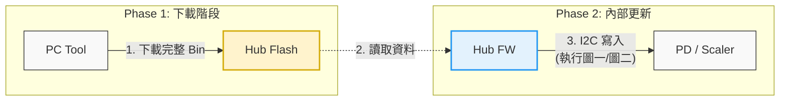
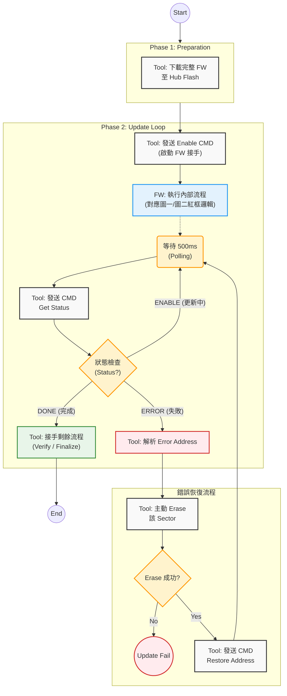

## 1. 核心架構 (System Architecture)
採用 Store and Forward (儲存後轉發) 機制，解決 USB 傳輸不穩導致的 I2C 時序問題。
- Phase 1 (Upload): Tool 透過 USB (HID Interrupt Out 建議) 將完整 Bin 檔與(PD/Scaler INFO)下載至 Hub Flash。
- Phase 2 (Internal Update): Tool 發送指令啟動 FW，由 Hub FW 負責執行圖一 (PD) 與圖二 (Scaler) 的實際寫入流程。
### 系統架構圖 (Mermaid)

---
## 2. 詳細更新流程 (Detailed Workflow)
此流程整合了 Tool 的控制邏輯與 FW 的內部運作（對應圖一與圖二）。
### Step 1: Phase 1 下載
1. Tool 將 PD Bin 與 Scaler Bin 與(PD/Scaler INFO)完整寫入 Hub Flash 的指定位址。
1. 進入 ISP Mode。
1. Tool: 發送 HID_CMD_Enable_PD_OnlineSpeedUp。
### Step 2: Phase 2 啟動與監控 (PD 階段)
1. Hub FW (執行圖一紅框邏輯):
1. Tool (Polling): 每 500ms 發送 Get_Update_Status。
### 圖一
### Step 3: Phase 2 啟動與監控 (Scaler 階段)
1. 進入 ISP Mode -> Disable Write Protect。
1. Tool: 發送 HID_CMD_Enable_Scaler_OnlineSpeedUp。
1. Hub FW (執行圖二紅框邏輯):
1. Tool (Polling): 每 500ms 發送 Get_Update_Status。
### 圖二
---
### 2.2 錯誤恢復機制 (Error Recovery)
當 FW 內部的 Retry (圖一紅框) 或 Verify (圖二紅框) 失敗並回報 ERROR 時，Tool 介入救援：
1. Tool: 解析 Get_Update_Status 回傳的 Error Address。
1. Tool: 主動對 Target (PD/Scaler) 發送指令，Erase 該失敗的 Sector。
1. Tool: 發送 Restore_Address 指令：
1. Hub FW: 更新內部的 Write Pointer，從指定位置繼續執行寫入。
---
## 3. 狀態機流程圖 (State Machine Flowchart)
這張圖展示了 Tool 與 FW 的互動，包含錯誤救援迴圈。

---
## 4. HID Command Protocol (Reference)
### 控制指令 (Control)
### 恢復指令 (Error Recovery)
### 狀態查詢 (Polling)
### 狀態碼定義 (Status Code)
- 0x01 / 0x10 (ENABLE): FW 忙碌中 (正在跑圖一/圖二的 Loop)。
- 0x04 / 0x40 (ERROR): 發生錯誤 (Retry 失敗)，等待 Tool 救援。
- 0x08 / 0x80 (DONE): 更新成功。
## Tool String(ISP Extend funciton)
