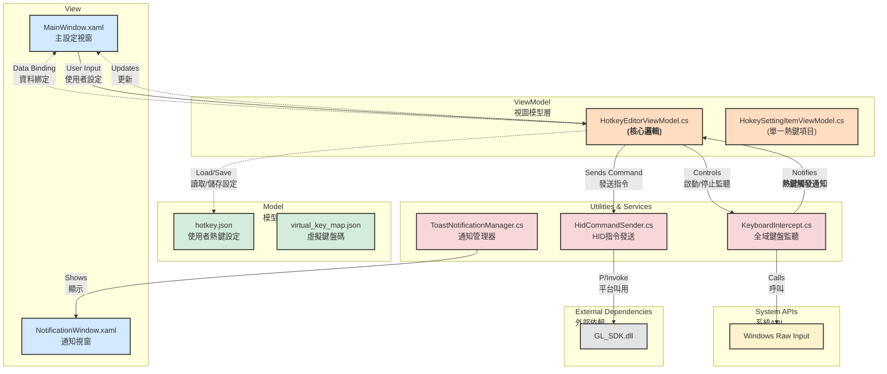
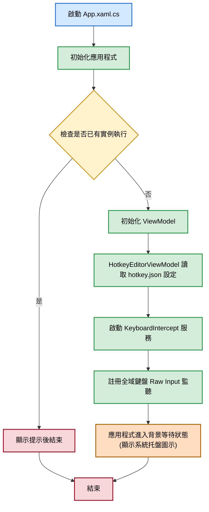
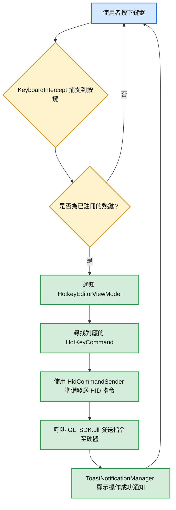
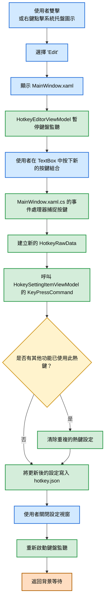

本專案旨在提供一個讓使用者能透過鍵盤熱鍵操作 OSD (On-Screen Display) 選單功能的工具。使用者不僅可以執行預設的熱鍵指令，還能透過設定介面來自訂與各項 OSD 功能對應的熱鍵組合。
## 主要功能
- 全域熱鍵監聽: 即使應用程式在背景執行，也能夠捕捉使用者設定的熱鍵。
- 自訂熱鍵設定: 提供圖形化介面，讓使用者可以輕鬆地修改、設定不同 OSD 功能對應的鍵盤熱鍵。
- HID 指令發送: 監聽到熱鍵後，程式會發送對應的 HID (Human Interface Device) 指令來觸發硬體功能。
- 系統托盤圖示: 應用程式常駐於系統托盤，方便使用者隨時存取設定或結束程式。
- 操作提示通知: 當熱鍵觸發功能時，會顯示短暫的提示訊息，告知使用者當前操作。
## 專案架構圖
本專案採用 MVVM (Model-View-ViewModel) 設計模式，結構清晰，易於維護和擴展。

本專案採用 MVVM (Model-View-ViewModel) 設計模式，將應用程式劃分為幾個獨立且職責分明的層級，以提高程式碼的可讀性、可維護性和可測試性。
- View (視圖層)
使用者介面層，由 WPF 的 XAML 檔案構成，負責顯示資料和接收使用者的互動。此層不包含任何業務邏輯，僅透過資料綁定與 ViewModel 進行通訊。
- ViewModel (視圖模型層)
應用程式的邏輯核心。它包含了所有 UI 的業務邏輯，例如處理使用者輸入、管理應用程式狀態等。ViewModel 透過雙向綁定更新 View，並在需要時調用後端的服務 (Services) 和存取資料模型 (Model)。
- Model (模型層)
資料模型層，負責定義應用程式中使用的核心資料結構，並代表資料的來源 (例如設定檔)。
- Utilities & Services (工具與服務層)
提供專案所需的各種底層核心功能，將複雜或與平台相關的操作封裝成獨立的服務，供 ViewModel 調用。
## 核心流程圖
### 1. 應用程式啟動與熱鍵監聽

2. 熱鍵觸發與指令發送

3. 使用者編輯熱鍵

## 安裝與使用
### 環境需求
- .NET Framework 4.6.1 或更高版本
- Windows 作業系統
### 編譯與執行
1. 使用 Visual Studio 2019 或更高版本開啟 OSDManager.sln 檔案。
1. 還原 NuGet 套件 (MaterialDesignThemes, log4net, Google.Protobuf)。
1. 將 GL_SDK.dll 放置於正確的路徑。
1. 編譯專案以生成 HotkeyManager.exe。
1. 執行 HotkeyManager.exe，程式將會常駐於系統托盤。
### 軟體打包
專案內包含 PowerShell 腳本 (HotkeyBuildInstaller.ps1) 與 Inno Setup 腳本 (hp_hitkey_manager.iss)，用於自動化建立安裝程式。
1. 確保已安裝 Inno Setup 6。
1. 執行 Package/HotkeyBuildInstaller.ps1 腳本，它將會自動編譯並打包成安裝檔。
### 使用方式
- 執行功能: 在背景執行時，按下您設定的熱鍵組合即可觸發對應的 OSD 功能。
- 編輯設定: 在系統托盤找到 "Hotkey Manager" 圖示，雙擊或按右鍵選擇 "Edit" 即可開啟設定視窗。
- 結束程式: 在系統托盤圖示上按右鍵選擇 "Exit"。
### C# 專案移植 macOS 任務清單
---
### 階段一：專案設定與環境準備 (無變動)
此階段目標不變：建立一個新的、可用於 macOS 開發的跨平台專案。
---
### 階段二：UI 介面層遷移 (View) (無變動)
目標是使用 Avalonia XAML 重建您的使用者介面。
---
### 階段三：程式碼遷移 (ViewModel & Model) (無變動)
此階段幾乎所有程式碼都可以直接重用。
---
### 階段四：平台特定功能重寫 (關鍵階段 - 已簡化)
這是變動最大，也是因為您有 .dylib 而變得簡單許多的部分。
---
### 階段五：建置、測試與部署 (無變動)
