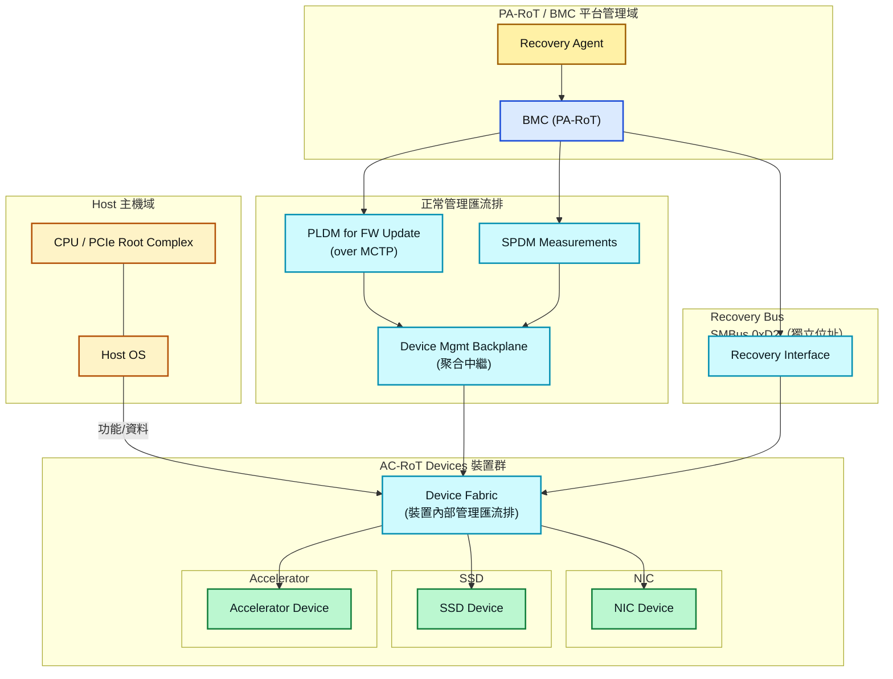
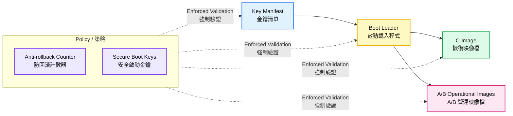
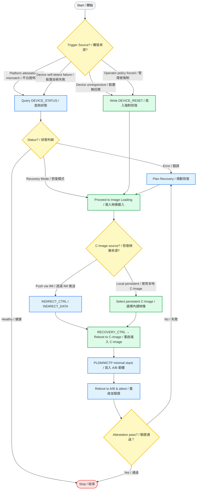
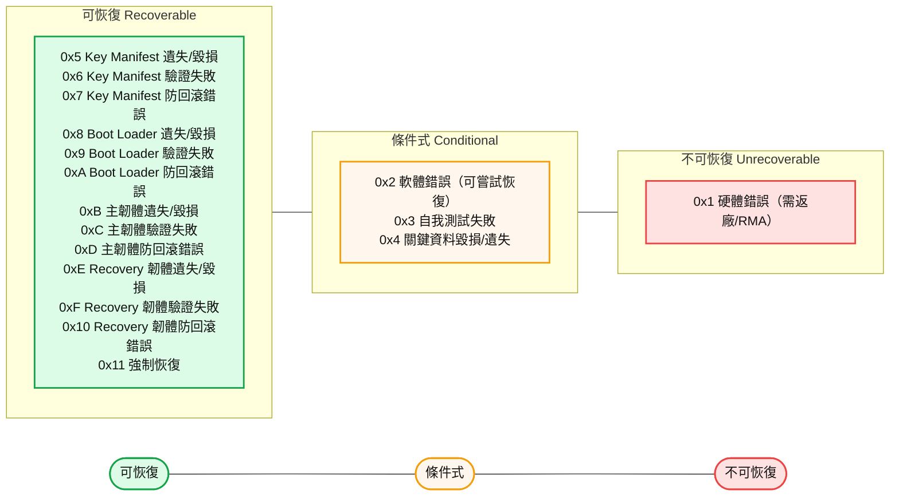
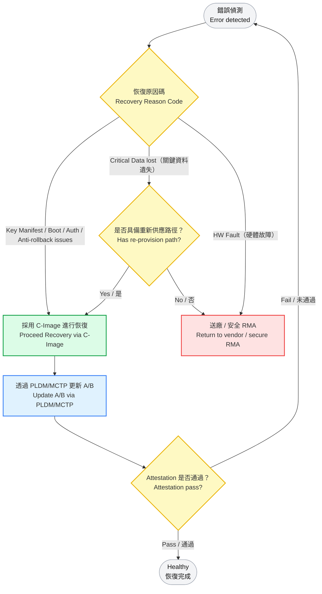
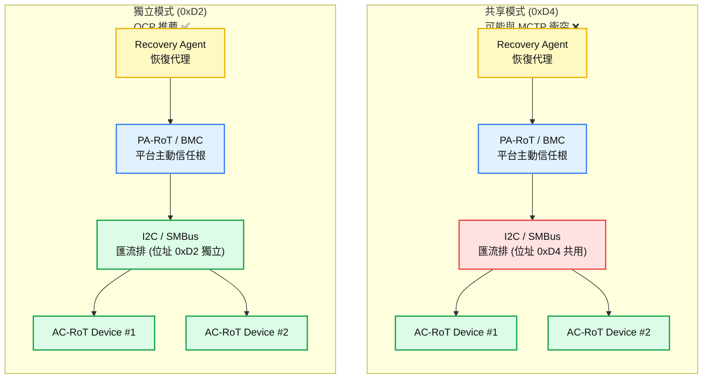
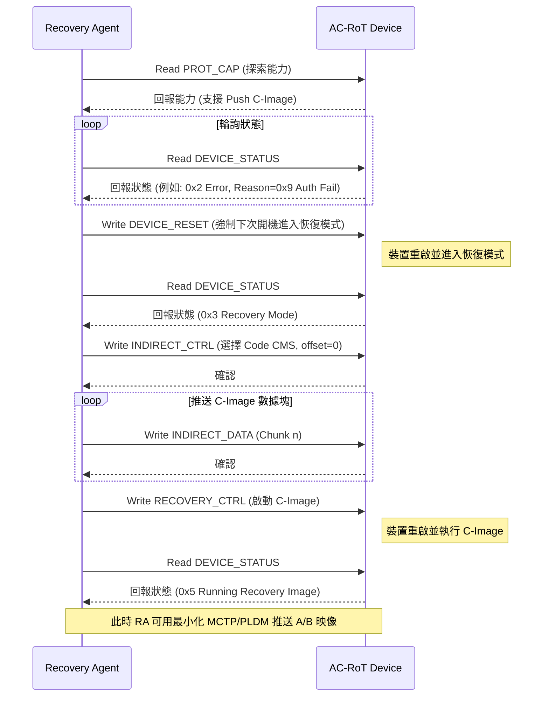

### OCP 安全韌體恢復 (Secure Firmware Recovery) 規範詳解
---
### 1. 總覽與目的 (Executive Summary)
本文件是由 Open Compute Project (OCP) 發布的一份技術規範，旨在為資料中心硬體建立一套標準化、安全且可靠的韌體恢復機制。
其核心目標是：當一個裝置（如網卡、SSD、加速卡）的韌體損壞、無回應或被惡意竄改時，平台管理者（如 BMC）能夠透過一個獨立於主作業系統的低階通道（Side-band channel），強制該裝置進入恢復模式，並將其恢復到一個已知、可信的安全狀態。
此規範基於 NIST SP 800-193《平台韌體彈性指南》 的三大支柱：
- 保護 (Protection): 透過安全啟動 (Secure Boot) 和金鑰管理來保護韌體。
- 偵測 (Detection): 透過平台證明 (Attestation) 來偵測韌體的完整性。
- 恢復 (Recovery): 本文件的核心，定義了如何從偵測到的問題中恢復。
### 1.1 系統全景架構圖 (System Overview)

---
### 2. 關鍵角色與術語 (Key Roles & Terminology)
- AC-RoT (Active Component Root of Trust): 主動元件信任根。指需要被恢復的裝置，例如一個 PCIe 卡。它本身具備安全啟動和證明能力。
- PA-RoT (Platform Active Root of Trust): 平台主動信任根。通常是平台上的管理控制器，如 BMC (Baseboard Management Controller)。
- RA (Recovery Agent): 恢復代理。通常是 PA-RoT (BMC) 內部的一個軟體模組，負責推送映像檔並協調恢復流程。
韌體映像檔類型 (Firmware Image Types):
- A/B Image (營運映像檔): 裝置正常運行時使用的韌體，採用 A/B 分區以支援不中斷更新。
- C-Image (恢復映像檔): 最小化韌體，用於啟動裝置並接收新的 A/B Image。
- 關鍵資料 (Critical Data): 裝置身份憑證、金鑰清單、安全配置等必須持久存在的資料。

---
### 3. 恢復觸發條件與場景 (Recovery Triggers & Scenarios)
觸發條件：
1. 平台偵測異常（Attestation 測量值不符）。
1. 裝置自我偵測（安全啟動失敗、防回滾錯誤、關鍵資料損壞）。
1. 裝置無回應（無法透過 MCTP 溝通）。
1. 強制恢復（由管理者策略或維護需求觸發）。
使用場景：
- 正常更新： 僅韌體升級，不動用此恢復機制。
- 帶有關鍵資料的恢復： 重寫韌體，身份保持不變。
- 不帶關鍵資料的恢復： 必須重新配置裝置身份與安全參數。
⚠️ 安全提醒：強制恢復 (Forced Recovery) 隱含信任 PA-RoT/RA，若被濫用可能造成 拒絕服務 (DoS)，因為攻擊者可反覆觸發裝置重置。

---
### 4. 恢復流程詳解 (Recovery Process Flow)
1. 偵測 (Detection) → PA-RoT 判斷 AC-RoT 不健康。
1. 狀態查詢 (Status Check) → RA 讀取 DEVICE_STATUS。
1. 進入恢復模式 (Entering Recovery) → 可透過 DEVICE_RESET 觸發。
1. 載入恢復映像檔 (Image Loading) → Push C-Image 或選擇本地 C-Image。
1. 啟動恢復映像檔 (Activation) → RECOVERY_CTRL 控制重啟並執行 C-Image。
1. 執行恢復 (Recovery Execution) → 推送完整的 A/B Image。
1. 完成與驗證 (Completion & Verification) → 重啟後由 Attestation 驗證健康狀態。

```mermaid
stateDiagram-v2
    %% 狀態樣式定義
    state "Healthy\\n健康" as Healthy
    state "Error / 錯誤" as Error
    state "Recovery Mode\\n恢復模式" as RecoveryMode
    state "Recovery Pending\\n等待啟動恢復" as RecoveryPending
    state "Running Recovery Image\\n執行恢復映像" as RunningRecoveryImage
    state "Fatal Error / 致命錯誤" as FatalError

    [*] --> Healthy
    Healthy --> Error: Attestation fail / 自檢失敗
    Healthy --> RecoveryMode: Forced Recovery (DEVICE_RESET flag)
    Error --> RecoveryMode: DETECTED & RECOVERY_REQUIRED
    RecoveryMode --> RecoveryPending: RECOVERY_CTRL 選擇/推送 C-Image
    RecoveryPending --> RunningRecoveryImage: Reboot into C-Image
    RunningRecoveryImage --> Healthy: A/B 更新成功，驗證通過
    RunningRecoveryImage --> Error: 更新或驗證失敗
    Error --> FatalError: 無法恢復 (HW / Policy)
    FatalError --> [*]

    %% 顏色套用
    classDef good fill:#dcfce7,stroke:#16a34a,stroke-width:2px
    classDef warn fill:#fef9c3,stroke:#eab308,stroke-width:2px
    classDef bad fill:#fee2e2,stroke:#ef4444,stroke-width:2px
    classDef process fill:#e0f2fe,stroke:#3b82f6,stroke-width:2px

    class Healthy good
    class RecoveryMode,RecoveryPending,RunningRecoveryImage process
    class Error warn
    class FatalError bad

```

狀態碼 (DEVICE_STATUS):
---
### 5. 恢復原因碼 (Recovery Reason Codes)
✅ = 可恢復 ｜ ❌ = 無法恢復 ｜ ◐ = 視情況需返廠

### 5.1 Mermaid：錯誤處理與可恢復性決策圖
> 說明：將「恢復原因碼」對應到實際路徑（可恢復／需重新供應／返廠）與驗證收斂。綠＝可恢復；橘＝條件式（需再供應）；紅＝返廠；藍＝流程節點；灰＝起訖。

---
### 6. 恢復介面協定 (Recovery Interface Protocol)
### 6.1 傳輸層 (Transport Layer)
- 物理介面: SMBus/I2C。
- 拓撲: 支援共享或獨立地址（建議 0xD2 獨立地址，因為更安全且不會與 MCTP 衝突）。
- 協定: 使用 SMBus 的塊讀寫命令，每個命令有 8-bit 命令碼 (Command Code)。
- 在共享模式下，若 MCTP 與 Recovery 同時使用 0xD4，可能導致裝置誤判管理封包，進而失敗。

### 6.2 間接記憶體介面 (Indirect Memory Interface - IMI)
- 功能: 用於推送 C-Image，採用視窗化方式存取 AC-RoT 內部記憶體空間。
- 步驟:
- CMS 類型: Code CMS（存放映像）、Log CMS（偵錯日誌）、Vendor Defined CMS。
### 6.3 主要命令時序圖 (Key Commands Sequence)

### 6.2.1 C-Image 最小功能需求  (Minimal Requirements for C-Image)
C-Image 的設計目標是「讓裝置在最小化環境下仍能被恢復」，因此即使它功能有限，也必須具備以下基本能力：
- 支援最小化 MCTP/PLDM 協定堆疊
- 能接收並驗證 A/B Image
- 能回報狀態與錯誤碼
- 最小化安全信任鏈延續
### 6.3 主要命令 (Key Commands)
- PROT_CAP (能力發現)
- DEVICE_ID (裝置身份)
- DEVICE_STATUS (狀態回報)
- DEVICE_RESET (重置/進入恢復模式)
- RECOVERY_CTRL (選擇/啟動 C-Image)
- INDIRECT_CTRL / INDIRECT_DATA (推送映像檔)
- 錯誤處理: 若命令不支援、參數錯誤、長度錯誤或校驗錯誤，必須在 DEVICE_STATUS 中回報。
---
### 7. 安全威脅模型與對抗策略 (Security Threat Model & Countermeasures)
---
### 8. 實作細節與最佳實踐 (Implementation Details & Best Practices)
- C-Image 設計：
- RA (BMC 端) 設計：
- 合規性要求：
---
### 9. 與其他規範的關聯性 (Relation to Other Specifications)
---
### 8. 結論 (Conclusion)
