韌體更新優化討論
目前針對「直接更新」與「Disconnected 更新」的差異，我希望能優化直接更新的效率：
1. 現狀問題：直接更新時，如果需要更新負責的 Scaler 或 PD 等元件，CMD (命令) 順序會變為：Tool → HID → USB Hub → I2C → Scaler。
1. 優化構想：想將「直接更新」與「Disconnected 更新」的流程合併，觀察其速度與效率是否能提升。
具體做法： 不論採用哪種更新方式，一律將 FW 先搬移至 USB Hub 的 Flash。
 如果是「直接更新」，再由 Tool 端發送指令，請 USB Hub 開始將 FW 從 Flash 搬移到後端的元件。
建議： 如果要實施此優化且不破壞原有的順序，或許可以結合下述的 同步更新 功能會更易於實作。這部分需要與你們進一步討論可行性。
-  所以要存放到Hub Flash 只有 Hub , PD , Scaler ? 其他vendor chip 還是按照以前的方式update ?

```mermaid
flowchart TB
    %% --- 樣式定義 ---
    classDef tool fill:#f9f9f9,stroke:#333,stroke-width:1
    classDef container fill:#f0f8ff,stroke:#0066cc,stroke-width:2,stroke-dasharray: 5 5
    classDef memory fill:#fff3cd,stroke:#e0a800,stroke-width:2
    classDef logic fill:#d1e7dd,stroke:#0f5132,stroke-width:2
    classDef target fill:#e9ecef,stroke:#6c757d,stroke-width:1

    %% === 最外層：強制上下排列 ===
    subgraph Diagram
      direction TB

      %% --- 舊流程：在上 ---
      subgraph OldFlow [舊流程：Pass-through]
          direction LR
          O_Tool["OCI Tool"] -->|"1. USB HID Packet"| O_Hub["Hub Controller"]
          O_Hub -->|"2. I2C 直接轉發"| O_Scaler["Scaler / PD"]
      end

      %% --- 新流程：在下 ---
      subgraph NewFlow [新流程：Store and Forward]
          direction LR
          N_Tool["OCI Tool"]

          subgraph HubHardware [USB Hub 硬體內部]
              direction TB
              N_Flash["Hub Flash<br>(暫存 Bin 檔)"]
              N_FW["Hub FW / Logic<br>(執行刷寫程序)"]
              N_Flash -. "2. 內部讀取" .-> N_FW
          end

          N_Scaler["Scaler / PD"]

          N_Tool -->|"1. 傳輸 Bin (HID)"| N_Flash
          N_FW -->|"3. I2C 寫入"| N_Scaler
      end
    end

    %% --- 套用樣式 ---
    class O_Tool,N_Tool tool
    class HubHardware container
    class N_Flash memory
    class N_FW,O_Hub logic
    class O_Scaler,N_Scaler target

```

- 具體做法如下
- 這樣影響速度的地方有三點
Windows 相關功能規劃
1. 同步更新： 此功能先前已與 Bernie 討論過。未來我希望將此功能專注導入於 Disconnected 更新 部分。這樣做既可避免修改到 FW 本身，同時也能強化 Disconnected 更新的優勢。
1. 實作計畫： 此功能我想採用 549pm 進行實作。
macOS
1. 相關設置(Framework, 打包)文件化： 上次已與 Gavin 討論過調整資料夾放置其他 Framework 的事宜。後續請協助整理，並將相關說明寫入文件中，以利後續提供給 ODM 參考。
1. Disconnected FW Update 確認： 想再次確認 macOS 版本的 Disconnected FW Update 功能是否已完成？如果尚未，後續我們也許可以用 732xk 來進行 POC 。
1. 壓力測試: 另外想請你們開發後續壓力測試的Tool, 讓ODM可以做降板升版測試
Linux
1. SDK 文件準備： 請貴司協助整理 Linux 部分相關的 SDK 開發文件說明。
1. 下一步： 我方將開始接洽幾家廠商進行後續的整合開發工作。
