# CFU 導入技術評估報告
> 文件用途：內部技術評估，供 RD / PM 於導入 CFU 前決策使用
受眾：FW RD、SW RD、PM
版本狀態：⚠️ 草稿——P0 決策點尚未全數確認，見第 3 節
參考來源：Microsoft CFU Specification、fwupd Plugin 文件（v2.0.18）、實際查證（2026-03）
---
## 1. 方案對照：三條路徑總覽
> 備註：Windows Update Firmware Package 路徑適用於 OEM 系統廠商（HP/Dell）自有產品，USB Hub 不走此路徑，故不列入評估範圍。
### 跨平台支援現況
關鍵結論：無論是否導入 CFU，macOS 工具都必須自行維護；CFU 的核心價值在於解決 Windows Driver 綁定問題，以及讓 Linux 透過 fwupd 原生整合。
---
### 📋 macOS CFU 支援查證說明（2026-03 實際查證）
以下為針對 「macOS 是否支援 CFU（Component Firmware Update）」 的獨立查證，供主管與 RD 確認。
## 查證結論
macOS 目前不支援 CFU。
CFU 為 Microsoft 所定義的裝置韌體更新協議，其 Host 端實作由 Windows 系統內建 Driver hidcfu.sys 提供。
截至 2026 年：
- Apple 未提供任何 CFU Host Driver
- macOS 未提供 CFU Firmware Update Framework
- 截至 2026 年公開文件中未出現 Apple 支援 CFU 的相關資訊
因此若裝置需在 macOS 上進行 CFU 更新，
所有 CFU Host Protocol 邏輯必須由廠商自行實作於 Application 層。
---
# 三大平台現況
說明：
- Windows 提供 完整 CFU Host Stack
- Linux 透過 fwupd project 提供部分支援
- macOS 僅提供 USB/HID transport API
---
# 技術說明：為什麼 macOS 的 IOKit ≠ CFU 支援
macOS 的 IOKit / IOHIDManager 僅提供 HID 傳輸能力：
- IOHIDDeviceSetReport
- IOHIDDeviceGetReport
- IOHIDDeviceRegisterInputReportCallback
其功能僅為：
> Host ↔ HID Report 的資料交換
並未提供：
- CFU protocol state machine
- Firmware update orchestration
- Retry / sequencing / error recovery
- Firmware package 管理
因此在 macOS 上，SW RD 必須自行實作完整 CFU Host Logic。
---
# macOS App 需自行實作的 CFU Host Logic
在 macOS 上進行 CFU 更新時，Application 必須負責以下邏輯：
### 1️⃣ HID Report 封裝
依 FW 端 HID Descriptor 定義：
- 手動組裝 HID Output Report
- 控制 Report 長度
- 管理 Sequence Number
---
### 2️⃣ Offer 狀態管理
Application 必須處理：
```plain text
FIRMWARE_UPDATE_OFFER
```
並解析 FW 回傳的狀態，例如：
- ACCEPT
- BUSY
- REJECT
- SKIP
---
### 3️⃣ 序列控制（Stop-and-Wait）
CFU 協議採用 Stop-and-Wait 模型：
```plain text
Host Send Packet
↓
Device Response
↓
Next Packet
```
macOS App 必須自行處理：
- Async callback
- Packet ordering
- Timeout control
---
### 4️⃣ 錯誤恢復
當傳輸中斷時：
macOS 系統不會自動重試。
Application 必須自行實作：
- timeout retry
- transaction restart
- offer 重新發起
---
# 與 Windows 的根本差異
Windows CFU 更新流程：
```plain text
Windows Update
      ↓
CFU Framework
      ↓
hidcfu.sys (Kernel Driver)
      ↓
HID Transport
```
macOS 更新流程：
```plain text
Vendor Application
      ↓
CFU Host Logic (User Space)
      ↓
IOHIDManager
      ↓
HID Transport
```
關鍵差異：

```mermaid
graph TD
    subgraph Windows_System ["Windows (System-Level Integration)"]
        A[FW Payload .bin] --> B{Windows OS}
        B -- "IT Admin / OEM Channel" --> C[Windows Update / Deployment Tool]
        B -- "Dev / Validation" --> D[cfucli / Test Tool]
        
        C & D --> E(hidcfu.sys Kernel Driver)
        
        subgraph Windows_Kernel [OS Kernel Layer]
            E --> F[Standard HID Class Driver]
        end
        F --> G[USB Hub FW]
        style E fill:#f96,stroke:#333,stroke-width:2px
    end

    subgraph macOS_App ["macOS (Application-Level Implementation)"]
        H[FW Payload .bin] --> I[Vendor Update Tool / App]
        
        subgraph Vendor_App_Logic [Vendor App Logic]
            I --> J[CFU Protocol Manager / SW RD 實作]
            J --> K[Offer and Content State Machine]
        end
        
        K --> L(IOHIDManager User-space API)
        
        subgraph macOS_Kernel [OS Kernel Layer]
            L --> M[Standard HID Class Driver]
        end
        M --> N[USB Hub FW]
        style J fill:#3498db,stroke:#333,stroke-width:2px,color:#fff
        style K fill:#3498db,stroke:#333,stroke-width:2px,color:#fff
    end
```

---
# 對 FW RD 的設計提醒
由於 macOS 的 CFU Host 實作位於 User Space Application，
其 Host Response Timing 可能受到：
- GCD scheduling
- Thread priority
- Application workload
- USB stack latency
影響。
因此在 FW 狀態機設計時：
> Timeout 設計不應假設 Windows hidcfu.sys Driver 的穩定 timing 行為。
建議 FW Timeout 容忍值應能容忍：
- User-space scheduling latency
- Host application jitter
- 跨平台 Host 實作差異
以確保 Windows / macOS Host 皆可正常完成更新流程。
