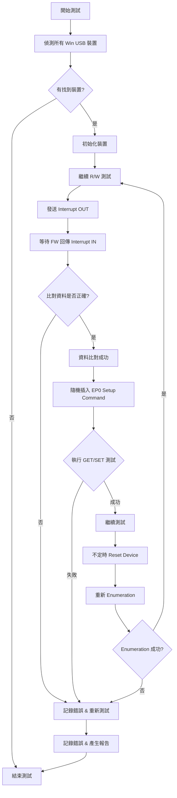

# USB 測試工具需求概述
本工具的目標是驗證 IC 7518，並擴展至其他 IC，確保不同 Win USB 裝置 的穩定性與數據傳輸正確性。
---
## 1. 測試範圍與挑戰
### 測試目標
- 先驗證 IC 7518，後續擴展至其他 IC。
- 自動偵測 所有 Win USB 裝置，並支援 同時測試多個裝置。
### 挑戰點
- 不同 IC 可能有不同的 Virtual Device 結構與 Endpoint 配置，工具需能適應變化。
- 測試過程中需處理 Interrupt、Bulk、Control 類型的數據傳輸，確保裝置穩定運行。
---
## 2. 支援的 Endpoint 類型
工具需支援以下 4 種 USB 端點 (Endpoint) 測試：
- Interrupt IN
- Interrupt OUT
- Bulk IN
- Bulk OUT
---
## 3. IC 7518 的 Virtual Device 結構
IC 7518 內建 兩種 Virtual Device，各自的 Endpoint 配置如下：
---
## 4. 測試內容與流程
### (A) Endpoint 資料比對
- 目標：驗證 Interrupt IN/OUT 端點是否能正確傳輸數據。
- 測試方式：
### (B) EP0 Setup Command 測試
- 目標：在 R/W 測試進行時，隨機插入 EP0 setup command，確認不同端點是否相互影響。
- 測試方式：
### (C) Reset & Enumeration 測試
- 目標：驗證在 R/W 過程中，執行裝置 Reset & Enumeration 是否影響數據傳輸。
- 測試方式：
---
## 5. 工具的核心功能
為了確保測試全面性與準確性，工具需具備以下能力：
- 自動偵測所有 Win USB 裝置，支援 同時測試多個裝置。
- 針對不同 Virtual Device (e.g., USB-C Bridge、HID)，執行 Interrupt IN/OUT 測試並比對數據。
- 隨機插入 EP0 setup command（包含 GET & SET），模擬實際應用環境並測試端點穩定性。
- 執行不定時 Reset & Enumeration 測試，確保裝置可正常重置並恢復運作。
- 可擴展支援不同 IC 型號，適應各種 Virtual Device 與 Endpoint 配置。

AOAI
