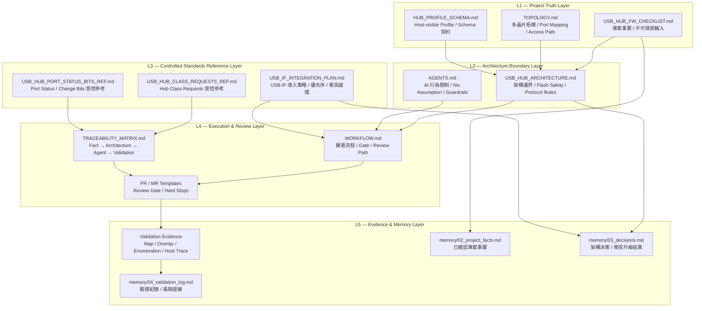

```mermaid
flowchart TB
    subgraph L1["L1 — Project Truth Layer"]
        A1["USB_HUB_FW_CHECKLIST.md<br/>專案事實 / 不可猜測輸入"]
        A2["TOPOLOGY.md<br/>多晶片拓樸 / Port Mapping / Access Path"]
        A3["HUB_PROFILE_SCHEMA.md<br/>Host-visible Profile / Schema 契約"]
    end

    subgraph L2["L2 — Architecture Boundary Layer"]
        B1["USB_HUB_ARCHITECTURE.md<br/>架構邊界 / Flash Safety / Protocol Rules"]
        B2["AGENTS.md<br/>AI 行為限制 / No-Assumption / Guardrails"]
    end

    subgraph L3["L3 — Controlled Standards Reference Layer"]
        C1["USB_IF_INTEGRATION_PLAN.md<br/>USB-IF 導入策略 / 優先序 / 衝突處理"]
        C2["USB_HUB_CLASS_REQUESTS_REF.md<br/>Hub Class Requests 受控參考"]
        C3["USB_HUB_PORT_STATUS_BITS_REF.md<br/>Port Status / Change Bits 受控參考"]
    end

    subgraph L4["L4 — Execution & Review Layer"]
        D1["WORKFLOW.md<br/>變更流程 / Gate / Review Path"]
        D2["TRACEABILITY_MATRIX.md<br/>Fact → Architecture → Agent → Validation"]
        D3["PR / MR Templates<br/>Review Gate / Hard Stops"]
    end

    subgraph L5["L5 — Evidence & Memory Layer"]
        E1["Validation Evidence<br/>Map / Overlay / Enumeration / Host Trace"]
        E2["memory/02_project_facts.md<br/>已確認專案事實"]
        E3["memory/03_decisions.md<br/>架構決策 / 衝突升級結果"]
        E4["memory/04_validation_log.md<br/>驗證紀錄 / 風險證據"]
    end

    A1 --> B1
    A2 --> B1
    A3 --> B1
    B1 --> D1
    B2 --> D1
    C1 --> D1
    C2 --> D2
    C3 --> D2
    D1 --> D3
    D2 --> D3
    D3 --> E1
    E1 --> E4
    A1 --> E2
    B1 --> E3
    C1 --> E3
```
