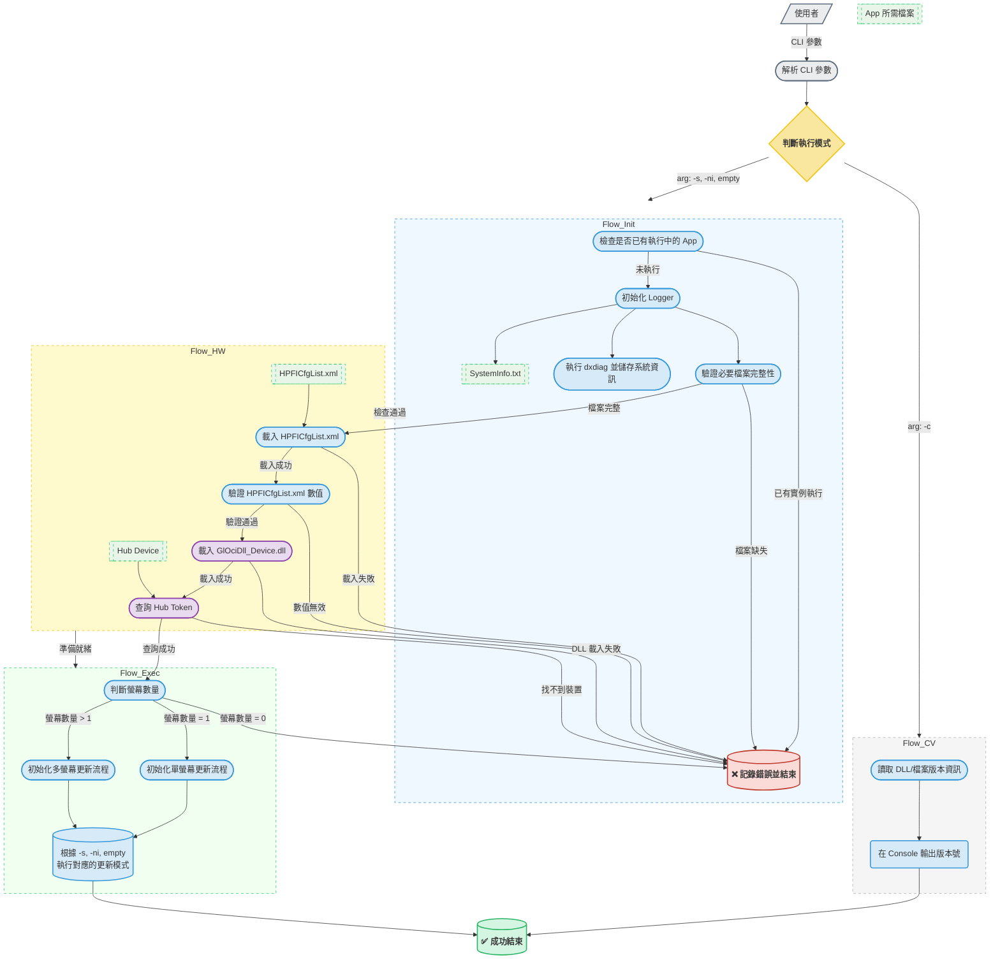
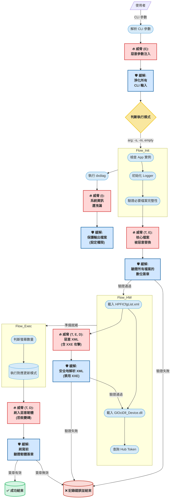

## OCI Tool Flow

## OCI Tool Flow 威脅建模

這份圖表的設計核心是**「威脅-緩解」**配對模式，讓安全措施與風險點直接對應。
### 1. 信任邊界 (Trust Boundary)
- 定義：信任邊界是您的可信程式碼與不可信的外部世界之間的分界線。任何跨越這條線的資料或指令都必須經過嚴格的審查。
- 圖中主要邊界包括：
### 2. 威脅節點 
- 用途：標示出**「哪裡可能出錯」**。每個紅色節點都代表一個基於 STRIDE 模型分析出的具體安全威脅。
- STRIDE 分類:
### 3. 緩解措施節點 (藍色)
- 用途：提出**「我們該如何應對」。每個藍色節點都是針對其前一個威脅的具體防禦策略，是開發中必須實施**的安全功能。
- 流程核心：圖表中的流程變成了：正常處理 → 發現威脅 → 實施緩解 → 判斷結果。如果緩解措施失敗（如簽章驗證不通過），流程必須終止，絕不能繼續。
---
### 關鍵威脅區域與應對策略
以下是此工具面臨的三個主要威脅領域，按優先級排序。
### 威脅區域 1：程式碼與韌體完整性 (最高優先級)
- 威脅：攻擊者將 GlOciDll_Device.dll 等核心檔案替換為惡意版本。當您的工具（特別是在以系統管理員權限執行時）載入這個惡意 DLL，攻擊者將完全控制執行該工具的系統。
- 潛在衝擊：權限提升 (E)、竄改 (T)。這是最嚴重的威脅。
- 必要策略 (M_Files, M_Firmware):
### 威脅區域 2：不安全的外部資料處理
- 威脅：攻擊者透過 CLI 參數 (T_Cli) 或 XML 設定檔 (T_Xml) 提供精心構造的惡意輸入，可能觸發路徑遍歷、緩衝區溢位或 XXE (XML 外部實體注入) 等攻擊。
- 潛在衝擊：權限提升 (E)、資訊洩露 (I)、服務阻斷 (D)。
- 必要策略 (M_Cli, M_Xml):
### 威脅區域 3：敏感資訊洩露
- 威脅：SystemInfo.txt 檔案包含了詳細的系統配置，可能被其他惡意軟體讀取，為攻擊者提供發動後續攻擊的有用情報。
- 潛在衝擊：資訊洩露 (I)。
- 必要策略 (M_Info):
