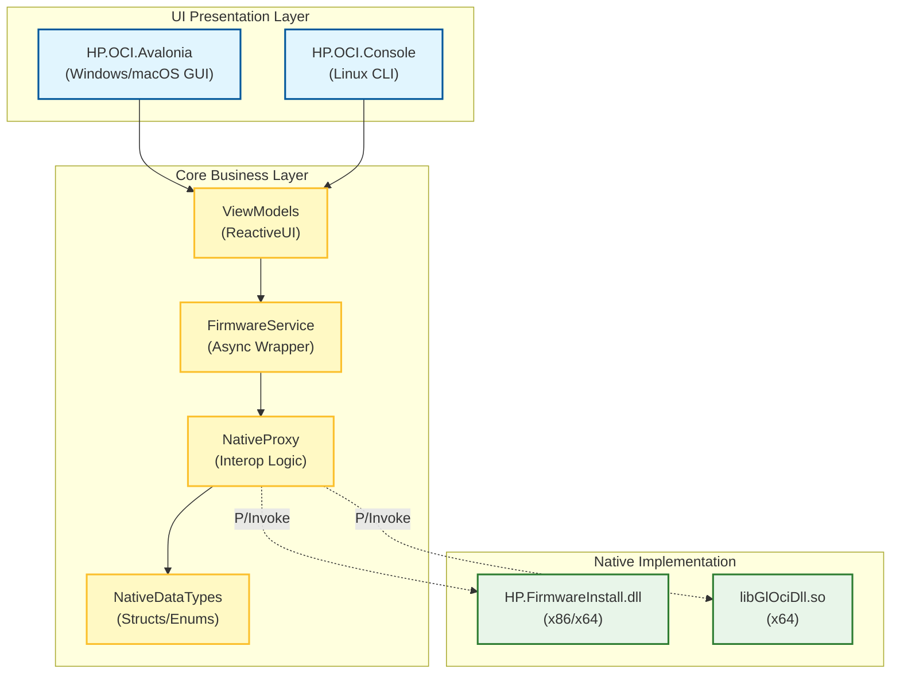
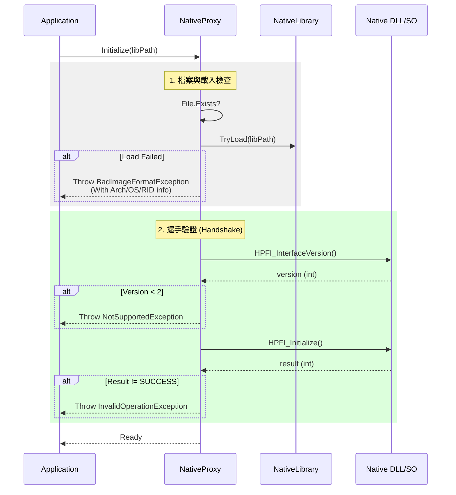
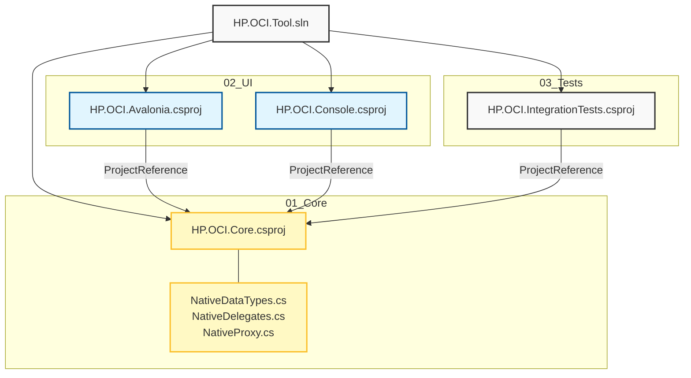

文件狀態: FROZEN (工程鎖定 / 可實作)版本: v3.4
日期: 2026-01-08
目標框架: .NET 8 (LTS)
審核人: GavinWu
---
## 1. 專案目標
將現有 WPF (.NET 4.6.1) 工具重構為 .NET 8 跨平台架構，確保核心業務邏輯與原生互通層 (Native Interop) 在 Windows、Linux 與 macOS 上的一致性與穩定性。
---
## 2. 系統架構設計 (System Architecture)
### 2.1 分層架構 (Layered Dependency)
採用 Clean Architecture 變體，強制分離「業務邏輯」與「原生互通細節」。

### 2.2 初始化與握手流程 (Initialization Sequence)
描述 NativeProxy 如何安全載入並驗證原生函式庫。

---
# 3. 專案結構總覽 (Project Structure)
本專案採用 Monorepo 結構，所有專案皆位於同一解決方案 (.sln) 下。
3.1 實體檔案結構 (File Tree)
```javascript
HP.OCI.Tool.sln
│
├── 📂 01_Core/
│   └── 📂 HP.OCI.Core/                 # [核心層] .NET Standard 2.0 / .NET 8
│       ├── 📂 Native/                  # [Native Interop]
│       │   ├── NativeDataTypes.cs      # Structs & Enums (Rule 3.1)
│       │   └── NativeDelegates.cs      # Delegate Definitions (Rule 3.2)
│       ├── 📂 Services/
│       │   ├── NativeProxy.cs          # Native Library Loader & Wrapper (Rule 3.3)
│       │   └── FirmwareService.cs      # Async Business Logic
│       └── 📂 ViewModels/              # ReactiveUI ViewModels
│
├── 📂 02_UI/
│   ├── 📂 HP.OCI.Avalonia/             # [GUI] Windows & macOS
│   │   ├── 📂 Views/
│   │   ├── App.axaml
│   │   └── Program.cs
│   │
│   └── 📂 HP.OCI.Console/              # [CLI] Linux Console
│       ├── Program.cs                  # Phase 0 Verification Script
│       └── InteractiveMode.cs
│
├── 📂 03_Tests/
│   └── 📂 HP.OCI.IntegrationTests/     # [Tests]
│       └── NativeInteropTests.cs       # Struct Size & Linkage Verification
│
└── 📂 lib/                             # [Native Libraries] (Copy to Output)
    ├── 📂 win-x64/
    │   └── HP.FirmwareInstall.dll
    └── 📂 linux-x64/
        └── libGlOciDll.so
```
3.2 專案引用關係 (Reference Graph)

3.3 關鍵檔案說明
---
## 4. 工程硬規範 (Engineering Hard Rules)
### [Rule 4.1] Struct 定義規範
- Packing: 必須標註 [StructLayout(LayoutKind.Sequential, Pack = 1)]。
- CharSet: HPFI_FIRMWARE_INFO 必須使用 CharSet.Unicode。
- String: 使用 [MarshalAs(UnmanagedType.ByValTStr, SizeConst = N)]。
- x64/x86: cbSize 欄位需區分 ulong (64-bit) 與 uint (32-bit)。
### [Rule 4.2] Calling Convention
- 策略: 使用預設 CallingConvention.Winapi。
- 定義: Windows = StdCall, Linux/macOS = Cdecl。
- 驗證: 必須通過 Phase 0 驗證。
### [Rule 4.3] 生命周期禁令 (No Runtime Unload)
- 強制執行: 移除所有 FreeLibrary / NativeLibrary.Free 呼叫。
- 原因: 防止 Driver 狀態殘留導致崩潰。
---
## 5. 實作套件 (Implementation Kit)
### 5.1 NativeDataTypes.cs (完整定義)
```javascript
using System;
using System.Runtime.InteropServices;

namespace HP.OCI.Core.Native
{
    public enum HPFI_RESULT : int
    {
        HPFI_RESULT_SUCCESS = 0,
        // ... 其他 enum ...
        HPFI_RESULT_FAILED = 8
    }

    [StructLayout(LayoutKind.Sequential, Pack = 1)]
    public struct HPFI_FIRMWARE_VERSION
    {
        public int major; public int minor; public int build; public int revision;
        public override string ToString() => $"{major}.{minor}.{build}.{revision}";
    }

    [StructLayout(LayoutKind.Sequential, Pack = 1)]
    public struct HPFI_FIRMWARE_DATE
    {
        public int year; public int month; public int day;
        public override string ToString() => $"{year:D4}-{month:D2}-{day:D2}";
    }

    // x64 定義 (size_t = 8 bytes)
    [StructLayout(LayoutKind.Sequential, Pack = 1, CharSet = CharSet.Unicode)]
    public struct HPFI_FIRMWARE_INFO_X64
    {
        public ulong cbSize;
        [MarshalAs(UnmanagedType.ByValTStr, SizeConst = 256)]
        public string szName;
        public HPFI_RESULT result;
        public HPFI_FIRMWARE_VERSION version;
        public HPFI_FIRMWARE_DATE date;
        [MarshalAs(UnmanagedType.ByValTStr, SizeConst = 1024)]
        public string szErrMsg;
        public int bForceInstall;

        public static HPFI_FIRMWARE_INFO_X64 Create() => 
            new HPFI_FIRMWARE_INFO_X64 { cbSize = (ulong)Marshal.SizeOf<HPFI_FIRMWARE_INFO_X64>() };
    }
    
    // x86 定義略 (參考 cbSize 為 uint)
}
```
### 5.2 NativeDelegates.cs
```javascript
using System;
using System.Runtime.InteropServices;

namespace HP.OCI.Core.Native
{
    // 使用預設 CallingConvention (Winapi)
    public delegate int HPFI_InterfaceVersionDelegate();
    public delegate int HPFI_InitializeDelegate(ref IntPtr ppV);
    public delegate void HPFI_FinalizeDelegate(IntPtr pV);
    
    public delegate void HPFI_GetPackagedFirmwareInfoDelegate_X64(ref HPFI_FIRMWARE_INFO_X64 pFi);
    // ... 其他 Delegates ...
}
```
### 5.3 NativeProxy.cs (核心邏輯)
```javascript
using System;
using System.IO;
using System.Runtime.InteropServices;
using HP.OCI.Core.Native;

namespace HP.OCI.Core.Services
{
    public class NativeProxy : IDisposable
    {
        private IntPtr _handle;
        private IntPtr _context;
        private bool _isX64;
        
        // Delegates...
        private HPFI_InterfaceVersionDelegate _interfaceVersion;
        private HPFI_InitializeDelegate _initialize;
        private HPFI_GetPackagedFirmwareInfoDelegate_X64 _getPackagedInfo_X64;

        public void Initialize(string libPath)
        {
            if (!File.Exists(libPath))
                throw new FileNotFoundException($"Lib not found: {libPath}");

            if (!NativeLibrary.TryLoad(libPath, out _handle))
            {
                var info = new FileInfo(libPath);
                throw new BadImageFormatException(
                    $"Load failed. Path: {libPath}, Size: {info.Length}, " +
                    $"OS: {RuntimeInformation.OSDescription}, Arch: {RuntimeInformation.ProcessArchitecture}");
            }

            _isX64 = IntPtr.Size == 8;
            BindFunctions();
            PerformHandshake();
        }

        private void BindFunctions()
        {
            _interfaceVersion = LoadFunc<HPFI_InterfaceVersionDelegate>("HPFI_InterfaceVersion");
            _initialize = LoadFunc<HPFI_InitializeDelegate>("HPFI_Initialize");
            
            if (_isX64)
                _getPackagedInfo_X64 = LoadFunc<HPFI_GetPackagedFirmwareInfoDelegate_X64>("HPFI_GetPackagedFirmwareInfo");
        }

        private void PerformHandshake()
        {
            int version = _interfaceVersion();
            if (version < 2) throw new NotSupportedException($"Version mismatch: {version}");

            _context = IntPtr.Zero;
            int result = _initialize(ref _context);
            if (result != 0) throw new InvalidOperationException($"Initialize failed: {result}");
        }

        public HPFI_FIRMWARE_INFO_X64 GetPackagedFirmwareInfo()
        {
            if (!_isX64) throw new PlatformNotSupportedException("Snippet for x64 only");
            var info = HPFI_FIRMWARE_INFO_X64.Create();
            _getPackagedInfo_X64(ref info);
            return info;
        }

        public void Dispose()
				{
				    // [Rule 4.3] No Runtime Unload
				    LibPtr = IntPtr.Zero;
				    _isDisposed = true;
				}

        private T LoadFunc<T>(string name) where T : Delegate
        {
            if (NativeLibrary.TryGetExport(_handle, name, out IntPtr addr))
                return Marshal.GetDelegateForFunctionPointer<T>(addr);
            throw new EntryPointNotFoundException(name);
        }
    }
}
```
---
## 6. Phase 0 驗收腳本 (Acceptance Script)
```javascript
public static void VerifyEnvironment(string libPath)
{
    Console.WriteLine($"=== Verifying {libPath} ===");
    int size = Marshal.SizeOf<HPFI_FIRMWARE_INFO_X64>();
    Console.WriteLine($"Struct Size (x64): {size} (Expected ~2604)");
    
    using var proxy = new NativeProxy();
    try {
        proxy.Initialize(libPath);
        var info = proxy.GetPackagedFirmwareInfo();
        Console.WriteLine($"Name: {info.szName}");
        Console.WriteLine("✅ Verification Passed");
    } catch (Exception ex) {
        Console.WriteLine($"❌ Failed: {ex.Message}");
    }
}
```
---
## 7. 風險控制表 (Risk Register)
