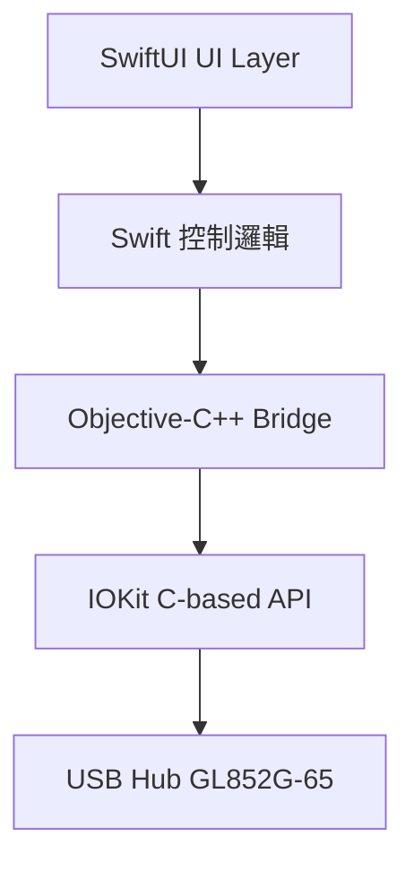
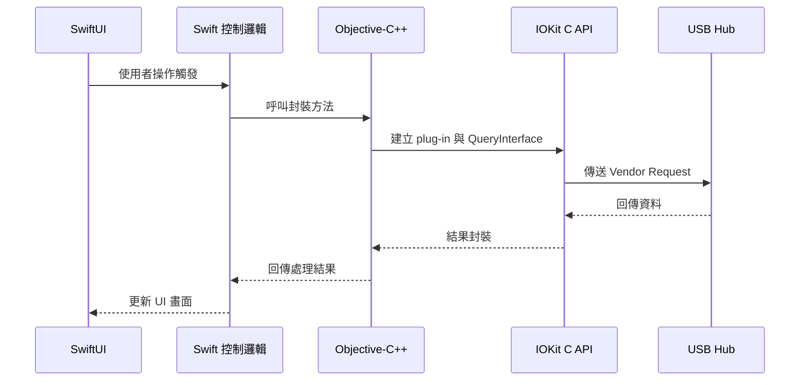
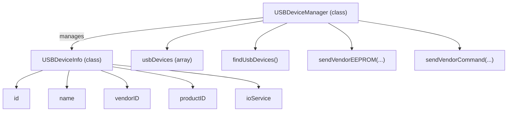
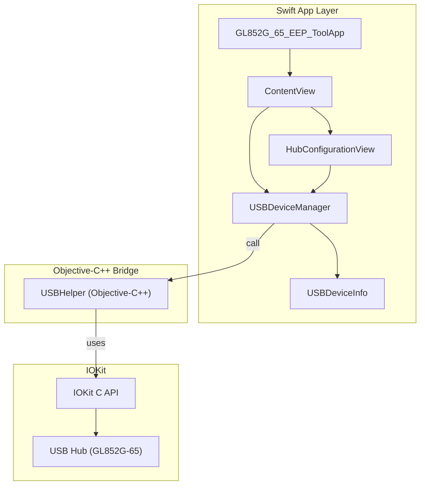

## 原由
客戶希望在 macOS 平台上修改 USB Hub 2.0 的 EEPROM 資料。
但由於從未在 macOS 上開發相關工具，且對原本的 Windows 版程式碼也不熟悉，因此初期僅提供替代工具給客戶使用。
在開會進一步討論後，確認 macOS 上仍需要專屬開發工具，於是將此需求納入開發時程中。
## 一、初期開發與挑戰
- 嘗試先觀察 Windows 工具的邏輯，並將其 Struct 與資料操作轉換為 Swift 相對應的寫法：
- 原本預期功能不多，但熟悉 Windows Tool 後才發現其內部功能與細節繁多，需逐一轉換為 Swift 邏輯實作。
- Windows 版工具中還藏有一些非公開的行為或特殊功能，開發中途才逐步發現，導致需回頭調整畫面排列與邏輯。
---
## 二、Swift UI 的使用與挑戰
- 使用 SwiftUI 進行 UI 建構，採用程式化方式繪製畫面，方便日後維護與擴充。
- 由於對 SwiftUI 語法不熟悉，開發初期只能透過 ChatGPT 協助逐步修改與調整。
- 因為每次調整需反覆驗證與修正，導致 UI 開發耗費大量時間。
- MFC UI 架構與 SwiftUI 不同，為讓 macOS 版本的行為與 Windows 一致，必須學習並理解 SwiftUI 的畫面邏輯與資料綁定方式。
---
##  三、透過 Swift 與 IOKit 溝通 USB Hub
### 初期遇到的問題
- IOCreatePlugInInterfaceForService 持續失敗
- QueryInterface 無法成功執行
### 解決方案
- 改用 Objective-C++ 撰寫與 IOKit 溝通的邏輯：


- Swift 僅負責呼叫封裝好的 Objective-C++ 函式：
> 備註：此方式有效降低開發風險，並可提高維護性。未來如需支援更多 USB 指令或 Hub 型號，也能透過 Objective-C++ 擴充核心邏輯，再由 Swift 呼叫即可。
---
## 四、目前尚未完成的項目
- 頁面設計差異尚未解決：
- 僅支援單一晶片型號：
---
## 五、與 ChatGPT 合作開發經驗
- 本工具是第一個從無到有，完整與 ChatGPT 協作開發的實例。
- 初期由 ChatGPT 協助產生 Swift 語法與 IOKit 介接邏輯，但其中包含許多錯誤，尤其在 UUID 定義與 interface 指標處理上，需依據 macOS Objective-C 範例一步步比對修正。
- SwiftUI 的生成支援度有限，無法依靠截圖自動產生正確畫面結構，就算是局部畫面截圖也有很高機率錯誤，仍需手動逐項微調。
- MFC 的邏輯與資料結構可較順利轉換為 Swift，僅需針對語法與語意差異進行微調。
- 若能事先整理好完整的功能邏輯（spec），再結合 MFC 範例 code，則由 GPT 產生正確 Swift code 的成功率會明顯提高。
---
## 六、總結與建議
- SwiftUI 對初學者來說學習曲線較陡，但熟悉後可大幅提升畫面維護效率。
- IOKit 屬低階 macOS 框架，建議使用 Objective-C++ 作為橋接，減少 Swift 操作底層 API 所帶來的風險。
- Windows 工具的隱藏功能與非標準流程需特別注意，開發前應完整盤點功能，避免中途大幅返工。
- 若需使用 ChatGPT 協助開發，建議先備妥：
## 七、UI 畫面
- 初始畫面
- BasicFunc
- FullFunc
## 八、USBDeviceManager 架構說明（程式簡要）

- 初始化時會呼叫 findUsbDevices() 搜尋 GL852G-65
- 主要資料結構為 USBDeviceInfo，包含 vendor/product ID、裝置名稱與 ioService handle
- 提供 EEPROM 讀取功能 sendVendorEEPROM()，透過 USBHelper 傳送 vendor request
- 提供簡單指令讀取 sendVendorCommand()，具 retry 機制與 log 記錄
- 使用 Logger 提供統一的 debug 與錯誤訊息記錄
- 使用 IOKit 搜尋裝置，並正確釋放 iterator 資源
## 九、EEPROM 資料結構（HUBEEP）
```swift
@frozen
public struct HUBEEP {
    public var VID: UInt16
    public var PID: UInt16
    public var Checksum: UInt8
    public var EEP_05: UInt8
    public var DeviceRemovable: UInt8
    public var PortNumber: UInt8
    public var MaxPower: UInt8
    public var EEP_09: UInt8
    public var EEP_0A: UInt8
    public var EEP_0B: UInt8
    public var EEP_0C: UInt8
    public var EEP_0D: UInt8
    public var EEP_0E: UInt8
    public var EEP_0F: UInt8
    public var VendorStrLen: UInt8
    public var VendorStr: (UInt8, ... x47)
    public var ProductStrLen: UInt8
    public var ProductStr: (UInt8, ... x47)
    public var SerialNumberLen: UInt8
    public var SerialNumber: (UInt8, ... x31)
    public var UUID: (UInt8, ... x16)
}
```
- HUBEEP 結構描述 EEPROM 設定，包含 VID/PID、Port 設定與 Vendor/Product 字串等。
- toViewModel() 用於轉換為 SwiftUI 的 @State 資料綁定格式。
- 提供 example() 方法產生範例資料，可供測試與 UI 模擬。
## 十、Swift + Objective-C 架構圖

### 🧩 各區塊功能說明
