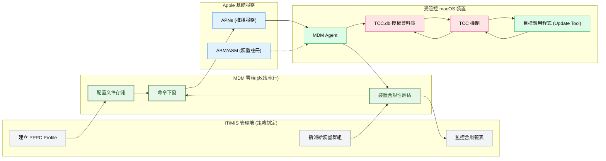
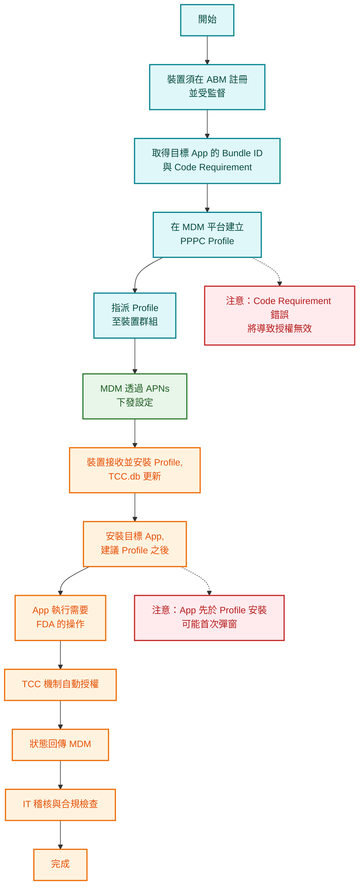
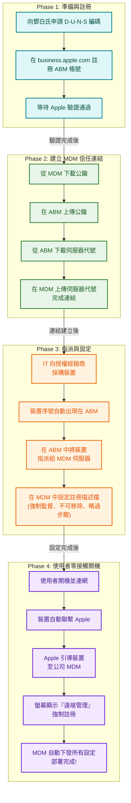

## 1. 執行摘要 (Executive Summary)
本文件提供一套標準作業程序 (SOP)，說明如何透過 Apple MDM (行動裝置管理) 框架，集中且自動化地為企業內部的 macOS 裝置授予應用程式（如內部更新工具）所需的 完全磁碟存取權限 (Full Disk Access, FDA)。
此方法完全符合 Apple 官方規範 與 國際資安標準，取代耗時且易出錯的人工設定，確保企業 合規性、一致性與安全性。
---
## 2. 背景：為何需要 MDM？
- Apple 的安全設計 (TCC)
- 企業挑戰
- Apple 官方解法
---
## 3. 解決方案架構
### 3.1 核心角色
1. IT/MIS 管理端 (策略制定者)
1. MDM 雲端平台 (政策執行者)
1. Apple 基礎服務 (生態系基礎)
1. 受管控 macOS 裝置 (政策接收者)
### 3.2 架構關係圖

## 4. 標準部署流程 (SOP)
此流程確保 FDA 權限能順利且無干擾地部署到所有裝置。

---
## 5. 關鍵設定：PPPC 描述檔詳解
以下是 PPPC 描述檔中授權 FDA 的核心 XML 片段。
```java
<dict>
  <key>PayloadType</key>
  <string>com.apple.TCC.configuration-profile-policy</string>
  <key>Services</key>
  <dict>
    <key>SystemPolicyAllFiles</key>
    <array>
      <dict>
        <key>Authorization</key>
        <string>Allow</string>
        <key>Identifier</key>
        <string>com.company.hubFwUpdaterCLI</string>
        <key>IdentifierType</key>
        <string>bundleID</string>
        <key>CodeRequirement</key>
        <string>identifier "com.company.hubFwUpdaterCLI" and anchor apple generic and certificate leaf[subject.OU] = "TEAMID1234"</string>
      </dict>
    </array>
  </dict>
</dict>

```
### 設定檔欄位詳解
### 欄位解析
---
## 6. 測試驗證
- 測試條件：受監督的 Mac，已透過 MDM 下發 Profile。
- 驗證方式：
---
## 7. 稽核與維運
---
## 8. 合規性對應
- Apple 官方：《MDM Protocol Reference》
- NIST：SP 800-53 → AC-6 Least Privilege, CM-6 Configuration Settings
- ISO 27001：A.9.2 使用者存取管理
- 企業資安政策：支援集中控管，滿足審計追蹤需求
---
## 9. 結論
1. 唯一合法路徑：FDA 權限無法透過腳本或安裝包靜默開啟，必須依循 MDM + PPPC。
1. 安全與合規並重：此流程符合 Apple 與 NIST/ISO 標準。
1. 最佳實踐：先下發 Profile，再安裝 App；持續監控與驗證。
---
### 附錄 A：設定自動化裝置註冊 (Apple Business Manager)
本附錄詳細說明如何完成「自動化裝置註冊 (Automated Device Enrollment, ADE)」的 foundational setup，以確保所有公司裝置都能被 MDM 強制納管並進入「受監督」模式。
### 核心概念：數位出生證明
ADE 流程等同於為公司裝置辦理「數位出生證明」。裝置出廠時，其序號就被 Apple 登記為貴公司資產。當裝置首次開機連網，它會自動向您指定的 MDM 伺服器報到並接受管理，實現 零接觸部署 (Zero-Touch Deployment)。
### 階段一：準備工作 (Prerequisites)
1. 鄧白氏環球編碼 (D-U-N-S Number)：用於驗證企業身份，可免費申請。
1. 有效的 MDM 解決方案：如 Jamf, Microsoft Intune, Meraki 等。
1. 從授權通路購買裝置：採購時提供您的 Apple 客戶編號或經銷商編號，裝置序號將自動匯入您的 ABM 帳戶。
### 階段二：設定流程
步驟 1：註冊 Apple Business Manager (ABM)
1. 前往 business.apple.com 進行註冊。
1. 填寫公司資訊及 D-U-N-S 編碼。
1. 等待 Apple 審核驗證，可能需要數天。
步驟 2：將 MDM 伺服器連結至 ABM
1. 從 MDM 平台：下載伺服器公鑰 (.pem 或 .cer)。
1. 在 ABM 網站：前往「設定」>「裝置管理設定」>「加入 MDM 伺服器」，上傳剛才下載的公鑰。
1. 從 ABM 網站：下載 ABM 產生的伺服器代號 (.p7m)。
1. 回到 MDM 平台：上傳剛才下載的伺服器代號，完成雙向信任連結。
步驟 3：在 ABM 中指派裝置
1. 設定預設規則：在 ABM「設定」中，將所有新購裝置預設指派給您的 MDM 伺服器。
1. 手動指派：對於已存在的裝置，手動選取並指派給 MDM 伺服器。
步驟 4：在 MDM 中設定「註冊描述檔」
1. 在 MDM 平台中建立一個「註冊描述檔 (Enrollment Profile)」。
1. 關鍵設定：
### 階段三：使用者體驗
設定完成後，新員工拿到未拆封的 Mac：
1. 開機、連網。
1. 裝置自動聯繫 Apple，螢幕出現無法跳過的「遠端管理」畫面。
1. 使用者確認後，MDM 開始自動下發所有公司設定、應用程式與安全策略。
1. 進入桌面時，裝置已完全配置好並處於受管狀態。
### 流程圖總結

