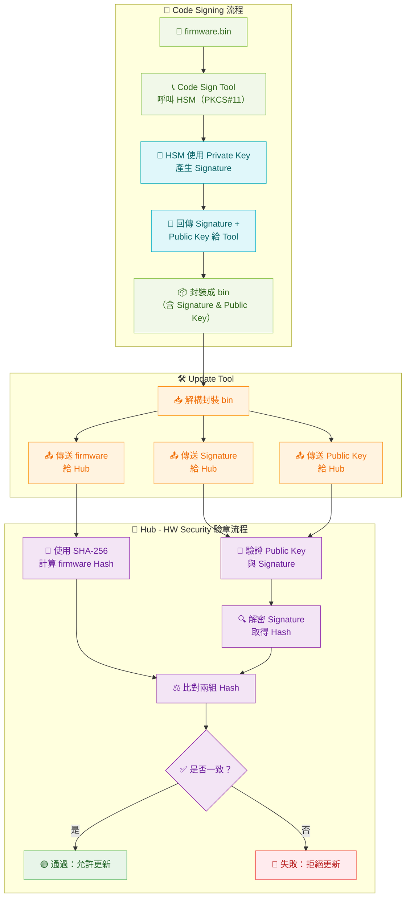
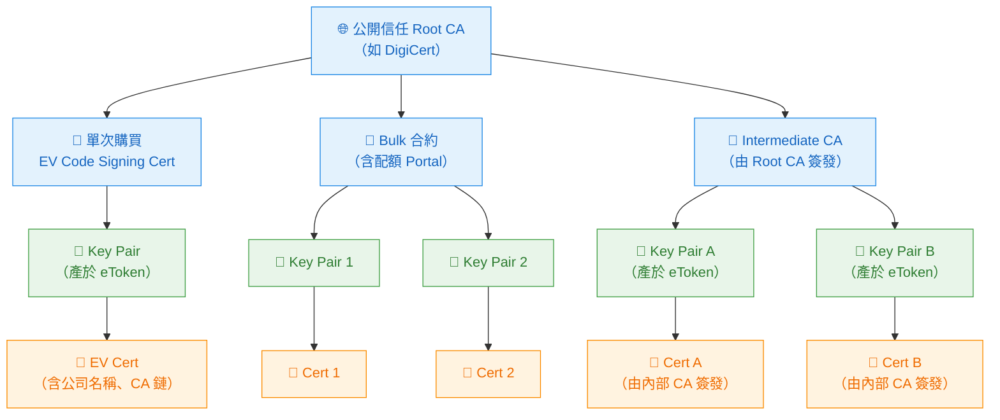
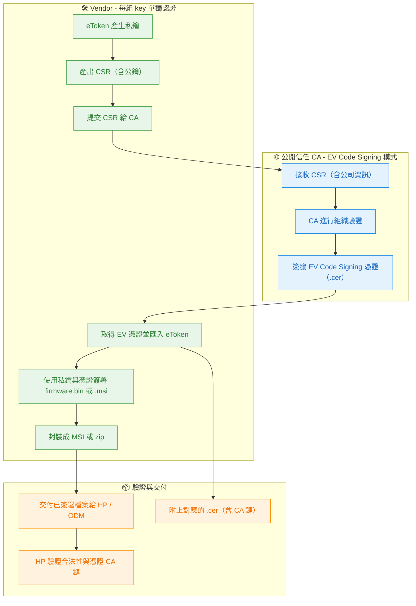
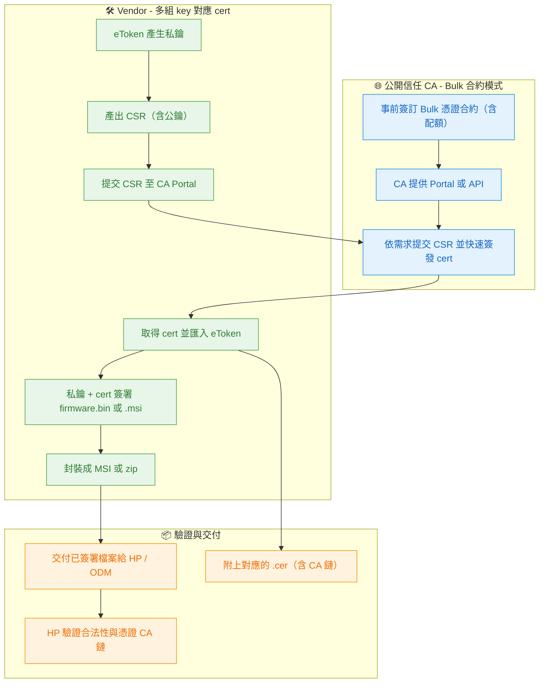
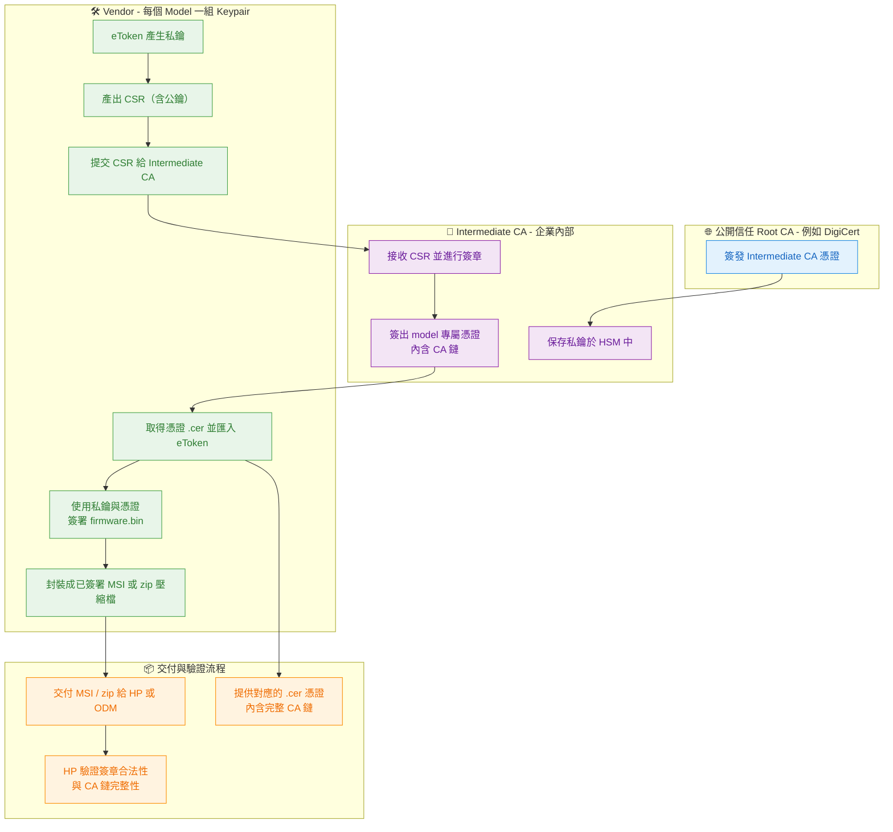
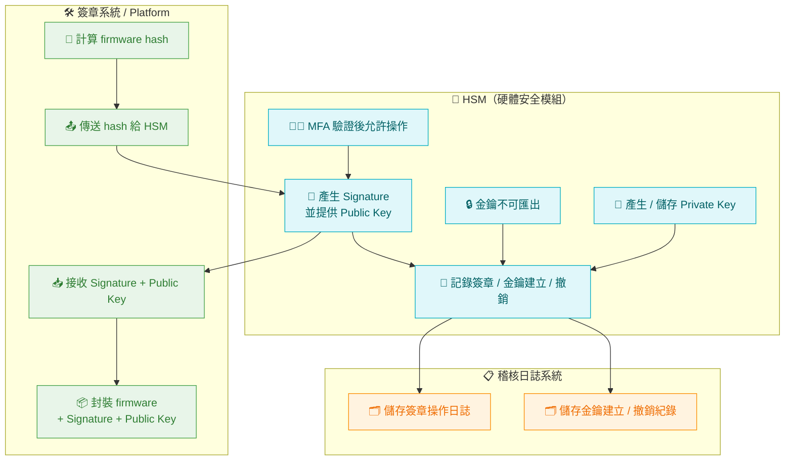

## ✅ Firmware Code Signing 與驗章流程說明
### 🧩 1. 簽章階段（Code Signing）
由開發端使用具備 HSM 保護的私鑰，對 firmware 進行數位簽章：
- 使用 Code Sign Tool 搭配 PKCS#11 協議 與 HSM 溝通。
- HSM 使用內部私鑰產生 Signature（簽章）。
- 同時匯出對應的 Public Key（公鑰）。
- 最終將 firmware.bin、Signature 與 Public Key 一併封裝，作為更新映像。
---
### 🛠️ 2. 更新階段（Update Tool 拆解）
Update Tool 在下發前，將簽章資訊解構並送往 Hub：
- 將封裝 bin 中的三項資訊拆開：
- 透過不同通道或分段，傳送給目標裝置（Hub）。
---
### 🔐 3. 驗章階段（Hub - HW Security 驗證）
Hub 端的硬體驗章模組（例如 Secure Boot Module）負責驗證：
- 對比 firmware.bin 的 Hash 與 Signature 是否一致。
- 確認 Public Key 是否正確對應 Signature。
- 簽章驗證成功：允許 firmware 寫入更新流程。
- 驗證失敗：拒絕更新，避免惡意或未授權映像導入。
---
### 📘 附註
## Firmware Code Sign & Verification Flow

## 🔐 CA 認證：韌體簽章與企業應用概論
---
為了符合如 HP 等大客戶在 Secure Delivery 與 Code Signing 的要求，企業在執行韌體／工具／安裝檔簽章時，需配合公開信任的 CA（Certificate Authority）發行憑證，並確保：
- ✅ 私鑰安全（例如儲存在 eToken 或 HSM 中）
- ✅ 簽章過程可稽核（Log 記錄、MFA 控制）
- ✅ 憑證具備完整的 CA 信任鏈（包含 Root/Intermediate）
### 🧩 三種常見的 CA 簽章模式整理如下：
## 🧭 架構圖

---
### ✅ Code Signing 憑證申請與維護對照表
### ✅ 單次購買 EV Code Signing 憑證（每組 key pair 個別認證）

### 🔸 Bulk 憑證合約（配額簽發）

### 🔶 自建 Intermediate CA（被公開 Root 簽章）

---
### 🧠 額外說明：
- EV Cert 買斷 ≠ 可重複簽多組 key：每組私鑰/公鑰都需要一組 cert 簽章。
- Bulk 合約 ≠ Intermediate CA：Bulk 是由 CA 控制簽發，只是價格比較便宜。
- Intermediate CA 最大優勢是自主性與可擴展性，但代價是：初期投入大、管理負擔高。
### ✅ CA Security Council - Minimum Requirements for Code Signing v1.1（2022）
這份標準文件由 CA/Browser Forum 所支持，目的是：
> 確保 Code Signing 憑證的私鑰與簽章操作具備可驗證的信任與安全性，防止惡意程式偽裝為合法軟體散佈。
---
### 🔐 一、私鑰儲存與管理要求
---
### 🔐 二、身份驗證與發證規範
---
### 📄 三、簽章行為稽核與可追溯性
---
### 🧱 四、應對金鑰洩漏的強制流程
---
## 🎯 你該怎麼做來滿足這份標準？
---
## 🔐 HSM 與簽章安全機制總覽
### ✅ 一、使用 HSM 的目的與基本要求
使用 HSM（Hardware Security Module）是實作強化數位簽章與金鑰管理的重要基礎，以下為供應商簽章安全相關的必要條件：
---
### ✅ 二、密碼演算法與金鑰長度要求（根據 NIST 與 FIPS）
> 🔎 注意事項： 自 2031 年起，小於 128-bit 的演算法僅允許用於歷史用途，不得作為新產品之簽章用途。
---
### ✅ 三、HP 對供應商 HSM 與簽章要求
根據 HP 的 Firmware 安全交付規範：
- 所有供應商必須使用 HSM 保護私鑰（含使用 EV Cert、Bulk Cert 或內部 Intermediate CA）
- 使用的金鑰與簽章流程，需符合 CA/B Forum 與 CA Security Council Minimum Requirements v1.1
- 簽章前的檔案必須經過惡意程式掃描（Malware Scan）
- 供應商需標明所使用的：
---
### ✅ 四、金鑰用途分類（測試 vs 正式）
> ❗ 禁止： 正式交付之映像檔包含任何測試用金鑰或憑證
---
### ✅ 五、建議措施彙整
- ✅ 儲存金鑰與簽章操作必須整合 HSM 與 MFA 控制
- ✅ 應設計完整的 key rotation / revocation 機制
- ✅ 對所有憑證與金鑰使用，應有審查與記錄流程（Audit）
- ✅ 所有簽章後的程式碼，應定期重新掃描安全性與效期檢查

### 🔐 1. RoT – Root of Trust（信任根）
> 定義：系統中最基礎、最可信賴的元件或機制，所有後續的信任鏈都由它開始建立。
