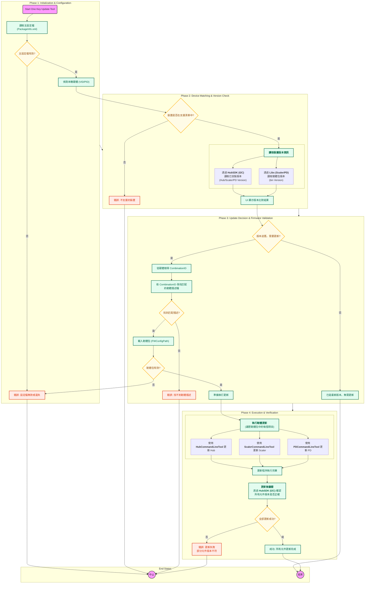
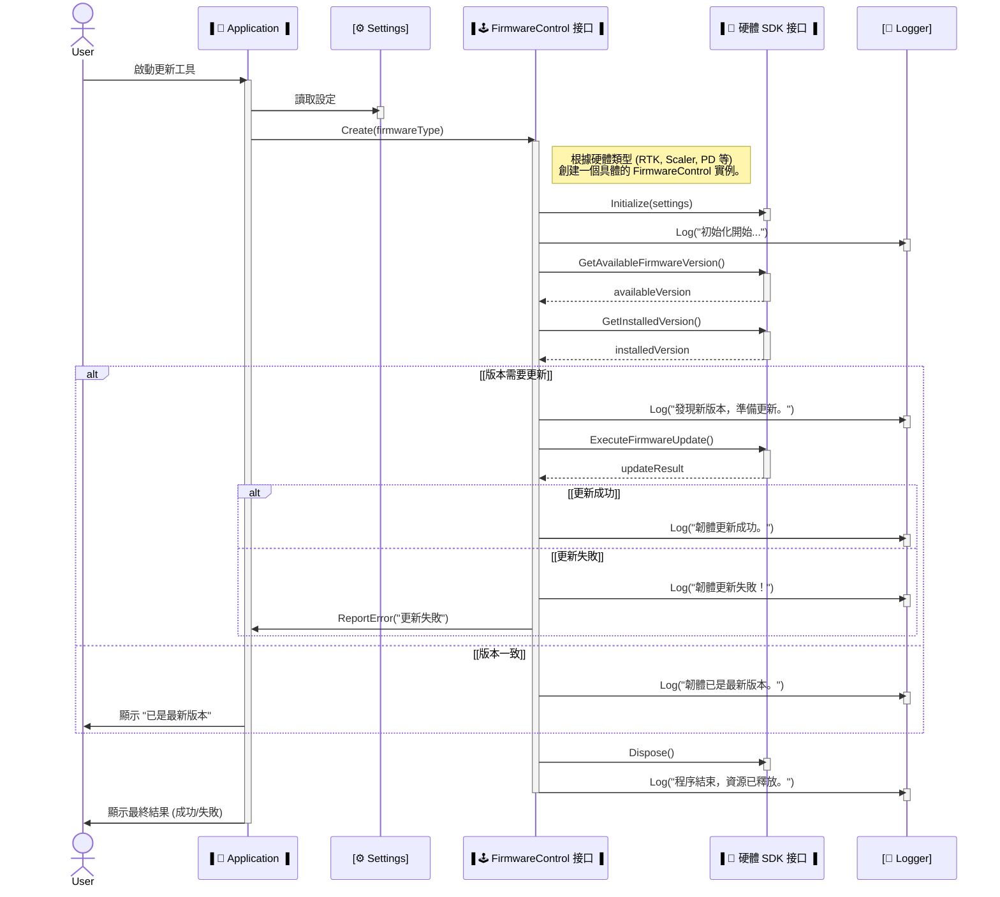

# 📄 一鍵更新工具 (Lenovo One Key Update Tool) - 技術設計文件

> 文件目的： 本文件旨在詳細闡述「一鍵更新工具」的系統架構、核心業務流程、類別設計以及詳細的執行時序。它將作為開發、維護和團隊溝通的統一參考。

## 1. 宏觀視角：系統架構與互動圖

這張圖從最高層次展示了系統由哪些主要元件組成，以及它們之間的互動關係。它回答了 **「誰在做事？」** 這個問題。

- **藍色**代表核心應用控制器。

- **綠色**代表負責執行的各種工具和函式庫。

- **灰色**代表最終操作的實體硬體。

💡 **核心思想：** 主控制器 (`MainController`) 負責協調，它調用不同的**命令列工具**來執行更新，並使用 **SDK/Lib** 來查詢資訊和與硬體通訊。

```mermaid
flowchart TD
    %% =============================================
    %% Style Definitions (樣式定義)
    %% =============================================
    classDef mainApp fill:#e6f2ff,stroke:#0052cc,stroke-width:2px,color:#0052cc
    classDef toolSet fill:#e3fcef,stroke:#006644,stroke-width:1px,color:#004d33
    classDef cliTool fill:#c3e6cb,stroke:#155724,stroke-width:2px,color:#155724
    classDef libSdk fill:#e3fcef,stroke:#006644,stroke-width:1px,color:#004d33
    classDef folder fill:#f8f9fa,stroke:#adb5bd,stroke-width:2px,stroke-dasharray: 4 4,color:#6c757d
    classDef device fill:#f5f5f5,stroke:#666,stroke-width:2px,color:#333

    %% =============================================
    %% Node Definitions (節點定義)
    %% =============================================

    %% One Key Update Tool
    subgraph OneKeyUpdateTool [One Key Update Tool]
        MainController
    end

    %% Hub Tools
    subgraph HubTools [Hub Tools]
        HubCommandLineTool
        HubSDK
        HubToolFolder
    end

    %% Scaler Tools
    subgraph ScalerTools [Scaler Tools]
        ScalerCommandLineTool
        ScalerLib
        ScalerToolFolder
    end

    %% PD Tools
    subgraph PDTools [PD Tools]
        PDCommandLineTool
        PDLib
        PDToolFolder
    end

    %% Devices
    subgraph PhysicalDevices [Physical Devices]
        HubDevice
        PDDevice
        ScalerDevice
    end

    %% =============================================
    %% Connections (連線定義)
    %% =============================================

    %% --- Main Controller Flows ---
    MainController -->|觸發 Scaler 更新| ScalerCommandLineTool
    MainController -->|觸發 PD 更新| PDCommandLineTool
    MainController -->|觸發 Hub 更新| HubCommandLineTool

    MainController -->|查詢 Scaler bin 檔資訊| ScalerLib
    MainController -->|查詢 PD bin 檔資訊| PDLib
    
    %% --- Hub 操作路徑 ---
    %% 1. Hub 更新路徑
    HubCommandLineTool -->|直接更新 Hub 韌體| HubDevice
    %% 2. 日常通訊與 I2C Relay 路徑
    MainController -->|查詢狀態/轉發命令| HubSDK
    HubSDK -->|HID Interface| HubDevice
    
    %% --- I2C Relay (修改為雙向箭頭) ---
    HubDevice <-->|<b>I2C Relay</b><br>雙向轉發命令/數據| ScalerDevice

    %% --- 其他裝置更新路徑 ---
    PDCommandLineTool -->|更新韌體| PDDevice
    ScalerCommandLineTool -->|更新韌體| ScalerDevice

    %% --- 檔案存取 ---
    ScalerLib -.->|解析 bin 檔| ScalerToolFolder
    PDLib -.->|解析 bin 檔| PDToolFolder
    HubSDK -.->|解析 bin 檔| HubToolFolder

    HubCommandLineTool -->|使用 bin 檔| HubToolFolder
    ScalerCommandLineTool -->|使用 bin 檔| ScalerToolFolder
    PDCommandLineTool -->|使用 bin 檔| PDToolFolder
    
    %% =============================================
    %% Apply Classes (套用樣式)
    %% =============================================
    class MainController mainApp
    
    class HubCommandLineTool,ScalerCommandLineTool,PDCommandLineTool cliTool
    class HubSDK,ScalerLib,PDLib libSdk
    class HubToolFolder,ScalerToolFolder,PDToolFolder folder
    
    class HubDevice,PDDevice,ScalerDevice device
```

## 2. 業務流程：詳細更新流程圖

這張圖詳細描述了工具從啟動到結束的**完整業務流程**，包含了所有決策點和錯誤處理路徑。它回答了 **「事情是怎麼做的？」** 這個問題。

- **粉色**代表起點/終點。

- **綠色**代表 I/O 或資訊處理。

- **黃色**代表決策點。

- **紅色**代表錯誤狀態。

核心思想：** 整個流程被劃分為四個主要階段：**初始化 -> 匹配與檢查 -> 決策與驗證 -> 執行與驗證**。這確保了更新過程的健壯性和可靠性。

## 3. 微觀視角：類別與時序設計

這一部分深入到程式碼層面，展示了系統的靜態類別結構和動態執行時序。

點擊展開，查看詳細的類別圖和時序圖

### 3.1 類別圖 (Class Diagram)

這張圖展示了系統中主要的類別、接口、列舉以及它們之間的靜態關係（繼承、依賴）。它回答了 **「系統是由哪些程式碼元件構成的？」** 這個問題。

核心設計：** 系統採用了**策略模式 (Strategy Pattern)**。`Application` 透過抽象的 `IFirmwareControl` 接口與具體的更新邏輯互動，從而實現了業務邏輯與具體硬體操作的解耦。

```mermaid
classDiagram
    %% =============================================
    %% Namespace: Core Controls (核心控制層)
    %% =============================================
    namespace CoreControls {
        class IFirmwareControl {
            <<Interface>>
            +InitialzeSDK() void
            +SetOEMVendor(OEMVendorType vendor) void
            +InitializeAsync() Task~GLResult~bool~~
            +FinalizeAsync() Task~GLResult~bool~~
            +GetFirmwareVersionAsync() Task~GLResult~string~~
            +GetInstalledVersionAsync() Task~GLResult~string~~
            +Dispose() void
        }

        class RTKScalerFirmwareControl {
            +GetFirmwareDetailsAsync() Task~GLResult~Dictionary~string, string~~~
            +ScheduleUpdate(int totalSecond, CancellationToken token) GLResult~bool~
        }
        
        class ScalerFirmwareControl {
            +ScheduleUpdate(short totalMinutes, CancellationToken token) GLResult~bool~
        }

        class PDFirmwareControl
        class HubFirmwareControl
    }
    
    %% =============================================
    %% Namespace: Data Models (資料模型層)
    %% =============================================
    namespace DataModels {
        class InstallOption {
            +Empty static InstallOption
            +AutoReset bool
            +HubIndex int
            +WindowHandle IntPtr
            +FirmwarePath string
        }

        class GLResult~T~ {
            +IsSuccess bool
            +Exception Exception
            +Data T
        }

        class ApplicationParameter {
            +ArgString string
            +CommandType ScalerCommandType
            +ExecutionTime DateTime
            +ScheduledTime DateTime
            +WindowHandle IntPtr
        }
    }

    %% =============================================
    %% Namespace: Utilities & Providers (輔助工具層)
    %% =============================================
    namespace Utilities {
        class LenovoMonitorInfoProvider {
            +Current static LenovoMonitorInfoProvider
            +GetMonitorCount(VendorType vendorType) GLResult~int~
        }

        class ConsoleProcessor {
            +RunCommandAsync(string fileName, string args) Task~GLResult~ConsoleResult~~
        }
    }

    %% =============================================
    %% Namespace: Enumerations (列舉類型)
    %% =============================================
    namespace Enums {
        class ScalerCommandType {
            <<enumeration>>
            UpdateNow
            ScheduleUpdate
            UpdateAfterSleep
            UpdateAfterUnplug
        }

        class OEMVendorType {
            <<enumeration>>
            WIS
            TPV
            FOX
        }

        class VendorType {
            <<enumeration>>
            Mtk
            Rtk
        }
    }

    %% =============================================
    %% Relationships (關係定義)
    %% =============================================
    
    %% 實作關係 (Implementation)
    IFirmwareControl <|-- RTKScalerFirmwareControl
    IFirmwareControl <|-- ScalerFirmwareControl
    IFirmwareControl <|-- PDFirmwareControl
    IFirmwareControl <|-- HubFirmwareControl

    %% 依賴關係 (Dependencies)
    IFirmwareControl "1" -- "many" GLResult : uses
    IFirmwareControl -- ConsoleProcessor : uses
    IFirmwareControl -- LenovoMonitorInfoProvider : uses
    IFirmwareControl -- ApplicationParameter : uses
    
    ApplicationParameter --> ScalerCommandType
    ApplicationParameter --> OEMVendorType
    ApplicationParameter --> VendorType
```

### 3.2 時序圖 (Sequence Diagram)

這張圖展示了在一次典型的更新流程中，各個物件之間是如何按時間順序傳遞訊息的。它回答了 **「一次成功的更新是如何執行的？」** 這個問題。

核心時序：** `Application` 作為總指揮，它創建對應的 `FirmwareControl` 實例，然後由 `Control` 實例負責與 `SDK` 進行所有具體的互動，包括版本檢查和執行更新。

