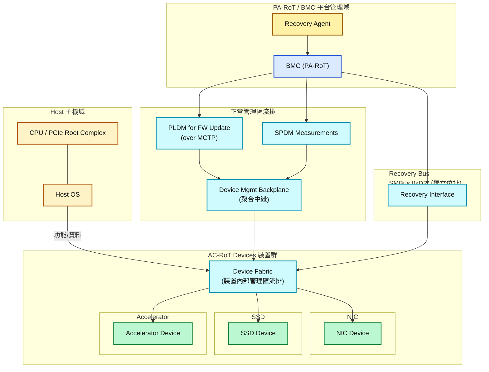
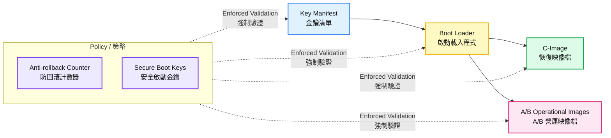
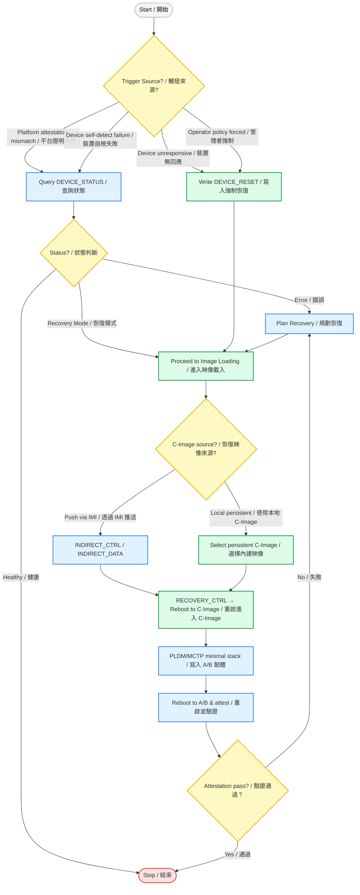
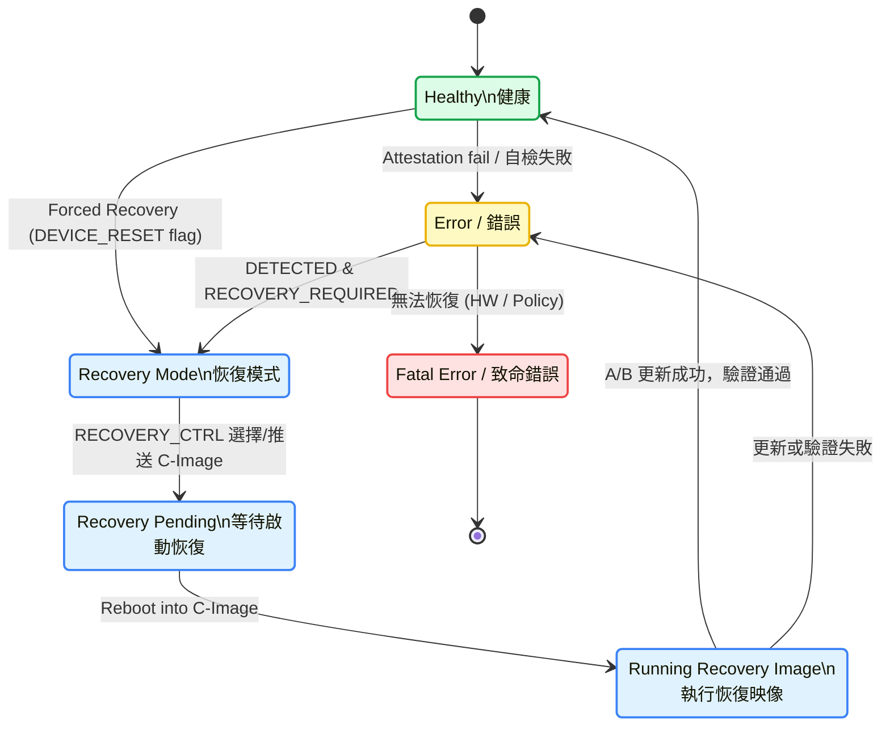

以下是根據提供的內容合成的「Secure Firmware Recovery」文件:

# Secure Firmware Recovery 規範詳解

## 1. 總覽與目的 (Executive Summary)
本文件是由 Open Compute Project (OCP) 發布的一份技術規範，旨在為資料中心硬體建立一套標準化、安全且可靠的韌體恢復機制。其核心目標是當一個裝置（如網卡、SSD、加速卡）的韌體損壞、無回應或被惡意竄改時，平台管理者（如 BMC）能夠透過一個獨立於主作業系統的低階通道（Side-band channel），強制該裝置進入恢復模式，並將其恢復到一個已知、可信的安全狀態。此規範基於 NIST SP 800-193《平台韌體彈性指南》的三大支柱：保護 (Protection)、偵測 (Detection) 和恢復 (Recovery)。

### 1.1 系統全景架構圖 (System Overview)


## 2. 關鍵角色與術語 (Key Roles & Terminology)
- AC-RoT (Active Component Root of Trust): 主動元件信任根。指需要被恢復的裝置，例如一個 PCIe 卡。它本身具備安全啟動和證明能力。
- PA-RoT (Platform Active Root of Trust): 平台主動信任根。通常是平台上的管理控制器，如 BMC (Baseboard Management Controller)。
- RA (Recovery Agent): 恢復代理。通常是 PA-RoT (BMC) 內部的一個軟體模組，負責推送映像檔並協調恢復流程。

韌體映像檔類型:
- A/B Image (營運映像檔): 裝置正常運行時使用的韌體，採用 A/B 分區以支援不中斷更新。
- C-Image (恢復映像檔): 最小化韌體，用於啟動裝置並接收新的 A/B Image。
- 關鍵資料 (Critical Data): 裝置身份憑證、金鑰清單、安全配置等必須持久存在的資料。



## 3. 恢復觸發條件與場景 (Recovery Triggers & Scenarios)
觸發條件:
1. 平台偵測異常（Attestation 測量值不符）。
1. 裝置自我偵測（安全啟動失敗、防回滾錯誤、關鍵資料損壞）。
1. 裝置無回應（無法透過 MCTP 溝通）。
1. 強制恢復（由管理者策略或維護需求觸發）。

使用場景:
- 正常更新： 僅韌體升級，不動用此恢復機制。
- 帶有關鍵資料的恢復： 重寫韌體，身份保持不變。
- 不帶關鍵資料的恢復： 必須重新配置裝置身份與安全參數。

⚠️ 安全提醒：強制恢復 (Forced Recovery) 隱含信任 PA-RoT/RA，若被濫用可能造成 拒絕服務 (DoS)，因為攻擊者可反覆觸發裝置重置。



## 4. 恢復流程詳解 (Recovery Process Flow)
1. 偵測 (Detection) → PA-RoT 判斷 AC-RoT 不健康。
1. 狀態查詢 (Status Check) → RA 讀取 DEVICE_STATUS。
1. 進入恢復模式 (Entering Recovery) → 可透過 DEVICE_RESET 觸發。
1. 載入恢復映像檔 (Image Loading) → Push C-Image 或選擇本地 C-Image。
1. 啟動恢復映像檔 (Activation) → RECOVERY_CTRL 控制重啟並執行 C-Image。
1. 執行恢復 (Recovery Execution) → 推送完整的 A/B Image。
1. 完成與驗證 (Completion & Verification) → 重啟後由 Attestation 驗證健康狀態。



狀態碼 (DEVICE_STATUS):

## 5. 恢復原因碼 (Recovery Reason Codes)
✅ = 可恢復 ｜ ❌ = 無法恢復 ｜ ◐ = 視情況需返廠

```mermaid
flowchart LR
    %% === 樣式 ===
    classDef ok fill:#dcfce7,stroke:#16a34a,stroke-width:2px,color:#111
    classDef maybe fill:#fff7ed,stroke:#f59e0b,stroke-width:2px,color:#111
    classDef no fill:#fee2e2,stroke:#ef4444,stroke-width:2px,color:#111
    classDef legend fill:#f3f4f6,stroke:#9ca3af,stroke-width:1px,color:#111

    %% === 可恢復 (綠) ===
    subgraph G1 [可恢復 Recoverable]
        direction TB
        ROK["0x5 Key Manifest 遺失/毀損<br/>0x6 Key Manifest 驗證失敗<br/>0x7 Key Manifest 防回滾錯誤<br/>0x8 Boot Loader 遺失/毀損<br/>0x9 Boot Loader 驗證失敗<br/>0xA Boot Loader 防回滾錯誤<br/>0xB 主韌體遺失/毀損<br/>0xC 主韌體驗證失敗<br/>0xD 主韌體防回滾錯誤<br/>0xE Recovery 韌體遺失/毀損<br/>0xF Recovery 韌體驗證失敗<br/>0x10 