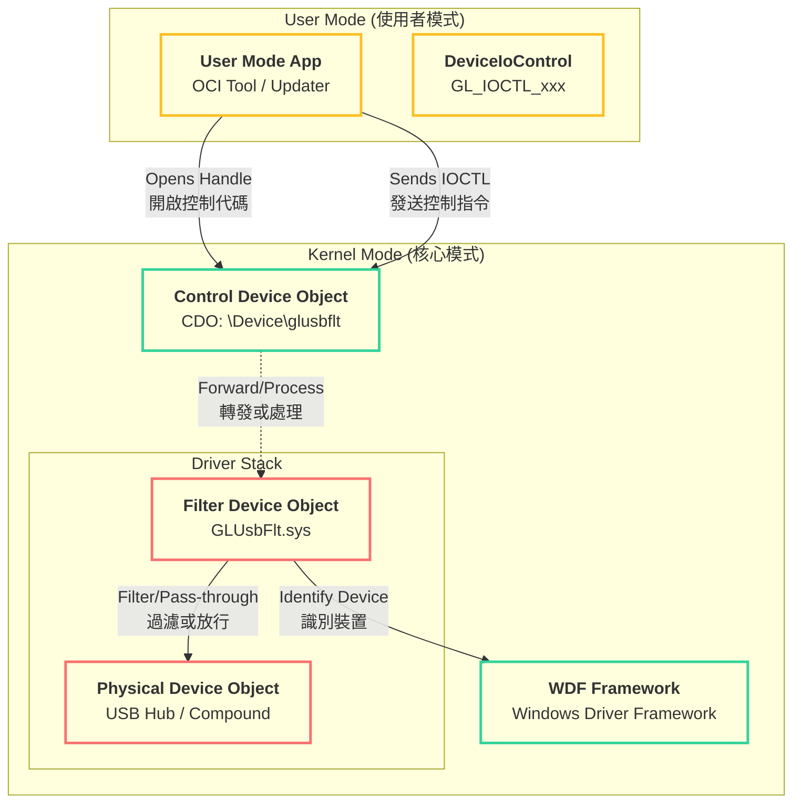
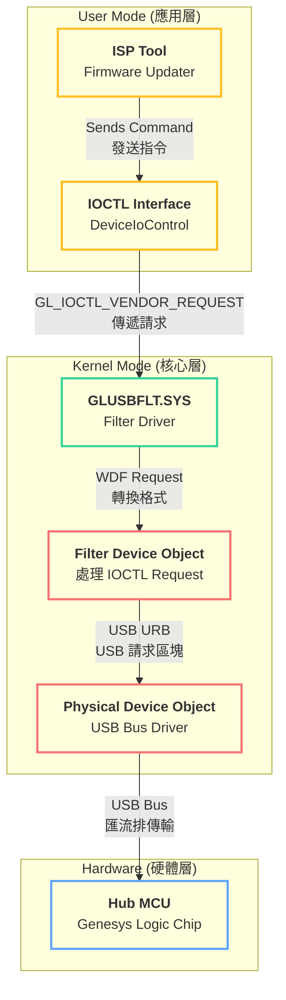
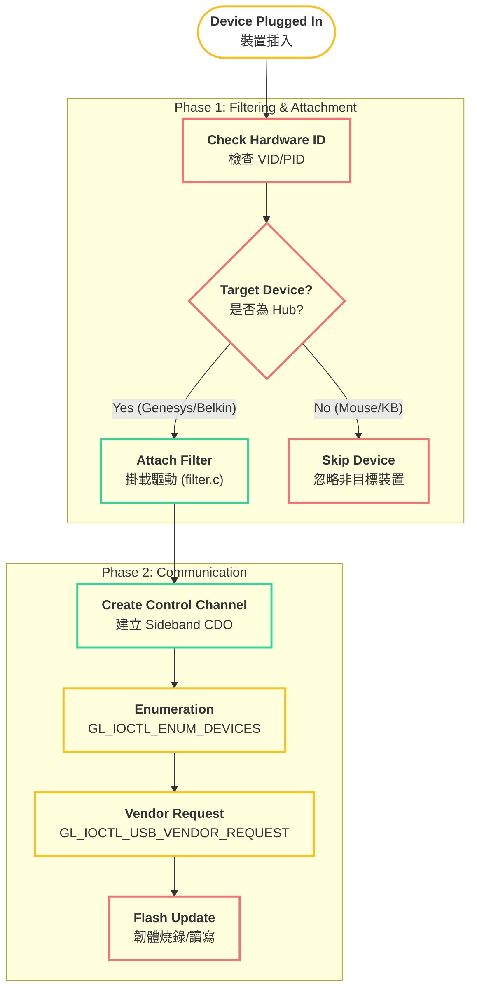
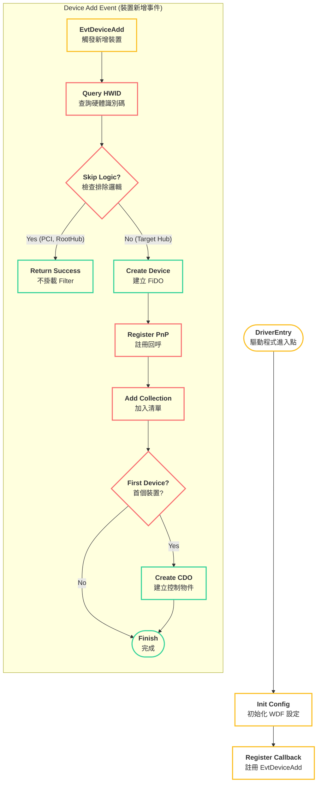
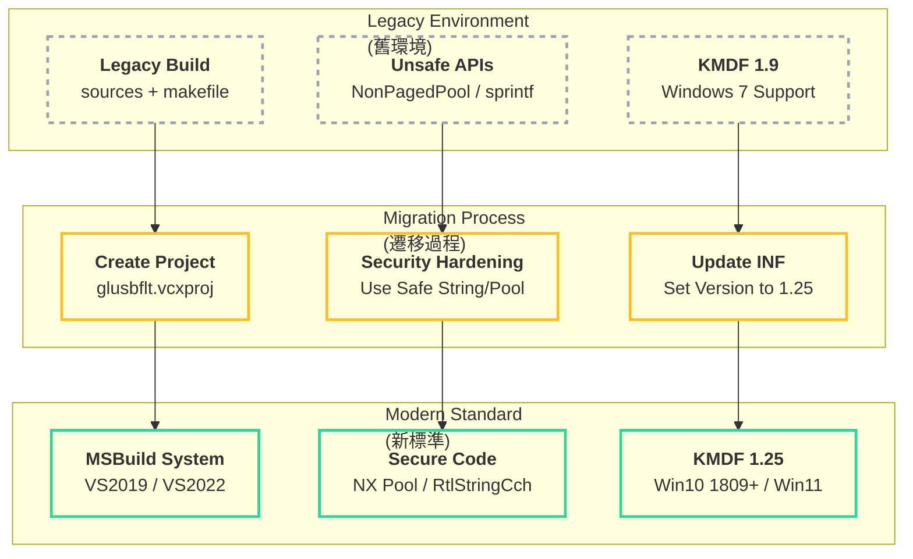

以下是 Generic USB Filter Driver 的綜合 Markdown 報告:

# Generic USB Filter Driver 概述

## 專案概述 (Overview)
此專案包含核心驅動程式 (Kernel Driver) 與相關的安裝檔案 (.inf)。驅動程式會掛載 (Attach) 在目標 USB 裝置的驅動程式堆疊 (Driver Stack) 上，攔截並處理 PnP (Plug and Play) 與 Power 事件，同時提供 Control Device Object (CDO) 供使用者模式 (User-Mode) 的應用程式進行通訊。

### 核心功能 (Key Features)
- 🛡️ 裝置過濾 (Device Filtering)
- ⚙️ 多模式運作 (Multi-Mode Operation)
- 📡 IOCTL 通訊介面

## 系統架構 (System Architecture)
下圖展示了 User Mode Application 與 Kernel Mode Driver 之間的互動架構。

## ISP Mode 詳細技術說明 (In-System Programming)

### 1. ISP 核心架構與路徑
在 ISP 模式下，驅動程式扮演「橋樑」的角色。以下圖表展示了指令如何從 User Mode 穿透驅動層到達硬體。

### 2. ISP 工作流程 (Workflow)
驅動程式如何識別裝置並建立通訊通道？

### 3. ISP 關鍵程式碼分析
### 4. ISP 安全性與限制
> ⚠️ 無狀態保存 (Stateless Design)

## 驅動程式初始化流程 (Initialization Flow)
當系統偵測到新裝置時，DriverEntry 註冊的回呼函數 FilterEvtDeviceAdd 會被觸發。

## IOCTL 命令列表 (IOCTL Commands)
定義於 filter_ioctl.h 中的主要控制碼：

## WDK Modernization Plan (WDK 現代化計畫)

### 目標 (Goal)
將 Generic USB Filter Driver 專案從舊版 WDK 環境遷移至現代化的 WDK 標準。

### 使用者審查事項 (User Review Required)
> ❗ IMPORTANT: Build System Change
> 🚨 WARNING: KMDF Version Upgrade

### 遷移架構圖 (Migration Architecture)

### 變更細節 (Proposed Changes)

#### 1. Code Security & Safety [Safe]
替換 utility.c 與 filter_control.c 中已棄用或不安全的函數。
- 🔒 Memory Allocation: 將 NonPagedPool 替換為 NonPagedPoolNx (No-Execute)，防止代碼注入攻擊。
- 🛡️ String Handling: 將 sprintf, strcpy 替換為 RtlStringCchPrintfA, RtlStringCchCopyA。

#### 2. INF Configuration [Safe]
- 📄 glusbflt.inf: 將 KmdfLibraryVersion 設定更新為 1.25。

#### 3. Build System [NEW]
- 🆕 glusbflt.vcxproj: 建立標準 KMDF Driver 專案結構，包含所有原始碼並設定 ARM64/x64 編譯配置。

## 編譯與安裝 (Build and Install)

### 編譯環境
- WDK (Windows Driver Kit): 安裝支援 KMDF 1.x 的 WDK。
- 使用 Visual Studio 2019/2022 開啟 glusbflt.vcxproj 進行編譯。

### 安裝方式
1. 進入 isp_x64\install。
1. 右鍵點擊 glusbflt.inf 並選擇 安裝 (Install)。
1. 或使用 devcon:Bash

## 檔案結構 (File Structure)
- 📄 filter.c: 驅動程式進入點與裝置新增邏輯。
- 📄 filter_ioctl.h: 定義 IOCTL Control Codes。
- 📄 filter_control.c: 處理 IOCTL 請求。
- 📄 filter_fdo.c: 處理 PnP 與 Power 事件。
- ⚙️ glusbflt.vcxproj: (New) MSBuild 專案檔。
- 📁 isp_x64/: Binary 與 INF 輸出目錄。